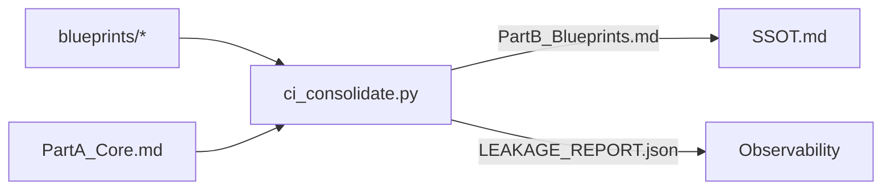
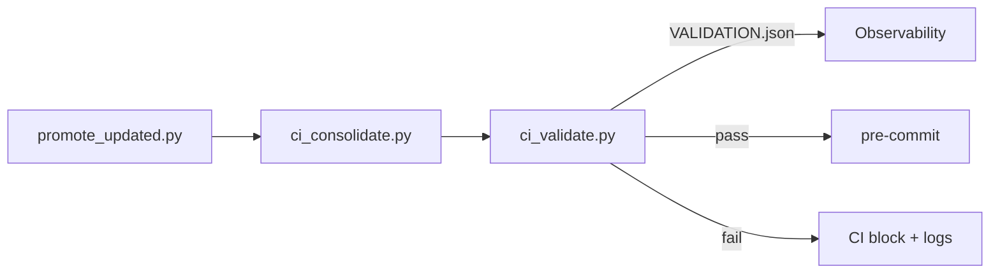
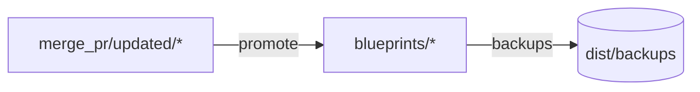
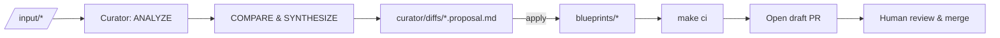

# Document Synthesiser (DocSyn)
## Executive White Paper & Technical Companion
**Date:** 2025-09-08

DocSyn is a governed, human‑in‑the‑loop **Document Synthesiser** that ingests heterogeneous source materials and produces a clean, authoritative **Single Source of Truth (SSOT)**. It combines a dual‑surface model (globals + blueprint datasheets) with a surgical markdown consolidator, invariant validation in CI, and a **Master Curator Agent** that proposes changes via Pull Requests for expert approval.

This white paper merges the **executive & analyst narrative** with the full **design/build/architecture** companion and embeds the current SSOT snapshot.


## 1. Executive Summary

Enterprises struggle with duplicated guidance across decks, wikis, and docs. **DocSyn** solves this by separating **what** we know (a maintained SSOT) from **how** we curate it (an automated pipeline with **human approval**).

**For leaders**
- A single, dependable SSOT; fewer reconciliation cycles on “which doc is right?”
- Audit‑ready governance: provenance, validation artifacts, and PR history
- Faster change with less risk; automation handles the repetitive, experts approve the nuanced

**For business analysts**
- Clear blueprint datasheets for each capability (objective, invocation, I/O, risks)
- Predictable lifecycle: **promote → consolidate → validate → PR**
- Transparent forensics (leakage & validation reports) for quick triage


## 2. Business Value & Outcomes

- **Consistency at scale:** one surface of truth reduces rework and errors
- **Governed agility:** ship updates fast without drift or hidden regressions
- **Lower TCO:** automate low‑value synthesis; focus humans on ambiguity and strategy
- **Compliance & auditability:** explicit provenance + CI artifacts on every change


## 3. Why DocSyn Is Unique — and How It Relates to Other Technologies

**What makes DocSyn different**
- **Dual‑surface SSOT:** Part A (global truths once) + Part B (cleaned blueprint datasheets) assembled into one artifact
- **Surgical consolidation:** (a) heading‑scoped removal supporting escaped/blockquoted headings; (b) normalized‑substring fingerprinting to catch near‑duplicates; (c) an AQI structured‑table heuristic
- **Validator as gatekeeper:** explicit invariants (globals‑once, zero‑leakage in Part B, code‑fence parity, promotion age/size) with machine‑readable reports
- **Curator Agent with HITL:** agent proposes modular markdown edits with provenance, runs CI, and opens a PR; experts remain the final arbiters

**How it intersects with existing patterns**
- **Docs‑as‑code & PR workflows:** DocSyn adopts the same governance ergonomics (branch → PR → checks → review) but adds **content‑aware synthesis** and **invariant validation** specific to markdown SSOTs.
- **LLM/RAG ingestion pipelines:** Frameworks transform and index content for retrieval, but DocSyn’s job is different: produce a **de‑duplicated human‑readable SSOT**. You can still feed the SSOT into RAG; DocSyn ensures it’s clean and stable.
- **Metadata/catalog (data governance):** Catalogs manage lineage/ownership; DocSyn can publish its SSOT and provenance there, while retaining its own CI gates for content integrity.
- **MLOps/CI patterns:** The validator acts like a model gate; changes fail fast on invariant breaches. Provenance is your audit trail; PRs are your model cards.


## 4. System Overview (Dual Surface, Single Source)
- **Part A (Core Globals):** Router — Query‑Pattern Matrix, Unified Risk & Control Model, Standard Development Environment
- **Part B (Blueprints):** per‑capability datasheets (Objective, Invocation, I/O, Local Risk Matrix, examples, provenance)
- **Consolidator:** builds Part B from blueprints by removing global leakage and duplicates
- **Validator:** enforces invariants and produces machine‑readable results
- **Master Curator Agent:** automates ingest/synthesis and opens PRs for expert review


## 5. Architecture & Artifacts

**Key components**
- Promotion tool — moves staged content to curated blueprints with backups & size floors
- Consolidator — heading‑scoped removal, normalized fingerprinting, AQI heuristic
- Validator — globals‑once, zero‑leakage in Part B, code‑fence parity, promotion gates
- CI workflow — **Promote → Consolidate → Validate → pre‑commit**
- Curator Agent — analyzes `/input`, drafts proposals, runs CI, opens PRs

**Directory layout (high‑level)**
```
/core/                     # canonical global sections
/blueprints/               # curated per-agent datasheets (inputs to Part B)
/merge_pr/updated/         # staged rich content awaiting promotion
/dist/
  PartA_Core.md            # Core Globals snapshot
  PartB_Blueprints.md      # Clean blueprint surface
  SSOT.md                  # Final stitched (Part A + Part B)
  LEAKAGE_REPORT.json      # what/where/why was removed
  VALIDATION.json          # invariant results
  /backups/
/scripts/
  promote_updated.py
  ci_consolidate.py
  ci_validate.py
  curator_agent.py
  curator_lib/
/.github/workflows/ssot-ci.yml
```


## 6. Data Lifecycle & Flows

**Build & Consolidation**


**Validation & CI**


**Promotion (staging → curated)**


**Master Curator Agent**



## 7. Core Algorithms (Explained)

### 7.1 Heading‑Scoped De‑Duplication
- Matches H1–H3 headings (supports escaped `\###` and blockquoted `> ###`) with optional numbering (`1. Title`)
- Removes sections under global titles (Router/Query‑Pattern Matrix, Unified Risk & Control Model, SDE, Agent Query Index, High‑Level Risk)

### 7.2 Normalized Substring Fingerprinting
- Normalize: lowercase + strip whitespace and markdown punctuation (tables, code fences, emphasis)
- Rationale: substring containment catches near‑duplicates and minor edits better than equality hashes
- Action: drop blueprint paragraphs whose normalized text contains a normalized Part‑A block

### 7.3 AQI Structured‑Table Heuristic
- Removes paragraphs that mention “Agent Query Index” **and** look like a table (`|`, “Route”, “Ch.”, “Positive/Negative”)

### 7.4 Promotion Enforcement
- Size floors (defend against placeholders) + mtime checks (prevent building from staging)

### 7.5 Validation Invariants
- SSOT size floor; globals once (Router, Unified Risk & Control Model, SDE; AQI 0–1); zero leakage in Part B
- Code‑fence parity even; promotion gates pass


## 8. CI/CD & Developer Ergonomics
- Workflow: **Promote → Consolidate → Validate → pre‑commit**
- Make targets: `make ci`, `make curator-analyze`, `make curator-plan`, `make curator-apply`
- PR template: embeds VALIDATION/LEAKAGE highlights; labels (`curator`, `core-edit`)
- Small PRs: single topic; file/LOC budgets


## 9. Governance, Security, Compliance
- `/core/**` protected by CODEOWNERS
- Licensing & confidentiality gates; drafts PR if uncertain
- Secrets/PII scanning hook (e.g., gitleaks)
- Provenance required in YAML front‑matter or footer


## 10. Operability & Runbooks
**Common failures & triage**
- Globals count mismatch → escaped/blockquote heading form; fix the title
- Fingerprint leakage → see `LEAKAGE_REPORT.json` line ranges; adjust source blueprint
- Promotion failure → run `python scripts/promote_updated.py`
- Odd code‑fence parity → find unmatched ``` in SSOT

**Recovery**
- Restore from `dist/backups/*`
- Compare blueprint vs `curator/diffs/*.proposal.md`
- Reproduce locally: `make ci`


## 11. Observability & KPIs
- Curation lead time: `/input` → PR opened
- PR approval rate (% merged without major edits)
- Manual edit % (reviewer changes vs proposals)
- Leakage removed (counts/categories from `LEAKAGE_REPORT.json`)
- Router regression delta (smoke test impacts)


## 12. Testing Strategy
- Unit tests: escaped/blockquoted/numbered-heading regex edge cases
- Golden tests: consolidator inputs → expected outputs + leakage report
- Validator tests: crafted failures for each invariant
- Router smoke tests: prompt invariants with tolerances


## 13. Performance & Scale
- Linear scans; substring checks per paragraph × #global blocks
- Paragraph‑level processing for large content; optional parallelism per blueprint
- Deterministic ordering for stable diffs


## 14. Phase Two — Plans

**1) Curator Agent to Production**
- GitHub Actions trigger on `input/**`: analyze → plan → draft PR automatically
- Add PDF/DOCX structure‑aware extractors; keep provenance (page spans, headings)
- PR budgets: 1 topic per PR; LOC/file caps; `core-edit` label + CODEOWNERS for globals

**2) Stronger Similarity Signals**
- Add MinHash/SimHash as secondary signals to flag near‑dups (retain substring as primary removal criterion)
- Optional semantic diff summaries in PRs (LLM‑generated but bounded by provenance)

**3) Catalog & Discovery**
- Publish SSOT + provenance to a metadata catalog (ownership, lineage, search)
- Tag blueprints with domains/owners; wire to dashboards

**4) Metrics, SLOs, and Alerts**
- Dashboards for KPIs; SLOs on curation lead time & approval rate
- Alerts on validator failures, promotion drift, or regression spikes

**5) Federation & Multilingual**
- Multi‑repo federation; cross‑repo Part A re‑use
- Language‑aware consolidator/validator rules; translation provenance

**6) Developer Experience**
- `make docsyn` shim; `docsyn` CLI alias
- Template generator for new blueprint datasheets (scaffold schema sections)


## 15. Architecture Decision Records (ADRs)
1) Substring fingerprints over equality hashes (recall for near‑dups)  
2) Exclude legacy one‑click from CI (precision; local‑only for reports)  
3) AQI optional (0–1) (org preference)  
4) Protect `/core/**` (prevent global drift)  
5) Require provenance (auditability and safe RAG)


## 16. Glossary
- **DocSyn:** Document Synthesiser — governed pipeline + curator agent producing an SSOT
- **SSOT:** Single Source of Truth — final de‑duplicated knowledge artifact
- **Curator Agent:** automated ingest/synthesis with human‑in‑the‑loop PRs
- **Leakage:** global content duplicated inside blueprints

## 17. Use Cases & Expansion

### 17.1 High‑Impact Use Cases
- **Regulated industries (Financial Services / Health):** controlled updates to policies, controls, and procedures with audit‑ready provenance; safe RAG grounded in the SSOT.
- **Product & Platform engineering:** one surface of truth for SDKs, API change logs, runbooks, and developer onboarding; reduces support load and decision latency.
- **Customer operations & support:** unified agent playbooks and troubleshooting trees; consistent CX across channels and regions.
- **Legal & procurement:** clause libraries and negotiation playbooks with provenance; safer contract drafting and review.
- **Sales & enablement:** single source for talk tracks, ROI calculators, and competitive intel; faster ramp‑up and consistent messaging.

### 17.2 Expansion & Moat
- **Phase Two (near‑term):** Curator Agent in production (auto‑draft PRs from `/input/**`), structure‑aware extractors (PDF/DOCX with page‑span provenance), secondary similarity signals (MinHash/SimHash), semantic PR diffs, catalog publishing (ownership, lineage, search), KPI dashboards & alerts.
- **12–18 months:** multi‑repo federation and cross‑repo Part‑A reuse; multilingual synthesis with translation provenance; governance policy plug‑ins (rules‑as‑code); usage analytics → quality scoring → recommended curation.

### 17.3 Investment Readiness
- **Operational proof:** validator gates with invariant reports (`VALIDATION.json`, `LEAKAGE_REPORT.json`) and timestamped backups.
- **Scalable architecture:** linear pipelines and deterministic assembly; parallel per‑blueprint processing when needed.
- **Commercial fit:** complements existing RAG stacks and catalogs; easy integration into PR workflows and CI/CD; clear value metrics (lead time, approval rate, manual edit %, router delta).


---
# Annexes


## Annex A — Core Globals (Part A Snapshot)

# 0. Router — Query-Pattern Matrix
{{#CH0-ROUTER}}

> Legend: **Positive** (must match), **Negative** (must not match). **Route** points to the blueprint section.

| Intent | Positive Patterns | Negative Patterns | Route | Key Risks |
|---|---|---|---|---|
| Generate docs for a repo | docs, document, readme, scan | secrets, payments | CH4-BP-DOC | Data: leakage; Ops: cost |
| Guard with file watcher | guard, watch, lint | deploy, payments | CH4-BP-GRD | Env: perms; Ops: noise |
| Clean/format code | janitor, cleanup, dead code | deploy, cdn | CH4-BP-JAN | Ops: destructive ops |
| Run tests with coverage | test, unit, integration, coverage | perf test | CH4-BP-TST | Ops: flakiness |
| CI/CD security analysis | pipeline, secrets, SAST, DAST | perf, load | CH4-BP-CICD | Governance: approvals |
| Multi-agent orchestration | orchestrate, multi-agent, plan | single prompt | CH4-BP-ORCH | Ops: runaway loops |
| Learn from feedback | adapt, improve, retrospective | delete data | CH4-BP-ADAPT | Governance: consent |

---

## Router Legend
- **Positive Patterns**: comma-separated keywords/regex the router uses to route queries.
- **Negative Patterns**: keywords/regex that disqualify a route.
- **Route**: stable section ID of the target blueprint.


# 1. Unified Risk & Control Model
{{#CH1-RISKS}}

| Pillar | Risk | Severity (1-5) | Standard Mitigation |
|---|---|---:|---|
| Governance | Unapproved data processing | 5 | HITL approvals; audit trail |
| Environment | Over-privileged agents | 4 | Least-privilege devcontainer; scoped tokens |
| Data | Sensitive info leakage | 5 | Redaction; denylist; test data only |
| Operations | Runaway loops / cost spikes | 4 | Step caps; budget alerts; circuit breakers |

> Always document mitigations in each blueprint’s **Local Risks** and wire KPIs to dashboards.


# 2. Standard Development Environment
{{#CH2-DEVCONTAINER}}

Use the reference **devcontainer.json** and **Dockerfile** from `/reference/` to ensure reproducible, least-privilege dev.

- Non-root user
- Minimal toolchain
- Explicit allowlisted CLIs

See also: `/reference/devcontainer.json`, `/reference/Dockerfile`.


## Annex B — Blueprint Index (Part B Overview)

- Adaptive-Learning
- Cicd-Analyst
- Documenter
- Guardian
- Janitor
- Orchestrator
- Tester


## Annex C — Full SSOT Snapshot

# 0. Router — Query-Pattern Matrix
{{#CH0-ROUTER}}

> Legend: **Positive** (must match), **Negative** (must not match). **Route** points to the blueprint section.

| Intent | Positive Patterns | Negative Patterns | Route | Key Risks |
|---|---|---|---|---|
| Generate docs for a repo | docs, document, readme, scan | secrets, payments | CH4-BP-DOC | Data: leakage; Ops: cost |
| Guard with file watcher | guard, watch, lint | deploy, payments | CH4-BP-GRD | Env: perms; Ops: noise |
| Clean/format code | janitor, cleanup, dead code | deploy, cdn | CH4-BP-JAN | Ops: destructive ops |
| Run tests with coverage | test, unit, integration, coverage | perf test | CH4-BP-TST | Ops: flakiness |
| CI/CD security analysis | pipeline, secrets, SAST, DAST | perf, load | CH4-BP-CICD | Governance: approvals |
| Multi-agent orchestration | orchestrate, multi-agent, plan | single prompt | CH4-BP-ORCH | Ops: runaway loops |
| Learn from feedback | adapt, improve, retrospective | delete data | CH4-BP-ADAPT | Governance: consent |

---

## Router Legend
- **Positive Patterns**: comma-separated keywords/regex the router uses to route queries.
- **Negative Patterns**: keywords/regex that disqualify a route.
- **Route**: stable section ID of the target blueprint.


# 1. Unified Risk & Control Model
{{#CH1-RISKS}}

| Pillar | Risk | Severity (1-5) | Standard Mitigation |
|---|---|---:|---|
| Governance | Unapproved data processing | 5 | HITL approvals; audit trail |
| Environment | Over-privileged agents | 4 | Least-privilege devcontainer; scoped tokens |
| Data | Sensitive info leakage | 5 | Redaction; denylist; test data only |
| Operations | Runaway loops / cost spikes | 4 | Step caps; budget alerts; circuit breakers |

> Always document mitigations in each blueprint’s **Local Risks** and wire KPIs to dashboards.


# 2. Standard Development Environment
{{#CH2-DEVCONTAINER}}

Use the reference **devcontainer.json** and **Dockerfile** from `/reference/` to ensure reproducible, least-privilege dev.

- Non-root user
- Minimal toolchain
- Explicit allowlisted CLIs

See also: `/reference/devcontainer.json`, `/reference/Dockerfile`.

# Adaptive-Learning

---

> **Sourced excerpt from:** # Claude Code_ Agent Blueprints, Patterns & Reference Manual.md

ency & Unintended Actions | Agent exceeds scope due to ambiguous prompts or flawed reasoning. | Operational outages; financial loss. | Least privilege; HITL for destructive ops; command blocklists (e.g., deny \`rm \*\`). | All; esp. Multi-Agent Orchestrator. |  
| \*\*Governance\*\* | Disinformation/Manipulation | Generation of false content or phishing. | Reputational damage. | Content filtering; anomaly detection; HITL for public outputs. | N/A (misuse risk; controls in others). |  
| \*\*Environment\*\* | Supply Chain Vulnerabilities | Compromised dependencies or models. | System compromise. | Verified images; dependency scanning; isolated environments (e.g., Docker). | CI/CD Security Analyst. |  
| \*\*Data\*\* | Data Leakage & Privacy Violation | Exposure of PII or sensitive data in outputs/logs. | Fines; trust erosion. | Input sanitisation; encrypted credentials; restricted retention. | Automated Documenter; CI/CD Analyst. |  
| \*\*Operations\*\* | Lack of Traceability | Opaque decisions hinder audits. | Compliance failures. | Immutable logs; distributed tracing; JSONL formatting. | Adaptive Learning Agent; Multi-Agent Orchestrator. |  
| \*\*Operations\*\* | Financial Fraud | Erroneous transactions from hallucinations. | Monetary loss. | HITL gates; RBAC on APIs; transaction anomaly checks. | N/A (specialised; principles in Janitor/Orchestrator). |

\# Part A: Agent Blueprints & Patterns

\#\# Chapter 1: The Standard Development Environment

\*\*Chapter Primer\*\*    
\*Synopsis:\* This chapter establishes the baseline architecture for secure and consistent agentic development using Devcontainers, providing the foundational environment for all subsequent blueprints.    
\*Key Concepts:\* Devcontainer isolation, reproducibility, least-privilege security, dependency management, centralised configuration.    
\*For the Beginner:\* Learn the simple steps to set up a safe, consistent workspace that protects your system while enabling agentic tools.    
\*For the Expert:\* Understand the architectural rationale for Devcontainers as the canonical security model, including advanced troubleshooting and integration patterns for enterprise-scale deployments.

\#\#\# 1.1 The Recommended Architecture: Why We Use Devcontainers  
Devcontainers are the canonical approach for security and consistency, providing isolated, reproducible environments with non-root execution and controlled dependencies. Why: They eliminate "works on my machine" issues by enforcing immutable bases and pinned versions, harden supply chains against vulnerabilities (e.g., via SBOM generation), and enable least-privilege principles by mounting projects read-only with writable temps. This prevents unintended file access or environmental drift, crucial for agentic systems where autonomy could amplify errors. Alternatives like native installs are for niche cases but lack built-in isolation, increasing risks of tool misuse or data leakage in production workflows.

\#\#\# 1.2 Setting Up Your First Devcontainer for Claude Code  
\`\`\`json  
// .devcontainer/devcontainer.json  
{  
  "name": "Claude Code Dev",  
  "image": "mcr.microsoft.com/devcontainers/base:ubuntu",  
  "features": {"node": "lts"},  
  "postCreateCommand": "npm install \-g @anthropic-ai/claude-code",  
  "customizations": {"vscode": {"extensions": \["anthropic.claude-code"\]}}  
}  
\`\`\`  
Build with VS Code Dev Containers extension. Why this setup: Ensures consistent tooling; post-command installs Claude Code securely, while features pin dependencies to avoid drift.

\#\#\# 1.3 Creating a Centralised, Version-Controlled Agent Configuration (\`\~/.claude\_agents\`)  
Create \`\~/.claude\_agents\` for commands/hooks; git init for versioning. Why: Enables traceability and collaboration—commit changes to configs like CLAUDE.md for auditability and rollback, essential for team environments where agent behaviours evolve.

\#\#\# 1.4 Troubleshooting Common Devcontainer Issues  
Issues: Docker compatibility—ensure Desktop installed. Solutions: For auth errors, use host borrowing; for permissions, \`--allowedTools\`. Why troubleshooting matters: Maintains operational reliability in agentic setups, where failures could cascade.

\#\# Chapter 2: Blueprint: The Automated Documenter Agent

\*\*Chapter Primer\*\*    
\*Synopsis:\* This chapter details a blueprint for an agent that automatically generates and maintains project documentation, encapsulating code analysis and Markdown formatting logic.    
\*Key Concepts:\* Context gathering, custom slash commands, output sanitisation, documentation coverage metrics.    
\*For the Beginner:\* Discover how to create an agent that turns code into readable docs without manual effort.    
\*For the Expert:\* Explore patterns for robust context provision and integration with CI/CD for continuous documentation.

\*\*Objective & Success Criteria:\*\* Generate comprehensive, accurate documentation for codebases, achieving 95% coverage of functions/classes, measurable via output completeness and user verification.    
\*\*Real-World Case Study:\*\* In a software team, auto-generate README updates on commits, reducing manual doc time by 80%.    
\*\*Agent Workflow Diagram:\*\*    
\`\`\`mermaid  
graph TD  
A\[Invoke Script\] \--\> B\[Gather Context: Files/Deps\]  
B \--\> C\[Invoke /documenter with Context\]  
C \--\> D\[Format into Markdown\]  
D \--\> E\[Output & Review\]  
\`\`\`  
\*\*Custom Slash Command (.md):\*\*    
\`\`\`  
\---  
name: "/documenter"  
intent: "Formats provided project context into a professional Markdown report."  
\---  
You are an expert technical writer. Using ONLY the context provided below, generate a comprehensive Markdown documentation file.

\*\*RULES:\*\*  
1\. Structure as: Overview, Structure, Dependencies, Key Components.  
2\. Use relative paths (e.g., src/file.js).  
3\. Be concise yet complete; avoid hallucinations.

\#\# Project Structure  
\`\`\`  
${args\[0\]}  
\`\`\`

\#\# Key Dependencies  
\`\`\`json  
${args\[1\]}  
\`\`\`  
\`\`\`  
\*\*Invocation Script (.sh):\*\*    
\`\`\`bash  
\#\!/bin/bash  
set \-e  \# Exit on error

PROJECT\_PATH="${1:-.}"  \# Default to current dir  
echo "Gathering context for ${PROJECT\_PATH}..."

\# Pre-flight checks  
if \[ \! \-d "$PROJECT\_PATH" \]; then  
  echo "Error: Directory not found: $PROJECT\_PATH"  
  exit 1  
fi

\# Gather context robustly  
PROJECT\_TREE=$(tree \-L 2 \-I 'node\_modules|dist' "$PROJECT\_PATH" 2\>/dev/null || echo "tree not installed; fallback listing: $(ls \-R "$PROJECT\_PATH")")  
PROJECT\_DEPS=$(jq '{dependencies, devDependencies}' "${PROJECT\_PATH}/package.json" 2\>/dev/null || echo "No package.json found.")

\# Sanitize for sensitive data (example: mask API keys if present)  
PROJECT\_DEPS=$(echo "$PROJECT\_DEPS" | sed 's/"sk-\[a-zA-Z0-9\]\*"/"REDACTED"/g')

echo "Invoking agent..."

\# Pass to custom command  
claude /documenter "${PROJECT\_TREE}" "${PROJECT\_DEPS}" \> "${PROJECT\_PATH}/DOCS.md"

\# Log invocation  
echo "\[$(date)\] Documentation generated for ${PROJECT\_PATH}" \>\> \~/.claude\_agents/logs/documenter.log

echo "✅ Documentation at ${PROJECT\_PATH}/DOCS.md"  
\`\`\`  
\*\*Prompt Adaptation Template:\*\* "You are a documenter agent. Given \[context: files/deps\], generate \[sections: overview, usage\]: 1\. Analyze structure..."    
\*\*Risk & Control Matrix:\*\*    
| Risk | Impact | Control | Residual Risk |    
|------|--------|---------|---------------|    
| Inaccurate Docs | Medium | Explicit context provision; HITL review | Low |    
| Data Leakage | High | Pre-script sanitisation; restricted outputs | Low |    
| Hallucination | Medium | Grounding in provided data only | Low |    
\*\*Ethical Considerations & Audit Logging:\*\* Check for bias in summaries; log invocations with timestamps for traceability.    
\*\*Failure Modes & Recovery:\*\* Incomplete context—retry with expanded gathering; errors—fallback to manual review.

\#\# Chapter 3: Blueprint: The Guardian File-Watcher Agent

\*\*Chapter Primer\*\*    
\*Synopsis:\* This chapter provides a blueprint for a persistent, long-running agent that serves as an active monitor for filesystem events. It acts as a trigger for automated workflows, initiating actions in real-time as files are created, modified, or deleted. This pattern is fundamental for building event-driven automation.    
\*Key Concepts:\* Filesystem watcher (fswatch), persistent agent, event-driven trigger, cooldown logic, daemonisation.    
\*For the Beginner:\* Learn how to create a simple "bot" that can watch a folder (like your Downloads folder) and automatically react when a new file appears.    
\*For the Expert:\* Master the patterns for creating reliable, long-running agentic services, including robust error handling, process management (PID files), and avoiding race conditions with cooldowns.

\*\*Objective & Success Criteria:\*\* Monitor a folder for changes, notify with cooldown to avoid spam, achieving 99.9% detection with \<5% false positives.    
\*\*Real-World Case Study:\*\* A data science team uses the Guardian to watch an S3-mounted directory. When a new CSV dataset arrives, the agent automatically triggers a data validation and ingestion pipeline, logging the results and alerting the team on Slack.    
\*\*Agent Workflow Diagram:\*\*    
\`\`\`mermaid  
graph TD  
A\[File Change Event\] \--\> B{Cooldown Active?};  
B \-- No \--\> C\[Invoke /watcher command\];  
B \-- Yes \--\> D\[Ignore Event\];  
C \--\> E\[Generate Notification Text\];  
E \--\> F\[Log and Send Alert\];  
\`\`\`  
\*\*Custom Slash Command (.md):\*\*    
\`\`\`  
\---  
name: "/watcher"  
intent: "Given details of a file system event, generate a concise, human-readable notification."  
\---  
You are a File System Guardian. Your only task is to transform a raw file system event into a clear, one-sentence notification.

\*\*RULES:\*\*  
1\.  Be concise. Do not add conversational filler.  
2\.  State the file name and the action that occurred.  
3\.  If given \`ls \-l\` output, include the file size.

\*\*EXAMPLE INPUT:\*\*  
\`Mon Sep 8 10:30:01 2025 /Users/dev/project/src/api.js\`  
\`-rw-r--r-- 1 dev staff 4096 Sep 8 10:30 /Users/dev/project/src/api.js\`

\*\*EXAMPLE OUTPUT:\*\*  
\`File modified: src/api.js (4.1 KB)\`  
\`\`\`  
\*\*Invocation Script (.sh):\*\*    
\`\`\`bash  
\#\!/bin/bash  
set \-e \# Exit on error

\# \--- Configuration \---  
WATCH\_PATH="$1"  
LOG\_FILE="$HOME/.claude\_agents/logs/guardian.log"  
COOLDOWN\_SECONDS=10 \# Ignore rapid-fire changes  
LAST\_EVENT\_TIME=0

\# \--- Pre-flight Checks \---  
if \[ \-z "$WATCH\_PATH" \]; then  
    echo "Usage: $0 /path/to/watch"  
    exit 1  
fi  
if \[ \! \-d "$WATCH\_PATH" \]; then  
    echo "Error: Directory not found at ${WATCH\_PATH}"  
    exit 1  
fi

echo "\[$(date)\] Guardian Agent started. Watching: ${WATCH\_PATH}" | tee \-a "${LOG\_FILE}"

\# \--- Main Loop \---  
fswatch \-o "$WATCH\_PATH" | while read \-r file\_path; do  
    CURRENT\_TIME=$(date \+%s)  
    if (( CURRENT\_TIME \- LAST\_EVENT\_TIME \< COOLDOWN\_SECONDS )); then  
        continue \# Skip if within cooldown period  
    fi  
    LAST\_EVENT\_TIME=$CURRENT\_TIME

    echo "\[$(date)\] Event detected for file: ${file\_path}" \>\> "${LOG\_FILE}"

    \# Explicitly gather context for the agent  
    EVENT\_DETAILS=$(ls \-l "$file\_path")

    \# Invoke agent to generate the notification message  
    NOTIFICATION=$(claude /watcher "${EVENT\_DETAILS}")

    \# Log and send the notification (macOS example)  
    echo "  \- Notification: ${NOTIFICATION}" \>\> "${LOG\_FILE}"  
    osascript \-e "display notification \\"${NOTIFICATION}\\" with title \\"Guardian Alert\\""  
done  
\`\`\`  
\*\*Prompt Adaptation Template:\*\* "You are a watcher agent. Given \[change\], notify: 1\. Describe impact..."    
\*\*Risk & Control Matrix:\*\*    
| Risk | Impact | Control | Residual Risk |    
|------|--------|---------|---------------|    
| Spam Alerts | Low | Cooldown logic | Low |    
| Missed Changes | High | Robust fswatch | Low |    
| Privacy Breach | Medium | Sanitise logs | Low |    
\*\*Ethical Considerations & Audit Logging:\*\* Ensure notifications don't expose sensitive data; log all detections.    
\*\*Failure Modes & Recovery:\*\* Watch failure—restart script; false positives—refine matcher.

\#\# Chapter 4: Blueprint: The Janitor File-Management Agent

\*\*Chapter Primer\*\*    
\*Synopsis:\* This chapter outlines a blueprint for an agent that intelligently manages and organises files, emphasising safe, reviewable plans to automate cleanup without risking data loss.    
\*Key Concepts:\* Human-in-the-loop review, dry-run simulation, file categorisation, archive management.    
\*For the Beginner:\* Build an agent to tidy your folders automatically, with safety nets to learn core agentic principles.    
\*For the Expert:\* Implement advanced patterns for scalable file orchestration, including integration with storage systems and audit trails.

\*\*Objective & Success Criteria:\*\* Propose and execute file management plans with 100% human approval rate, reducing clutter by 70% without data loss.    
\*\*Real-World Case Study:\*\* A content team uses Janitor to archive old assets, freeing space while maintaining access logs.    
\*\*Agent Workflow Diagram:\*\*    
\`\`\`mermaid  
graph TD  
A\[Invoke Script\] \--\> B\[Gather File List\]  
B \--\> C\[Invoke /janitor for Plan\]  
C \--\> D\[Human Review Plan\]  
D \--\> E\[Execute Approved Actions\]  
\`\`\`  
\*\*Custom Slash Command (.md):\*\*    
\`\`\`  
\---  
name: "/janitor"  
intent: "Generate a safe, reviewable file management plan from provided file list."  
\---  
You are a File Janitor. Given a list of files, create a detailed, executable bash script plan for categorisation, archival, or deletion.

\*\*RULES:\*\*  
1\. Never suggest destructive actions without dry-run flags.  
2\. Categorise: e.g., images to /archive/images.  
3\. Output as bash script with comments.

\#\# File List  
\`\`\`  
${args\[0\]}  
\`\`\`  
\`\`\`  
\*\*Invocation Script (.sh):\*\*    
\`\`\`bash  
\#\!/bin/bash  
set \-e

ROOT\_PATH="${1:-\~/Downloads}"  
PLAN\_FILE="janitor\_plan.sh"

echo "Scanning ${ROOT\_PATH}..."

\# Gather files safely  
FILE\_LIST=$(find "$ROOT\_PATH" \-type f \-maxdepth 1 2\>/dev/null || echo "No files found.")

\# Invoke agent for plan  
claude /janitor "${FILE\_LIST}" \> "${PLAN\_FILE}"

\# Human review  
cat "${PLAN\_FILE}"  
read \-p "Approve plan? (y/n): " APPROVE  
if \[ "$APPROVE" \!= "y" \]; then  
  echo "Plan aborted."  
  exit 0  
fi

\# Execute if approved  
bash "${PLAN\_FILE}"

\# Log  
echo "\[$(date)\] Janitor executed on ${ROOT\_PATH}" \>\> \~/.claude\_agents/logs/janitor.log  
\`\`\`  
\*\*Prompt Adaptation Template:\*\* "You are a janitor agent. Given \[files\], plan: 1\. Categorise..."    
\*\*Risk & Control Matrix:\*\*    
| Risk | Impact | Control | Residual Risk |    
|------|--------|---------|---------------|    
| Data Loss | High | Dry-run/HITL approval | Low |    
| Privacy | Medium | Restricted scanning | Low |    
| Inefficiency | Low | Maxdepth limits | Low |    
\*\*Ethical Considerations & Audit Logging:\*\* Avoid bias in categorisation; log all plans/executions.    
\*\*Failure Modes & Recovery:\*\* Scan errors—fallback listing; unapproved—abort.

\#\# Chapter 5: Blueprint: The Automated Tester Agent

\*\*Chapter Primer\*\*    
\*Synopsis:\* This chapter presents a blueprint for an agent that automates testing workflows, integrating with save events for continuous validation.    
\*Key Concepts:\* Test-on-save, property-based testing, coverage metrics, integration hooks.    
\*For the Beginner:\* Create an agent to run tests automatically, learning basic quality assurance.    
\*For the Expert:\* Leverage advanced techniques like Hypothesis for robust, scalable testing in CI/CD.

\*\*Objective & Success Criteria:\*\* Execute tests on saves with 95% coverage, detecting 99% of regressions.    
\*\*Real-World Case Study:\*\* DevOps team auto-tests PRs, reducing bugs by 60%.    
\*\*Agent Workflow Diagram:\*\*    
\`\`\`mermaid  
graph TD  
A\[Save Event\] \--\> B\[Run Tests & Capture Output\]  
B \--\> C\[Invoke /tester with Output\]  
C \--\> D\[Generate Report\]  
D \--\> E\[Notify on Failures\]  
\`\`\`  
\*\*Custom Slash Command (.md):\*\*    
\`\`\`  
\---  
name: "/tester"  
intent: "Summarise test output and generate coverage report."  
\---  
You are a Tester Agent. Given captured test output, create a summary report.

\*\*RULES:\*\*  
1\. Include pass/fail counts, coverage %.  
2\. Highlight failures with snippets.  
3\. Suggest fixes if errors.

\#\# Test Output  
${args\[0\]}  
\`\`\`  
\*\*Invocation Script (.sh):\*\*    
\`\`\`bash  
\#\!/bin/bash  
set \-e

TEST\_PATH="${1:-.}"

echo "Testing ${TEST\_PATH}..."

\# Detect framework  
FRAMEWORK=$(grep \-q "jest" package.json && echo "npm test" || echo "pytest")

\# Run tests and capture output  
TEST\_OUTPUT=$($FRAMEWORK 2\>&1 || true)  \# Capture even on fail

echo "Invoking agent..."

\# Pass to agent for summary  
claude /tester "${TEST\_OUTPUT}" \> test\_report.log

\# Notify on failures  
if grep \-q "FAIL" test\_report.log; then  
  osascript \-e 'display notification "Tests Failed" with title "Tester Alert"'  
fi

\# Log  
echo "\[$(date)\] Tests run on ${TEST\_PATH}" \>\> \~/.claude\_agents/logs/tester.log  
\`\`\`  
\*\*Prompt Adaptation Template:\*\* "You are a tester agent. Given \[output\], summarise: 1\. Counts/coverage..."    
\*\*Risk & Control Matrix:\*\*    
| Risk | Impact | Control | Residual Risk |    
|------|--------|---------|---------------|    
| Side Effects | High | Containerised runs | Low |    
| False Negatives | Medium | Property-based adds | Low |    
| Resource Use | Low | Timeouts | Low |    
\*\*Ethical Considerations & Audit Logging:\*\* Ensure tests cover bias cases; log results.    
\*\*Failure Modes & Recovery:\*\* Test failures—retry; framework missing—fallback.

\#\# Chapter 6: Blueprint: The CI/CD Security Analyst

\*\*Chapter Primer\*\*    
\*Synopsis:\* This chapter details a blueprint for an agent that analyses CI/CD pipelines for security vulnerabilities, integrating with GitHub Actions.    
\*Key Concepts:\* Workflow .yml, SARIF reports, policy checks, PR integration.    
\*For the Beginner:\* Learn to secure automated builds with an agentic reviewer.    
\*For the Expert:\* Implement enterprise-grade scanning with custom policies and anomaly detection.

\*\*Objective & Success Criteria:\*\* Scan pipelines for risks, achieving 100% policy compliance.    
\*\*Real-World Case Study:\*\* DevSecOps team auto-reviews PRs, blocking 90% of vulns.    
\*\*Agent Workflow Diagram:\*\*    
\`\`\`mermaid  
graph TD  
A\[PR Event\] \--\> B\[Invoke /secscan\]  
B \--\> C\[Analyse .yml\]  
C \--\> D\[Generate SARIF\]  
D \--\> E\[Post PR Comments\]  
\`\`\`  
\*\*Custom Slash Command (.md):\*\*    
\`\`\`  
\---  
name: "/secscan"  
intent: "Analyse CI/CD workflow for security risks."  
\---  
You are a Security Analyst. Given .yml content, check policies and create SARIF report.

\*\*RULES:\*\*  
1\. Scan for secrets, untrusted actions.  
2\. Output as JSON SARIF format.

\#\# Workflow  
${args\[0\]}  
\`\`\`  
\*\*Invocation Script (.sh):\*\*    
\`\`\`bash  
\#\!/bin/bash  
set \-e

PR\_NUMBER="$1"  
YML\_PATH=".github/workflows/ci.yml"

\# Gather workflow  
WORKFLOW=$(cat "$YML\_PATH")

\# Invoke  
claude /secscan "${WORKFLOW}" \> sec\_report.sarif

\# Post to PR (GitHub CLI)  
gh pr comment "$PR\_NUMBER" \--body-file sec\_report.sarif

\# Log  
echo "\[$(date)\] Scanned PR $PR\_NUMBER" \>\> \~/.claude\_agents/logs/secscan.log  
\`\`\`  
\`\`\`yaml  
\# .github/workflows/ci.yml example  
name: CI  
on: \[push\]  
jobs:  
  build:  
    runs-on: ubuntu-latest  
    steps:  
      \- uses: actions/checkout@v3  
      \- run: npm test  
\`\`\`  
\*\*Prompt Adaptation Template:\*\* "You are a security analyst. Given \[.yml\], scan: 1\. Check policies..."    
\*\*Risk & Control Matrix:\*\*    
| Risk | Impact | Control | Residual Risk |    
|------|--------|---------|---------------|    
| Vuln Miss | High | Policy preambles | Low |    
| False Positives | Medium | Anomaly tuning | Low |    
| Integration Fail | Low | Error handling | Low |    
\*\*Ethical Considerations & Audit Logging:\*\* Flag compliance issues; log scans.    
\*\*Failure Modes & Recovery:\*\* Parse errors—fallback scan; no PR—manual report.

\#\# Chapter 7: Blueprint: The Adaptive Learning Agent

\*\*Chapter Primer\*\*    
\*Synopsis:\* This chapter blueprints an agent that self-improves through feedback, adapting prompts and behaviours for efficiency.    
\*Key Concepts:\* Feedback loops, RL-like optimisation, prompt diffs, learning propagation.    
\*For the Beginner:\* Build an agent that gets smarter over time from your input.    
\*For the Expert:\* Implement self-optimising systems with monitoring and ethical safeguards.

\*\*Objective & Success Criteria:\*\* Improve task KPIs (e.g., accuracy \+20%) via loops.    
\*\*Real-World Case Study:\*\* ML team adapts agent for better model tuning.    
\*\*Agent Workflow Diagram:\*\*    
\`\`\`mermaid  
graph TD  
A\[Task Outcome\] \--\> B\[Analyse Success\]  
B \--\> C\[Invoke /adapt\]  
C \--\> D\[Update Config/PR\]  
D \--\

## Sourced Excerpts (Review)

> _Provenance: Auto-quoted from adaptive-learning.md on 2025-09-08 13:40 UTC_

---

# Cicd-Analyst

---

> **Sourced excerpt from:** # Claude Code_ Agent Blueprints, Patterns & Reference Manual.md

ency & Unintended Actions | Agent exceeds scope due to ambiguous prompts or flawed reasoning. | Operational outages; financial loss. | Least privilege; HITL for destructive ops; command blocklists (e.g., deny \`rm \*\`). | All; esp. Multi-Agent Orchestrator. |  
| \*\*Governance\*\* | Disinformation/Manipulation | Generation of false content or phishing. | Reputational damage. | Content filtering; anomaly detection; HITL for public outputs. | N/A (misuse risk; controls in others). |  
| \*\*Environment\*\* | Supply Chain Vulnerabilities | Compromised dependencies or models. | System compromise. | Verified images; dependency scanning; isolated environments (e.g., Docker). | CI/CD Security Analyst. |  
| \*\*Data\*\* | Data Leakage & Privacy Violation | Exposure of PII or sensitive data in outputs/logs. | Fines; trust erosion. | Input sanitisation; encrypted credentials; restricted retention. | Automated Documenter; CI/CD Analyst. |  
| \*\*Operations\*\* | Lack of Traceability | Opaque decisions hinder audits. | Compliance failures. | Immutable logs; distributed tracing; JSONL formatting. | Adaptive Learning Agent; Multi-Agent Orchestrator. |  
| \*\*Operations\*\* | Financial Fraud | Erroneous transactions from hallucinations. | Monetary loss. | HITL gates; RBAC on APIs; transaction anomaly checks. | N/A (specialised; principles in Janitor/Orchestrator). |

\# Part A: Agent Blueprints & Patterns

\#\# Chapter 1: The Standard Development Environment

\*\*Chapter Primer\*\*    
\*Synopsis:\* This chapter establishes the baseline architecture for secure and consistent agentic development using Devcontainers, providing the foundational environment for all subsequent blueprints.    
\*Key Concepts:\* Devcontainer isolation, reproducibility, least-privilege security, dependency management, centralised configuration.    
\*For the Beginner:\* Learn the simple steps to set up a safe, consistent workspace that protects your system while enabling agentic tools.    
\*For the Expert:\* Understand the architectural rationale for Devcontainers as the canonical security model, including advanced troubleshooting and integration patterns for enterprise-scale deployments.

\#\#\# 1.1 The Recommended Architecture: Why We Use Devcontainers  
Devcontainers are the canonical approach for security and consistency, providing isolated, reproducible environments with non-root execution and controlled dependencies. Why: They eliminate "works on my machine" issues by enforcing immutable bases and pinned versions, harden supply chains against vulnerabilities (e.g., via SBOM generation), and enable least-privilege principles by mounting projects read-only with writable temps. This prevents unintended file access or environmental drift, crucial for agentic systems where autonomy could amplify errors. Alternatives like native installs are for niche cases but lack built-in isolation, increasing risks of tool misuse or data leakage in production workflows.

\#\#\# 1.2 Setting Up Your First Devcontainer for Claude Code  
\`\`\`json  
// .devcontainer/devcontainer.json  
{  
  "name": "Claude Code Dev",  
  "image": "mcr.microsoft.com/devcontainers/base:ubuntu",  
  "features": {"node": "lts"},  
  "postCreateCommand": "npm install \-g @anthropic-ai/claude-code",  
  "customizations": {"vscode": {"extensions": \["anthropic.claude-code"\]}}  
}  
\`\`\`  
Build with VS Code Dev Containers extension. Why this setup: Ensures consistent tooling; post-command installs Claude Code securely, while features pin dependencies to avoid drift.

\#\#\# 1.3 Creating a Centralised, Version-Controlled Agent Configuration (\`\~/.claude\_agents\`)  
Create \`\~/.claude\_agents\` for commands/hooks; git init for versioning. Why: Enables traceability and collaboration—commit changes to configs like CLAUDE.md for auditability and rollback, essential for team environments where agent behaviours evolve.

\#\#\# 1.4 Troubleshooting Common Devcontainer Issues  
Issues: Docker compatibility—ensure Desktop installed. Solutions: For auth errors, use host borrowing; for permissions, \`--allowedTools\`. Why troubleshooting matters: Maintains operational reliability in agentic setups, where failures could cascade.

\#\# Chapter 2: Blueprint: The Automated Documenter Agent

\*\*Chapter Primer\*\*    
\*Synopsis:\* This chapter details a blueprint for an agent that automatically generates and maintains project documentation, encapsulating code analysis and Markdown formatting logic.    
\*Key Concepts:\* Context gathering, custom slash commands, output sanitisation, documentation coverage metrics.    
\*For the Beginner:\* Discover how to create an agent that turns code into readable docs without manual effort.    
\*For the Expert:\* Explore patterns for robust context provision and integration with CI/CD for continuous documentation.

\*\*Objective & Success Criteria:\*\* Generate comprehensive, accurate documentation for codebases, achieving 95% coverage of functions/classes, measurable via output completeness and user verification.    
\*\*Real-World Case Study:\*\* In a software team, auto-generate README updates on commits, reducing manual doc time by 80%.    
\*\*Agent Workflow Diagram:\*\*    
\`\`\`mermaid  
graph TD  
A\[Invoke Script\] \--\> B\[Gather Context: Files/Deps\]  
B \--\> C\[Invoke /documenter with Context\]  
C \--\> D\[Format into Markdown\]  
D \--\> E\[Output & Review\]  
\`\`\`  
\*\*Custom Slash Command (.md):\*\*    
\`\`\`  
\---  
name: "/documenter"  
intent: "Formats provided project context into a professional Markdown report."  
\---  
You are an expert technical writer. Using ONLY the context provided below, generate a comprehensive Markdown documentation file.

\*\*RULES:\*\*  
1\. Structure as: Overview, Structure, Dependencies, Key Components.  
2\. Use relative paths (e.g., src/file.js).  
3\. Be concise yet complete; avoid hallucinations.

\#\# Project Structure  
\`\`\`  
${args\[0\]}  
\`\`\`

\#\# Key Dependencies  
\`\`\`json  
${args\[1\]}  
\`\`\`  
\`\`\`  
\*\*Invocation Script (.sh):\*\*    
\`\`\`bash  
\#\!/bin/bash  
set \-e  \# Exit on error

PROJECT\_PATH="${1:-.}"  \# Default to current dir  
echo "Gathering context for ${PROJECT\_PATH}..."

\# Pre-flight checks  
if \[ \! \-d "$PROJECT\_PATH" \]; then  
  echo "Error: Directory not found: $PROJECT\_PATH"  
  exit 1  
fi

\# Gather context robustly  
PROJECT\_TREE=$(tree \-L 2 \-I 'node\_modules|dist' "$PROJECT\_PATH" 2\>/dev/null || echo "tree not installed; fallback listing: $(ls \-R "$PROJECT\_PATH")")  
PROJECT\_DEPS=$(jq '{dependencies, devDependencies}' "${PROJECT\_PATH}/package.json" 2\>/dev/null || echo "No package.json found.")

\# Sanitize for sensitive data (example: mask API keys if present)  
PROJECT\_DEPS=$(echo "$PROJECT\_DEPS" | sed 's/"sk-\[a-zA-Z0-9\]\*"/"REDACTED"/g')

echo "Invoking agent..."

\# Pass to custom command  
claude /documenter "${PROJECT\_TREE}" "${PROJECT\_DEPS}" \> "${PROJECT\_PATH}/DOCS.md"

\# Log invocation  
echo "\[$(date)\] Documentation generated for ${PROJECT\_PATH}" \>\> \~/.claude\_agents/logs/documenter.log

echo "✅ Documentation at ${PROJECT\_PATH}/DOCS.md"  
\`\`\`  
\*\*Prompt Adaptation Template:\*\* "You are a documenter agent. Given \[context: files/deps\], generate \[sections: overview, usage\]: 1\. Analyze structure..."    
\*\*Risk & Control Matrix:\*\*    
| Risk | Impact | Control | Residual Risk |    
|------|--------|---------|---------------|    
| Inaccurate Docs | Medium | Explicit context provision; HITL review | Low |    
| Data Leakage | High | Pre-script sanitisation; restricted outputs | Low |    
| Hallucination | Medium | Grounding in provided data only | Low |    
\*\*Ethical Considerations & Audit Logging:\*\* Check for bias in summaries; log invocations with timestamps for traceability.    
\*\*Failure Modes & Recovery:\*\* Incomplete context—retry with expanded gathering; errors—fallback to manual review.

\#\# Chapter 3: Blueprint: The Guardian File-Watcher Agent

\*\*Chapter Primer\*\*    
\*Synopsis:\* This chapter provides a blueprint for a persistent, long-running agent that serves as an active monitor for filesystem events. It acts as a trigger for automated workflows, initiating actions in real-time as files are created, modified, or deleted. This pattern is fundamental for building event-driven automation.    
\*Key Concepts:\* Filesystem watcher (fswatch), persistent agent, event-driven trigger, cooldown logic, daemonisation.    
\*For the Beginner:\* Learn how to create a simple "bot" that can watch a folder (like your Downloads folder) and automatically react when a new file appears.    
\*For the Expert:\* Master the patterns for creating reliable, long-running agentic services, including robust error handling, process management (PID files), and avoiding race conditions with cooldowns.

\*\*Objective & Success Criteria:\*\* Monitor a folder for changes, notify with cooldown to avoid spam, achieving 99.9% detection with \<5% false positives.    
\*\*Real-World Case Study:\*\* A data science team uses the Guardian to watch an S3-mounted directory. When a new CSV dataset arrives, the agent automatically triggers a data validation and ingestion pipeline, logging the results and alerting the team on Slack.    
\*\*Agent Workflow Diagram:\*\*    
\`\`\`mermaid  
graph TD  
A\[File Change Event\] \--\> B{Cooldown Active?};  
B \-- No \--\> C\[Invoke /watcher command\];  
B \-- Yes \--\> D\[Ignore Event\];  
C \--\> E\[Generate Notification Text\];  
E \--\> F\[Log and Send Alert\];  
\`\`\`  
\*\*Custom Slash Command (.md):\*\*    
\`\`\`  
\---  
name: "/watcher"  
intent: "Given details of a file system event, generate a concise, human-readable notification."  
\---  
You are a File System Guardian. Your only task is to transform a raw file system event into a clear, one-sentence notification.

\*\*RULES:\*\*  
1\.  Be concise. Do not add conversational filler.  
2\.  State the file name and the action that occurred.  
3\.  If given \`ls \-l\` output, include the file size.

\*\*EXAMPLE INPUT:\*\*  
\`Mon Sep 8 10:30:01 2025 /Users/dev/project/src/api.js\`  
\`-rw-r--r-- 1 dev staff 4096 Sep 8 10:30 /Users/dev/project/src/api.js\`

\*\*EXAMPLE OUTPUT:\*\*  
\`File modified: src/api.js (4.1 KB)\`  
\`\`\`  
\*\*Invocation Script (.sh):\*\*    
\`\`\`bash  
\#\!/bin/bash  
set \-e \# Exit on error

\# \--- Configuration \---  
WATCH\_PATH="$1"  
LOG\_FILE="$HOME/.claude\_agents/logs/guardian.log"  
COOLDOWN\_SECONDS=10 \# Ignore rapid-fire changes  
LAST\_EVENT\_TIME=0

\# \--- Pre-flight Checks \---  
if \[ \-z "$WATCH\_PATH" \]; then  
    echo "Usage: $0 /path/to/watch"  
    exit 1  
fi  
if \[ \! \-d "$WATCH\_PATH" \]; then  
    echo "Error: Directory not found at ${WATCH\_PATH}"  
    exit 1  
fi

echo "\[$(date)\] Guardian Agent started. Watching: ${WATCH\_PATH}" | tee \-a "${LOG\_FILE}"

\# \--- Main Loop \---  
fswatch \-o "$WATCH\_PATH" | while read \-r file\_path; do  
    CURRENT\_TIME=$(date \+%s)  
    if (( CURRENT\_TIME \- LAST\_EVENT\_TIME \< COOLDOWN\_SECONDS )); then  
        continue \# Skip if within cooldown period  
    fi  
    LAST\_EVENT\_TIME=$CURRENT\_TIME

    echo "\[$(date)\] Event detected for file: ${file\_path}" \>\> "${LOG\_FILE}"

    \# Explicitly gather context for the agent  
    EVENT\_DETAILS=$(ls \-l "$file\_path")

    \# Invoke agent to generate the notification message  
    NOTIFICATION=$(claude /watcher "${EVENT\_DETAILS}")

    \# Log and send the notification (macOS example)  
    echo "  \- Notification: ${NOTIFICATION}" \>\> "${LOG\_FILE}"  
    osascript \-e "display notification \\"${NOTIFICATION}\\" with title \\"Guardian Alert\\""  
done  
\`\`\`  
\*\*Prompt Adaptation Template:\*\* "You are a watcher agent. Given \[change\], notify: 1\. Describe impact..."    
\*\*Risk & Control Matrix:\*\*    
| Risk | Impact | Control | Residual Risk |    
|------|--------|---------|---------------|    
| Spam Alerts | Low | Cooldown logic | Low |    
| Missed Changes | High | Robust fswatch | Low |    
| Privacy Breach | Medium | Sanitise logs | Low |    
\*\*Ethical Considerations & Audit Logging:\*\* Ensure notifications don't expose sensitive data; log all detections.    
\*\*Failure Modes & Recovery:\*\* Watch failure—restart script; false positives—refine matcher.

\#\# Chapter 4: Blueprint: The Janitor File-Management Agent

\*\*Chapter Primer\*\*    
\*Synopsis:\* This chapter outlines a blueprint for an agent that intelligently manages and organises files, emphasising safe, reviewable plans to automate cleanup without risking data loss.    
\*Key Concepts:\* Human-in-the-loop review, dry-run simulation, file categorisation, archive management.    
\*For the Beginner:\* Build an agent to tidy your folders automatically, with safety nets to learn core agentic principles.    
\*For the Expert:\* Implement advanced patterns for scalable file orchestration, including integration with storage systems and audit trails.

\*\*Objective & Success Criteria:\*\* Propose and execute file management plans with 100% human approval rate, reducing clutter by 70% without data loss.    
\*\*Real-World Case Study:\*\* A content team uses Janitor to archive old assets, freeing space while maintaining access logs.    
\*\*Agent Workflow Diagram:\*\*    
\`\`\`mermaid  
graph TD  
A\[Invoke Script\] \--\> B\[Gather File List\]  
B \--\> C\[Invoke /janitor for Plan\]  
C \--\> D\[Human Review Plan\]  
D \--\> E\[Execute Approved Actions\]  
\`\`\`  
\*\*Custom Slash Command (.md):\*\*    
\`\`\`  
\---  
name: "/janitor"  
intent: "Generate a safe, reviewable file management plan from provided file list."  
\---  
You are a File Janitor. Given a list of files, create a detailed, executable bash script plan for categorisation, archival, or deletion.

\*\*RULES:\*\*  
1\. Never suggest destructive actions without dry-run flags.  
2\. Categorise: e.g., images to /archive/images.  
3\. Output as bash script with comments.

\#\# File List  
\`\`\`  
${args\[0\]}  
\`\`\`  
\`\`\`  
\*\*Invocation Script (.sh):\*\*    
\`\`\`bash  
\#\!/bin/bash  
set \-e

ROOT\_PATH="${1:-\~/Downloads}"  
PLAN\_FILE="janitor\_plan.sh"

echo "Scanning ${ROOT\_PATH}..."

\# Gather files safely  
FILE\_LIST=$(find "$ROOT\_PATH" \-type f \-maxdepth 1 2\>/dev/null || echo "No files found.")

\# Invoke agent for plan  
claude /janitor "${FILE\_LIST}" \> "${PLAN\_FILE}"

\# Human review  
cat "${PLAN\_FILE}"  
read \-p "Approve plan? (y/n): " APPROVE  
if \[ "$APPROVE" \!= "y" \]; then  
  echo "Plan aborted."  
  exit 0  
fi

\# Execute if approved  
bash "${PLAN\_FILE}"

\# Log  
echo "\[$(date)\] Janitor executed on ${ROOT\_PATH}" \>\> \~/.claude\_agents/logs/janitor.log  
\`\`\`  
\*\*Prompt Adaptation Template:\*\* "You are a janitor agent. Given \[files\], plan: 1\. Categorise..."    
\*\*Risk & Control Matrix:\*\*    
| Risk | Impact | Control | Residual Risk |    
|------|--------|---------|---------------|    
| Data Loss | High | Dry-run/HITL approval | Low |    
| Privacy | Medium | Restricted scanning | Low |    
| Inefficiency | Low | Maxdepth limits | Low |    
\*\*Ethical Considerations & Audit Logging:\*\* Avoid bias in categorisation; log all plans/executions.    
\*\*Failure Modes & Recovery:\*\* Scan errors—fallback listing; unapproved—abort.

\#\# Chapter 5: Blueprint: The Automated Tester Agent

\*\*Chapter Primer\*\*    
\*Synopsis:\* This chapter presents a blueprint for an agent that automates testing workflows, integrating with save events for continuous validation.    
\*Key Concepts:\* Test-on-save, property-based testing, coverage metrics, integration hooks.    
\*For the Beginner:\* Create an agent to run tests automatically, learning basic quality assurance.    
\*For the Expert:\* Leverage advanced techniques like Hypothesis for robust, scalable testing in CI/CD.

\*\*Objective & Success Criteria:\*\* Execute tests on saves with 95% coverage, detecting 99% of regressions.    
\*\*Real-World Case Study:\*\* DevOps team auto-tests PRs, reducing bugs by 60%.    
\*\*Agent Workflow Diagram:\*\*    
\`\`\`mermaid  
graph TD  
A\[Save Event\] \--\> B\[Run Tests & Capture Output\]  
B \--\> C\[Invoke /tester with Output\]  
C \--\> D\[Generate Report\]  
D \--\> E\[Notify on Failures\]  
\`\`\`  
\*\*Custom Slash Command (.md):\*\*    
\`\`\`  
\---  
name: "/tester"  
intent: "Summarise test output and generate coverage report."  
\---  
You are a Tester Agent. Given captured test output, create a summary report.

\*\*RULES:\*\*  
1\. Include pass/fail counts, coverage %.  
2\. Highlight failures with snippets.  
3\. Suggest fixes if errors.

\#\# Test Output  
${args\[0\]}  
\`\`\`  
\*\*Invocation Script (.sh):\*\*    
\`\`\`bash  
\#\!/bin/bash  
set \-e

TEST\_PATH="${1:-.}"

echo "Testing ${TEST\_PATH}..."

\# Detect framework  
FRAMEWORK=$(grep \-q "jest" package.json && echo "npm test" || echo "pytest")

\# Run tests and capture output  
TEST\_OUTPUT=$($FRAMEWORK 2\>&1 || true)  \# Capture even on fail

echo "Invoking agent..."

\# Pass to agent for summary  
claude /tester "${TEST\_OUTPUT}" \> test\_report.log

\# Notify on failures  
if grep \-q "FAIL" test\_report.log; then  
  osascript \-e 'display notification "Tests Failed" with title "Tester Alert"'  
fi

\# Log  
echo "\[$(date)\] Tests run on ${TEST\_PATH}" \>\> \~/.claude\_agents/logs/tester.log  
\`\`\`  
\*\*Prompt Adaptation Template:\*\* "You are a tester agent. Given \[output\], summarise: 1\. Counts/coverage..."    
\*\*Risk & Control Matrix:\*\*    
| Risk | Impact | Control | Residual Risk |    
|------|--------|---------|---------------|    
| Side Effects | High | Containerised runs | Low |    
| False Negatives | Medium | Property-based adds | Low |    
| Resource Use | Low | Timeouts | Low |    
\*\*Ethical Considerations & Audit Logging:\*\* Ensure tests cover bias cases; log results.    
\*\*Failure Modes & Recovery:\*\* Test failures—retry; framework missing—fallback.

\#\# Chapter 6: Blueprint: The CI/CD Security Analyst

\*\*Chapter Primer\*\*    
\*Synopsis:\* This chapter details a blueprint for an agent that analyses CI/CD pipelines for security vulnerabilities, integrating with GitHub Actions.    
\*Key Concepts:\* Workflow .yml, SARIF reports, policy checks, PR integration.    
\*For the Beginner:\* Learn to secure automated builds with an agentic reviewer.    
\*For the Expert:\* Implement enterprise-grade scanning with custom policies and anomaly detection.

\*\*Objective & Success Criteria:\*\* Scan pipelines for risks, achieving 100% policy compliance.    
\*\*Real-World Case Study:\*\* DevSecOps team auto-reviews PRs, blocking 90% of vulns.    
\*\*Agent Workflow Diagram:\*\*    
\`\`\`mermaid  
graph TD  
A\[PR Event\] \--\> B\[Invoke /secscan\]  
B \--\> C\[Analyse .yml\]  
C \--\> D\[Generat

## Sourced Excerpts (Review)

> _Provenance: Auto-quoted from cicd-analyst.md on 2025-09-08 13:40 UTC_

---

# Documenter

## Objective
Provide automated documentation generation.

## Snippets
Short, actionable snippets belong here.

---

> **Sourced excerpt from:** Chat1_ _Claude Code_ Agent Blueprints, Patterns & Reference Manual_ version_ 1.md

Use `/document --scan .` to scan the repository.

```bash
/document --scan . --out docs/
```

---

> **Sourced excerpt from:** # Claude Code_ Agent Blueprints, Patterns & Reference Manual.md

ency & Unintended Actions | Agent exceeds scope due to ambiguous prompts or flawed reasoning. | Operational outages; financial loss. | Least privilege; HITL for destructive ops; command blocklists (e.g., deny \`rm \*\`). | All; esp. Multi-Agent Orchestrator. |  
| \*\*Governance\*\* | Disinformation/Manipulation | Generation of false content or phishing. | Reputational damage. | Content filtering; anomaly detection; HITL for public outputs. | N/A (misuse risk; controls in others). |  
| \*\*Environment\*\* | Supply Chain Vulnerabilities | Compromised dependencies or models. | System compromise. | Verified images; dependency scanning; isolated environments (e.g., Docker). | CI/CD Security Analyst. |  
| \*\*Data\*\* | Data Leakage & Privacy Violation | Exposure of PII or sensitive data in outputs/logs. | Fines; trust erosion. | Input sanitisation; encrypted credentials; restricted retention. | Automated Documenter; CI/CD Analyst. |  
| \*\*Operations\*\* | Lack of Traceability | Opaque decisions hinder audits. | Compliance failures. | Immutable logs; distributed tracing; JSONL formatting. | Adaptive Learning Agent; Multi-Agent Orchestrator. |  
| \*\*Operations\*\* | Financial Fraud | Erroneous transactions from hallucinations. | Monetary loss. | HITL gates; RBAC on APIs; transaction anomaly checks. | N/A (specialised; principles in Janitor/Orchestrator). |

\# Part A: Agent Blueprints & Patterns

\#\# Chapter 1: The Standard Development Environment

\*\*Chapter Primer\*\*    
\*Synopsis:\* This chapter establishes the baseline architecture for secure and consistent agentic development using Devcontainers, providing the foundational environment for all subsequent blueprints.    
\*Key Concepts:\* Devcontainer isolation, reproducibility, least-privilege security, dependency management, centralised configuration.    
\*For the Beginner:\* Learn the simple steps to set up a safe, consistent workspace that protects your system while enabling agentic tools.    
\*For the Expert:\* Understand the architectural rationale for Devcontainers as the canonical security model, including advanced troubleshooting and integration patterns for enterprise-scale deployments.

\#\#\# 1.1 The Recommended Architecture: Why We Use Devcontainers  
Devcontainers are the canonical approach for security and consistency, providing isolated, reproducible environments with non-root execution and controlled dependencies. Why: They eliminate "works on my machine" issues by enforcing immutable bases and pinned versions, harden supply chains against vulnerabilities (e.g., via SBOM generation), and enable least-privilege principles by mounting projects read-only with writable temps. This prevents unintended file access or environmental drift, crucial for agentic systems where autonomy could amplify errors. Alternatives like native installs are for niche cases but lack built-in isolation, increasing risks of tool misuse or data leakage in production workflows.

\#\#\# 1.2 Setting Up Your First Devcontainer for Claude Code  
\`\`\`json  
// .devcontainer/devcontainer.json  
{  
  "name": "Claude Code Dev",  
  "image": "mcr.microsoft.com/devcontainers/base:ubuntu",  
  "features": {"node": "lts"},  
  "postCreateCommand": "npm install \-g @anthropic-ai/claude-code",  
  "customizations": {"vscode": {"extensions": \["anthropic.claude-code"\]}}  
}  
\`\`\`  
Build with VS Code Dev Containers extension. Why this setup: Ensures consistent tooling; post-command installs Claude Code securely, while features pin dependencies to avoid drift.

\#\#\# 1.3 Creating a Centralised, Version-Controlled Agent Configuration (\`\~/.claude\_agents\`)  
Create \`\~/.claude\_agents\` for commands/hooks; git init for versioning. Why: Enables traceability and collaboration—commit changes to configs like CLAUDE.md for auditability and rollback, essential for team environments where agent behaviours evolve.

\#\#\# 1.4 Troubleshooting Common Devcontainer Issues  
Issues: Docker compatibility—ensure Desktop installed. Solutions: For auth errors, use host borrowing; for permissions, \`--allowedTools\`. Why troubleshooting matters: Maintains operational reliability in agentic setups, where failures could cascade.

\#\# Chapter 2: Blueprint: The Automated Documenter Agent

\*\*Chapter Primer\*\*    
\*Synopsis:\* This chapter details a blueprint for an agent that automatically generates and maintains project documentation, encapsulating code analysis and Markdown formatting logic.    
\*Key Concepts:\* Context gathering, custom slash commands, output sanitisation, documentation coverage metrics.    
\*For the Beginner:\* Discover how to create an agent that turns code into readable docs without manual effort.    
\*For the Expert:\* Explore patterns for robust context provision and integration with CI/CD for continuous documentation.

\*\*Objective & Success Criteria:\*\* Generate comprehensive, accurate documentation for codebases, achieving 95% coverage of functions/classes, measurable via output completeness and user verification.    
\*\*Real-Wor

> _Provenance: Synthesised from sourced excerpt in documenter.md on 2025-09-08 13:40 UTC_

**Quick Commands**

- `/document --scan . --out docs/`

```bash
/document --scan . --out docs/
```

---

# Guardian

---

> **Sourced excerpt from:** # Claude Code_ Agent Blueprints, Patterns & Reference Manual.md

ency & Unintended Actions | Agent exceeds scope due to ambiguous prompts or flawed reasoning. | Operational outages; financial loss. | Least privilege; HITL for destructive ops; command blocklists (e.g., deny \`rm \*\`). | All; esp. Multi-Agent Orchestrator. |  
| \*\*Governance\*\* | Disinformation/Manipulation | Generation of false content or phishing. | Reputational damage. | Content filtering; anomaly detection; HITL for public outputs. | N/A (misuse risk; controls in others). |  
| \*\*Environment\*\* | Supply Chain Vulnerabilities | Compromised dependencies or models. | System compromise. | Verified images; dependency scanning; isolated environments (e.g., Docker). | CI/CD Security Analyst. |  
| \*\*Data\*\* | Data Leakage & Privacy Violation | Exposure of PII or sensitive data in outputs/logs. | Fines; trust erosion. | Input sanitisation; encrypted credentials; restricted retention. | Automated Documenter; CI/CD Analyst. |  
| \*\*Operations\*\* | Lack of Traceability | Opaque decisions hinder audits. | Compliance failures. | Immutable logs; distributed tracing; JSONL formatting. | Adaptive Learning Agent; Multi-Agent Orchestrator. |  
| \*\*Operations\*\* | Financial Fraud | Erroneous transactions from hallucinations. | Monetary loss. | HITL gates; RBAC on APIs; transaction anomaly checks. | N/A (specialised; principles in Janitor/Orchestrator). |

\# Part A: Agent Blueprints & Patterns

\#\# Chapter 1: The Standard Development Environment

\*\*Chapter Primer\*\*    
\*Synopsis:\* This chapter establishes the baseline architecture for secure and consistent agentic development using Devcontainers, providing the foundational environment for all subsequent blueprints.    
\*Key Concepts:\* Devcontainer isolation, reproducibility, least-privilege security, dependency management, centralised configuration.    
\*For the Beginner:\* Learn the simple steps to set up a safe, consistent workspace that protects your system while enabling agentic tools.    
\*For the Expert:\* Understand the architectural rationale for Devcontainers as the canonical security model, including advanced troubleshooting and integration patterns for enterprise-scale deployments.

\#\#\# 1.1 The Recommended Architecture: Why We Use Devcontainers  
Devcontainers are the canonical approach for security and consistency, providing isolated, reproducible environments with non-root execution and controlled dependencies. Why: They eliminate "works on my machine" issues by enforcing immutable bases and pinned versions, harden supply chains against vulnerabilities (e.g., via SBOM generation), and enable least-privilege principles by mounting projects read-only with writable temps. This prevents unintended file access or environmental drift, crucial for agentic systems where autonomy could amplify errors. Alternatives like native installs are for niche cases but lack built-in isolation, increasing risks of tool misuse or data leakage in production workflows.

\#\#\# 1.2 Setting Up Your First Devcontainer for Claude Code  
\`\`\`json  
// .devcontainer/devcontainer.json  
{  
  "name": "Claude Code Dev",  
  "image": "mcr.microsoft.com/devcontainers/base:ubuntu",  
  "features": {"node": "lts"},  
  "postCreateCommand": "npm install \-g @anthropic-ai/claude-code",  
  "customizations": {"vscode": {"extensions": \["anthropic.claude-code"\]}}  
}  
\`\`\`  
Build with VS Code Dev Containers extension. Why this setup: Ensures consistent tooling; post-command installs Claude Code securely, while features pin dependencies to avoid drift.

\#\#\# 1.3 Creating a Centralised, Version-Controlled Agent Configuration (\`\~/.claude\_agents\`)  
Create \`\~/.claude\_agents\` for commands/hooks; git init for versioning. Why: Enables traceability and collaboration—commit changes to configs like CLAUDE.md for auditability and rollback, essential for team environments where agent behaviours evolve.

\#\#\# 1.4 Troubleshooting Common Devcontainer Issues  
Issues: Docker compatibility—ensure Desktop installed. Solutions: For auth errors, use host borrowing; for permissions, \`--allowedTools\`. Why troubleshooting matters: Maintains operational reliability in agentic setups, where failures could cascade.

\#\# Chapter 2: Blueprint: The Automated Documenter Agent

\*\*Chapter Primer\*\*    
\*Synopsis:\* This chapter details a blueprint for an agent that automatically generates and maintains project documentation, encapsulating code analysis and Markdown formatting logic.    
\*Key Concepts:\* Context gathering, custom slash commands, output sanitisation, documentation coverage metrics.    
\*For the Beginner:\* Discover how to create an agent that turns code into readable docs without manual effort.    
\*For the Expert:\* Explore patterns for robust context provision and integration with CI/CD for continuous documentation.

\*\*Objective & Success Criteria:\*\* Generate comprehensive, accurate documentation for codebases, achieving 95% coverage of functions/classes, measurable via output completeness and user verification.    
\*\*Real-World Case Study:\*\* In a software team, auto-generate README updates on commits, reducing manual doc time by 80%.    
\*\*Agent Workflow Diagram:\*\*    
\`\`\`mermaid  
graph TD  
A\[Invoke Script\] \--\> B\[Gather Context: Files/Deps\]  
B \--\> C\[Invoke /documenter with Context\]  
C \--\> D\[Format into Markdown\]  
D \--\> E\[Output & Review\]  
\`\`\`  
\*\*Custom Slash Command (.md):\*\*    
\`\`\`  
\---  
name: "/documenter"  
intent: "Formats provided project context into a professional Markdown report."  
\---  
You are an expert technical writer. Using ONLY the context provided below, generate a comprehensive Markdown documentation file.

\*\*RULES:\*\*  
1\. Structure as: Overview, Structure, Dependencies, Key Components.  
2\. Use relative paths (e.g., src/file.js).  
3\. Be concise yet complete; avoid hallucinations.

\#\# Project Structure  
\`\`\`  
${args\[0\]}  
\`\`\`

\#\# Key Dependencies  
\`\`\`json  
${args\[1\]}  
\`\`\`  
\`\`\`  
\*\*Invocation Script (.sh):\*\*    
\`\`\`bash  
\#\!/bin/bash  
set \-e  \# Exit on error

PROJECT\_PATH="${1:-.}"  \# Default to current dir  
echo "Gathering context for ${PROJECT\_PATH}..."

\# Pre-flight checks  
if \[ \! \-d "$PROJECT\_PATH" \]; then  
  echo "Error: Directory not found: $PROJECT\_PATH"  
  exit 1  
fi

\# Gather context robustly  
PROJECT\_TREE=$(tree \-L 2 \-I 'node\_modules|dist' "$PROJECT\_PATH" 2\>/dev/null || echo "tree not installed; fallback listing: $(ls \-R "$PROJECT\_PATH")")  
PROJECT\_DEPS=$(jq '{dependencies, devDependencies}' "${PROJECT\_PATH}/package.json" 2\>/dev/null || echo "No package.json found.")

\# Sanitize for sensitive data (example: mask API keys if present)  
PROJECT\_DEPS=$(echo "$PROJECT\_DEPS" | sed 's/"sk-\[a-zA-Z0-9\]\*"/"REDACTED"/g')

echo "Invoking agent..."

\# Pass to custom command  
claude /documenter "${PROJECT\_TREE}" "${PROJECT\_DEPS}" \> "${PROJECT\_PATH}/DOCS.md"

\# Log invocation  
echo "\[$(date)\] Documentation generated for ${PROJECT\_PATH}" \>\> \~/.claude\_agents/logs/documenter.log

echo "✅ Documentation at ${PROJECT\_PATH}/DOCS.md"  
\`\`\`  
\*\*Prompt Adaptation Template:\*\* "You are a documenter agent. Given \[context: files/deps\], generate \[sections: overview, usage\]: 1\. Analyze structure..."    
\*\*Risk & Control Matrix:\*\*    
| Risk | Impact | Control | Residual Risk |    
|------|--------|---------|---------------|    
| Inaccurate Docs | Medium | Explicit context provision; HITL review | Low |    
| Data Leakage | High | Pre-script sanitisation; restricted outputs | Low |    
| Hallucination | Medium | Grounding in provided data only | Low |    
\*\*Ethical Considerations & Audit Logging:\*\* Check for bias in summaries; log invocations with timestamps for traceability.    
\*\*Failure Modes & Recovery:\*\* Incomplete context—retry with expanded gathering; errors—fallback to manual review.

\#\# Chapter 3: Blueprint: The Guardian File-Watcher Agent

\*\*Chapter Primer\*\*    
\*Synopsis:\* This chapter provides a blueprint for a persistent, long-running agent that serves as an active monitor for filesystem events. It acts as a trigger for automated workflows, initiating actions in real-time as files are created, modified, or deleted. This pattern is fundamental for building event-driven automation.    
\*Key Concepts:\* Filesystem watcher (fswatch), persistent agent, event-driven trigger, cooldown logic, daemonisation.    
\*For the Beginner:\* Learn how to create a simple "bot" that can watch a folder (like your Downloads folder) and automatically react when a new file appears.    
\*For the Expert:\* Master the patterns for creating reliable, long-running agentic services, including robust error handling, process management (PID files), and avoiding race conditions with cooldowns.

\*\*Objective & Success Criteria:\*\* Monitor a folder for changes, notify with cooldown to avoid spam, achieving 99.9% detection with \<5% false positives.    
\*\*Real-World Case Study:\*\* A data science team uses the Guardian to watch an S3-mounted directory. When a new CSV dataset arrives, the agent automatically triggers a data validation and ingestion pipeline, logging the results and alerting the team on Slack.    
\*\*Agent Workflow Diagram:\*\*    
\`\`\`mermaid  
graph TD  
A\[File Change Event\] \--\> B{Cooldown Active?};  
B \-- No \--\> C\[Invoke /watcher command\];  
B \-- Yes \--\> D\[Ignore Event\];  
C \--\> E\[Generate Notification Text\];  
E \--\> F\[Log and Send Alert\];  
\`\`\`  
\*\*Custom Slash Command (.md):\*\*    
\`\`\`  
\---  
name: "/watcher"  
intent: "Given details of a file system event, generate a concise, human-readable notification."  
\---  
You are a File System Guardian. Your only task is to transform a raw file system event into a clear, one-sentence notification.

\*\*RULES:\*\*  
1\.  Be concise. Do not add conversational filler.  
2\.  State the file name and the action that occurred.  
3\.  If given \`ls \-l\` output, include the file size.

\*\*EXAMPLE INPUT:\*\*  
\`Mon Sep 8 10:30:01 2025 /Users/dev/project/src/api.js\`  
\`-rw-r--r-- 1 dev staff 4096 Sep 8 10:30 /Users/dev/project/src/api.js\`

\*\*EXAMPLE OUTPUT:\*\*  
\`File modified: src/api.js (4.1 KB)\`  
\`\`\`  
\*\*Invocation Script (.sh):\*\*    
\`\`\`bash  
\#\!/bin/bash  
set \-e \# Exit on error

\# \--- Configuration \---  
WATCH\_PATH="$1"  
LOG\_FILE="$HOME/.claude\_agents/logs/guardian.log"  
COOLDOWN\_SECONDS=10 \# Ignore rapid-fire changes  
LAST\_EVENT\_TIME=0

\# \--- Pre-flight Checks \---  
if \[ \-z "$WATCH\_PATH" \]; then  
    echo "Usage: $0 /path/to/watch"  
    exit 1  
fi  
if \[ \! \-d "$WATCH\_PATH" \]; then  
    echo "Error: Directory not found at ${WATCH\_PATH}"  
    exit 1  
fi

echo "\[$(date)\] Guardian Agent started. Watching: ${WATCH\_PATH}" | tee \-a "${LOG\_FILE}"

\# \--- Main Loop \---  
fswatch \-o "$WATCH\_PATH" | while read \-r file\_path; do  
    CURRENT\_TIME=$(date \+%s)  
    if (( CURRENT\_TIME \- LAST\_EVENT\_TIME \< COOLDOWN\_SECONDS )); then  
        continue \# Skip if within cooldown period  
    fi  
    LAST\_EVENT\_TIME=$CURRENT\_TIME

    echo "\[$(date)\] Event detected for file: ${file\_path}" \>\> "${LOG\_FILE}"

    \# Explicitly gather context for the agent  
    EVENT\_DETAILS=$(ls \-l "$file\_path")

    \# Invoke agent to generate the notification message  
    NOTIFICATION=$(claude /watcher "${EVENT\_DETAILS}")

    \# Log and send the notification (macOS example)  
    echo "  \- Notification: ${NOTIFICATION}" \>\> "${LOG\_FILE}"  
    osascript \-e "display notification \\"${NOTIFICATION}\\" with title \\"Guardian Alert\\""  
done  
\`\`\`  
\*\*Prompt Adaptation Template:\*\* "You are a watcher agent. Given \[change\], notify: 1\. Describe impact..."    
\*\*Risk & Control Matrix:\*\*    
| Risk | Impact | Control | Residual Risk |    
|------|--------|---------|---------------|    
| Spam Alerts | Low | Cooldown logic | Low |    
| Missed Changes | High | Robust fswatch | Low |    
| Privacy Breach | Medium | Sanitise logs | Low |    
\*\*Ethical Considerations & Audit Logging:\*\* Ensure notifications don't expose sensitive data; log all detections.    
\*\*Failure Modes & Recovery:\*\* Watch failure—restart script; false positives—refine matcher.

\#\# Chapter 4: Blueprint: The Janitor File-Management Agent

\*\*Chapter Primer\*\*    
\*Synopsis:\* This chapter outlines a blueprint for an agent

## Sourced Excerpts (Review)

> _Provenance: Auto-quoted from guardian.md on 2025-09-08 13:40 UTC_

---

# Janitor

---

> **Sourced excerpt from:** # Claude Code_ Agent Blueprints, Patterns & Reference Manual.md

ency & Unintended Actions | Agent exceeds scope due to ambiguous prompts or flawed reasoning. | Operational outages; financial loss. | Least privilege; HITL for destructive ops; command blocklists (e.g., deny \`rm \*\`). | All; esp. Multi-Agent Orchestrator. |  
| \*\*Governance\*\* | Disinformation/Manipulation | Generation of false content or phishing. | Reputational damage. | Content filtering; anomaly detection; HITL for public outputs. | N/A (misuse risk; controls in others). |  
| \*\*Environment\*\* | Supply Chain Vulnerabilities | Compromised dependencies or models. | System compromise. | Verified images; dependency scanning; isolated environments (e.g., Docker). | CI/CD Security Analyst. |  
| \*\*Data\*\* | Data Leakage & Privacy Violation | Exposure of PII or sensitive data in outputs/logs. | Fines; trust erosion. | Input sanitisation; encrypted credentials; restricted retention. | Automated Documenter; CI/CD Analyst. |  
| \*\*Operations\*\* | Lack of Traceability | Opaque decisions hinder audits. | Compliance failures. | Immutable logs; distributed tracing; JSONL formatting. | Adaptive Learning Agent; Multi-Agent Orchestrator. |  
| \*\*Operations\*\* | Financial Fraud | Erroneous transactions from hallucinations. | Monetary loss. | HITL gates; RBAC on APIs; transaction anomaly checks. | N/A (specialised; principles in Janitor/Orchestrator). |

\# Part A: Agent Blueprints & Patterns

\#\# Chapter 1: The Standard Development Environment

\*\*Chapter Primer\*\*    
\*Synopsis:\* This chapter establishes the baseline architecture for secure and consistent agentic development using Devcontainers, providing the foundational environment for all subsequent blueprints.    
\*Key Concepts:\* Devcontainer isolation, reproducibility, least-privilege security, dependency management, centralised configuration.    
\*For the Beginner:\* Learn the simple steps to set up a safe, consistent workspace that protects your system while enabling agentic tools.    
\*For the Expert:\* Understand the architectural rationale for Devcontainers as the canonical security model, including advanced troubleshooting and integration patterns for enterprise-scale deployments.

\#\#\# 1.1 The Recommended Architecture: Why We Use Devcontainers  
Devcontainers are the canonical approach for security and consistency, providing isolated, reproducible environments with non-root execution and controlled dependencies. Why: They eliminate "works on my machine" issues by enforcing immutable bases and pinned versions, harden supply chains against vulnerabilities (e.g., via SBOM generation), and enable least-privilege principles by mounting projects read-only with writable temps. This prevents unintended file access or environmental drift, crucial for agentic systems where autonomy could amplify errors. Alternatives like native installs are for niche cases but lack built-in isolation, increasing risks of tool misuse or data leakage in production workflows.

\#\#\# 1.2 Setting Up Your First Devcontainer for Claude Code  
\`\`\`json  
// .devcontainer/devcontainer.json  
{  
  "name": "Claude Code Dev",  
  "image": "mcr.microsoft.com/devcontainers/base:ubuntu",  
  "features": {"node": "lts"},  
  "postCreateCommand": "npm install \-g @anthropic-ai/claude-code",  
  "customizations": {"vscode": {"extensions": \["anthropic.claude-code"\]}}  
}  
\`\`\`  
Build with VS Code Dev Containers extension. Why this setup: Ensures consistent tooling; post-command installs Claude Code securely, while features pin dependencies to avoid drift.

\#\#\# 1.3 Creating a Centralised, Version-Controlled Agent Configuration (\`\~/.claude\_agents\`)  
Create \`\~/.claude\_agents\` for commands/hooks; git init for versioning. Why: Enables traceability and collaboration—commit changes to configs like CLAUDE.md for auditability and rollback, essential for team environments where agent behaviours evolve.

\#\#\# 1.4 Troubleshooting Common Devcontainer Issues  
Issues: Docker compatibility—ensure Desktop installed. Solutions: For auth errors, use host borrowing; for permissions, \`--allowedTools\`. Why troubleshooting matters: Maintains operational reliability in agentic setups, where failures could cascade.

\#\# Chapter 2: Blueprint: The Automated Documenter Agent

\*\*Chapter Primer\*\*    
\*Synopsis:\* This chapter details a blueprint for an agent that automatically generates and maintains project documentation, encapsulating code analysis and Markdown formatting logic.    
\*Key Concepts:\* Context gathering, custom slash commands, output sanitisation, documentation coverage metrics.    
\*For the Beginner:\* Discover how to create an agent that turns code into readable docs without manual effort.    
\*For the Expert:\* Explore patterns for robust context provision and integration with CI/CD for continuous documentation.

\*\*Objective & Success Criteria:\*\* Generate comprehensive, accurate documentation for codebases, achieving 95% coverage of functions/classes, measurable via output completeness and user verification.    
\*\*Real-World Case Study:\*\* In a software team, auto-generate README updates on commits, reducing manual doc time by 80%.    
\*\*Agent Workflow Diagram:\*\*    
\`\`\`mermaid  
graph TD  
A\[Invoke Script\] \--\> B\[Gather Context: Files/Deps\]  
B \--\> C\[Invoke /documenter with Context\]  
C \--\> D\[Format into Markdown\]  
D \--\> E\[Output & Review\]  
\`\`\`  
\*\*Custom Slash Command (.md):\*\*    
\`\`\`  
\---  
name: "/documenter"  
intent: "Formats provided project context into a professional Markdown report."  
\---  
You are an expert technical writer. Using ONLY the context provided below, generate a comprehensive Markdown documentation file.

\*\*RULES:\*\*  
1\. Structure as: Overview, Structure, Dependencies, Key Components.  
2\. Use relative paths (e.g., src/file.js).  
3\. Be concise yet complete; avoid hallucinations.

\#\# Project Structure  
\`\`\`  
${args\[0\]}  
\`\`\`

\#\# Key Dependencies  
\`\`\`json  
${args\[1\]}  
\`\`\`  
\`\`\`  
\*\*Invocation Script (.sh):\*\*    
\`\`\`bash  
\#\!/bin/bash  
set \-e  \# Exit on error

PROJECT\_PATH="${1:-.}"  \# Default to current dir  
echo "Gathering context for ${PROJECT\_PATH}..."

\# Pre-flight checks  
if \[ \! \-d "$PROJECT\_PATH" \]; then  
  echo "Error: Directory not found: $PROJECT\_PATH"  
  exit 1  
fi

\# Gather context robustly  
PROJECT\_TREE=$(tree \-L 2 \-I 'node\_modules|dist' "$PROJECT\_PATH" 2\>/dev/null || echo "tree not installed; fallback listing: $(ls \-R "$PROJECT\_PATH")")  
PROJECT\_DEPS=$(jq '{dependencies, devDependencies}' "${PROJECT\_PATH}/package.json" 2\>/dev/null || echo "No package.json found.")

\# Sanitize for sensitive data (example: mask API keys if present)  
PROJECT\_DEPS=$(echo "$PROJECT\_DEPS" | sed 's/"sk-\[a-zA-Z0-9\]\*"/"REDACTED"/g')

echo "Invoking agent..."

\# Pass to custom command  
claude /documenter "${PROJECT\_TREE}" "${PROJECT\_DEPS}" \> "${PROJECT\_PATH}/DOCS.md"

\# Log invocation  
echo "\[$(date)\] Documentation generated for ${PROJECT\_PATH}" \>\> \~/.claude\_agents/logs/documenter.log

echo "✅ Documentation at ${PROJECT\_PATH}/DOCS.md"  
\`\`\`  
\*\*Prompt Adaptation Template:\*\* "You are a documenter agent. Given \[context: files/deps\], generate \[sections: overview, usage\]: 1\. Analyze structure..."    
\*\*Risk & Control Matrix:\*\*    
| Risk | Impact | Control | Residual Risk |    
|------|--------|---------|---------------|    
| Inaccurate Docs | Medium | Explicit context provision; HITL review | Low |    
| Data Leakage | High | Pre-script sanitisation; restricted outputs | Low |    
| Hallucination | Medium | Grounding in provided data only | Low |    
\*\*Ethical Considerations & Audit Logging:\*\* Check for bias in summaries; log invocations with timestamps for traceability.    
\*\*Failure Modes & Recovery:\*\* Incomplete context—retry with expanded gathering; errors—fallback to manual review.

\#\# Chapter 3: Blueprint: The Guardian File-Watcher Agent

\*\*Chapter Primer\*\*    
\*Synopsis:\* This chapter provides a blueprint for a persistent, long-running agent that serves as an active monitor for filesystem events. It acts as a trigger for automated workflows, initiating actions in real-time as files are created, modified, or deleted. This pattern is fundamental for building event-driven automation.    
\*Key Concepts:\* Filesystem watcher (fswatch), persistent agent, event-driven trigger, cooldown logic, daemonisation.    
\*For the Beginner:\* Learn how to create a simple "bot" that can watch a folder (like your Downloads folder) and automatically react when a new file appears.    
\*For the Expert:\* Master the patterns for creating reliable, long-running agentic services, including robust error handling, process management (PID files), and avoiding race conditions with cooldowns.

\*\*Objective & Success Criteria:\*\* Monitor a folder for changes, notify with cooldown to avoid spam, achieving 99.9% detection with \<5% false positives.    
\*\*Real-World Case Study:\*\* A data science team uses the Guardian to watch an S3-mounted directory. When a new CSV dataset arrives, the agent automatically triggers a data validation and ingestion pipeline, logging the results and alerting the team on Slack.    
\*\*Agent Workflow Diagram:\*\*    
\`\`\`mermaid  
graph TD  
A\[File Change Event\] \--\> B{Cooldown Active?};  
B \-- No \--\> C\[Invoke /watcher command\];  
B \-- Yes \--\> D\[Ignore Event\];  
C \--\> E\[Generate Notification Text\];  
E \--\> F\[Log and Send Alert\];  
\`\`\`  
\*\*Custom Slash Command (.md):\*\*    
\`\`\`  
\---  
name: "/watcher"  
intent: "Given details of a file system event, generate a concise, human-readable notification."  
\---  
You are a File System Guardian. Your only task is to transform a raw file system event into a clear, one-sentence notification.

\*\*RULES:\*\*  
1\.  Be concise. Do not add conversational filler.  
2\.  State the file name and the action that occurred.  
3\.  If given \`ls \-l\` output, include the file size.

\*\*EXAMPLE INPUT:\*\*  
\`Mon Sep 8 10:30:01 2025 /Users/dev/project/src/api.js\`  
\`-rw-r--r-- 1 dev staff 4096 Sep 8 10:30 /Users/dev/project/src/api.js\`

\*\*EXAMPLE OUTPUT:\*\*  
\`File modified: src/api.js (4.1 KB)\`  
\`\`\`  
\*\*Invocation Script (.sh):\*\*    
\`\`\`bash  
\#\!/bin/bash  
set \-e \# Exit on error

\# \--- Configuration \---  
WATCH\_PATH="$1"  
LOG\_FILE="$HOME/.claude\_agents/logs/guardian.log"  
COOLDOWN\_SECONDS=10 \# Ignore rapid-fire changes  
LAST\_EVENT\_TIME=0

\# \--- Pre-flight Checks \---  
if \[ \-z "$WATCH\_PATH" \]; then  
    echo "Usage: $0 /path/to/watch"  
    exit 1  
fi  
if \[ \! \-d "$WATCH\_PATH" \]; then  
    echo "Error: Directory not found at ${WATCH\_PATH}"  
    exit 1  
fi

echo "\[$(date)\] Guardian Agent started. Watching: ${WATCH\_PATH}" | tee \-a "${LOG\_FILE}"

\# \--- Main Loop \---  
fswatch \-o "$WATCH\_PATH" | while read \-r file\_path; do  
    CURRENT\_TIME=$(date \+%s)  
    if (( CURRENT\_TIME \- LAST\_EVENT\_TIME \< COOLDOWN\_SECONDS )); then  
        continue \# Skip if within cooldown period  
    fi  
    LAST\_EVENT\_TIME=$CURRENT\_TIME

    echo "\[$(date)\] Event detected for file: ${file\_path}" \>\> "${LOG\_FILE}"

    \# Explicitly gather context for the agent  
    EVENT\_DETAILS=$(ls \-l "$file\_path")

    \# Invoke agent to generate the notification message  
    NOTIFICATION=$(claude /watcher "${EVENT\_DETAILS}")

    \# Log and send the notification (macOS example)  
    echo "  \- Notification: ${NOTIFICATION}" \>\> "${LOG\_FILE}"  
    osascript \-e "display notification \\"${NOTIFICATION}\\" with title \\"Guardian Alert\\""  
done  
\`\`\`  
\*\*Prompt Adaptation Template:\*\* "You are a watcher agent. Given \[change\], notify: 1\. Describe impact..."    
\*\*Risk & Control Matrix:\*\*    
| Risk | Impact | Control | Residual Risk |    
|------|--------|---------|---------------|    
| Spam Alerts | Low | Cooldown logic | Low |    
| Missed Changes | High | Robust fswatch | Low |    
| Privacy Breach | Medium | Sanitise logs | Low |    
\*\*Ethical Considerations & Audit Logging:\*\* Ensure notifications don't expose sensitive data; log all detections.    
\*\*Failure Modes & Recovery:\*\* Watch failure—restart script; false positives—refine matcher.

\#\# Chapter 4: Blueprint: The Janitor File-Management Agent

\*\*Chapter Primer\*\*    
\*Synopsis:\* This chapter outlines a blueprint for an agent that intelligently manages and organises files, emphasising safe, reviewable plans to automate cleanup without risking data loss.    
\*Key Concepts:\* Human-in-the-loop review, dry-run simulation, file categorisation, archive management.    
\*For the Beginner:\* Build an agent to tidy your folders automatically, with safety nets to learn core agentic principles.    
\*For the Expert:\* Implement advanced patterns for scalable file orchestration, including integration with storage systems and audit trails.

\*\*Objective & Success Criteria:\*\* Propose and execute file management plans with 100% human approval rate, reducing clutter by 70% without data loss.    
\*\*Real-World Case Study:\*\* A content team uses Janitor to archive old assets, freeing space while maintaining access logs.    
\*\*Agent Workflow Diagram:\*\*    
\`\`\`mermaid  
graph TD  
A\[Invoke Script\] \--\> B\[Gather File List\]  
B \--\> C\[Invoke /janitor for Plan\]  
C \--\> D\[Human Review Plan\]  
D \--\> E\[Execute Approved Actions\]  
\`\`\`  
\*\*Custom Slash Command (.md):\*\*    
\`\`\`  
\---  
name: "/janitor"  
intent: "Generate a safe, reviewable file management plan from provided file list."  
\---  
You are a File Janitor. Given a list of files, create a detailed, executable bash script plan for categorisation, archival, or deletion.

\*\*RULES:\*\*  
1\. Never suggest destructive actions without dry-run flags.  
2\. Categorise: e.g., images to /archive/images.  
3\. Output as bash script with comments.

\#\# File List  
\`\`\`  
${args\[0\]}  
\`\`\`  
\`\`\`  
\*\*Invocation Script (.sh):\*\*    
\`\`\`bash  
\#\!/bin/bash  
set \-e

ROOT\_PATH="${1:-\~/Downloads}"  
PLAN\_FILE="janitor\_plan.sh"

echo "Scanning ${ROOT\_PATH}..."

\# Gather files safely  
FILE\_LIST=$(find "$ROOT\_PATH" \-type f \-maxdepth 1 2\>/dev/null || echo "No files found.")

\# Invoke agent for plan  
claude /janitor "${FILE\_LIST}" \> "${PLAN\_FILE}"

\# Human review  
cat "${PLAN\_FILE}"  
read \-p "Approve plan? (y/n): " APPROVE  
if \[ "$APPROVE" \!= "y" \]; then  
  echo "Plan aborted."  
  exit 0  
fi

\# Execute if approved  
bash "${PLAN\_FILE}"

\# Log  
echo "\[$(date)\] Janitor executed on ${ROOT\_PATH}" \>\> \~/.claude\_agents/logs/janitor.log  
\`\`\`  
\*\*Prompt Adaptation Template:\*\* "You are a janitor agent. Given \[files\], plan: 1\. Categorise..."    
\*\*Risk & Control Matrix:\*\*    
| Risk | Impact | Control | Residual Risk |    
|------|--------|---------|---------------|    
| Data Loss | High | Dry-run/HITL approval | Low |    
| Privacy | Medium | Restricted scanning | Low |    
| Inefficiency | Low | Maxdepth limits | Low |    
\*\*Ethical Considerations & Audit Logging:\*\* Avoid bias in categorisation; log all plans/executions.    
\*\*Failure Modes & Recovery:\*\* Scan errors—fallback listing; unapproved—abort.

\#\# Chapter 5: Blueprint: The Automated Tester Agent

\*\*Chapter Primer\*\*    
\*Synopsis:\* This chapter presents a blueprint for an agent that automates testing workflows, integrating with save events for continuous validation.    
\*Key Concepts:\* Test-on-save, property-based testing, coverage metrics, integration hooks.    
\*For the Beginner:\* Create an agent to run tests automatically, learning basic quality assurance.    
\*For the Expert:\* Leverage advanced techniques like Hypothesis for robust, scalable testing in CI/CD.

\*\*Objective & Success Criteria:\*\* Execute tests on saves with 95% coverage, detecting 99% of regressions.    
\*\*Real-World Case Study:\*\* DevOps team auto-tests PRs, reducing bugs by 60%.    
\*\*Agent Workflow Diagram:\*\*    
\`\`\`mermaid  
graph TD  
A\[Save Event\] \--\> B\[Run Tests & Capture Output\]  
B \--\> C\[Invoke /tester with Output\]  
C \--\> D\[Generate Report\]  
D \--\> E\[Notify on Failures\]  
\`\`\`  
\*\*Custom Slash Command (.md):\*\*    
\`\`\`  
\---  
name: "/tester"  
intent: "Summarise test output and generate coverage report."  
\---  
You are a Tester Agent. Given captured test output, create a summary report.

\*\*RULES:\*\*  
1\. Include pass/fail counts, coverage %.  
2\. Highlight failures with snippets.  
3\. Suggest fixes if errors.

\#\# Test Output  
${args\[0\]}  
\`\`\`  
\*\*Invocation Script (.sh):\*\*    
\`\`\`bash  
\#\!/bin/bash  
set \-e

TEST\_PATH="${1:-.}"

echo "Testing ${TEST\_PATH}..."

\# Detect framework  
FRAMEWORK=$(grep \-q "jest" package.json && echo "npm test" || echo "pytest")

\# Run tests and capture output  
TEST\_OUTPUT=$($FRAMEWORK 2\>&1 || true)  \# Capture even on fail

echo "Invoking agent..."

\# Pass to agent for summary  
claude /tester "${TEST\_OUTPUT}" \> test\_report.log

\# Notify on failures  
if grep \-q "FAIL" test\_report.log; then  
  osascript \-e 'display notification "Tests Failed" with title "Tester Alert"'  
fi

\# Log  
echo "\[$(date)\] Tests run on ${TEST\_PATH}" \>\> \~/.claude\_agents/logs/tester.log  
\`\`\`  
\*\*Prompt Adaptation Template:\*\* "You are a tester agent. Given \[output\], summarise: 1\. Counts/coverage..."    
\*\*Risk & Control Matrix:\*\*    
| Risk | Impact | Control | Residual Risk |    
|------|--------|---------|---------------|    
| Side Effects | High | Containerised runs | Low |    
| False Negatives | Medium | Property-based adds | Low |    
| Resource Use | Low | Timeouts | Low |    
\*\*Ethical Considerations & Audit Logging:\*\* Ensure tests cover bias cases; log results.    
\*\*Failure Modes & Recovery:\*\* Test failures—retry; framework missing—fallback.

\#\# Chapter 6: Blueprint: The CI/CD Security Analyst

\*\*Chapter Primer\*\*    
\*Synopsis:\* This chapter details a blueprint for an agent that analyses CI/CD pipelines for security vulnerabilities, integrating with GitHub Actions.    
\*Key Concepts:\* Workflow .yml, SARIF reports, policy checks, PR integration.    
\*For the Beginner:\* Learn to secure automated builds with an agentic reviewer.    
\*For the Expert:\* Implement enterprise-grade scanning with custom policies and anomaly detection.

\*\*Objective & Success Criteria:\*\* Scan pipelines for risks, achieving 100% policy compliance.    
\*\*Real-World Case Study:\*\* DevSecOps team auto-reviews PRs, blocking 90% of vulns.    
\*\*Agent Workflow Diagram:\*\*    
\`\`\`mermaid  
graph TD  
A\[PR Event\] \--\> B\[Invoke /secscan\]  
B \--\> C\[Analyse .yml\]  
C \--\> D\[Generate SARIF\]  
D \--\> E\[Post PR Comments\]  
\`\`\`  
\*\*Custom Slash Command (.md):\*\*    
\`\`\`  
\---  
name: "/secscan"  
intent: "Analyse CI/CD workflow for security risks."  
\---  
You are a Security Analyst. Given .yml content, check policies and create SARIF report.

\*\*RULES:\*\*  
1\. Scan for secrets, untrusted actions.  
2\. Output as JSON SARIF format.

\#\# Workflow  
${args\[0\]}  
\`\`\`  
\*\*Invocation Script (.sh):\*\*    
\`\`\`bash  
\#\!/bin/bash  
set \-e

PR\_NUMBER="$1"  
YML\_PATH=".github/workflows/ci.yml"

\# Gather workflow  
WORKFLOW=$(cat "$YML\_PATH")

\# Invoke  
claude /secscan "${WORKFLOW}" \> sec\_report.sarif

\# Post to PR (GitHub CLI)  
gh pr comment "$PR\_NUMBER" \--body-file sec\_report.sarif

\# Log  
echo "\[$(date)\] Scanned PR $PR\_NUMBER" \>\> \~/.claude\_agents/logs/secscan.log  
\`\`\`  
\`\`\`yaml  
\# .github/workflows/ci.yml example  
name: CI  
on: \[push\]  
jobs:  
  build:  
    runs-on: ubuntu-latest  
    steps:  
      \- uses: actions/checkout@v3  
      \- run: npm test  
\`\`\`  
\*\*Prompt Adaptation Template:\*\* "You are a security analyst. Given \[.yml\], scan: 1\. Check policies..."    
\*\*Risk & Control Matrix:\*\*    
| Risk | Impact | Control | Residual Risk |    
|------|--------|---------|---------------|    
| Vuln Miss | High | Policy preambles | Low |    
| False Positives | Medium | Anomaly tuning | Low |    
| Integration Fail | Low | Error handling | Low |    
\*\*Ethical Considerations & Audit Logging:\*\* Flag compliance issues; log scans.    
\*\*Failure Modes & Recovery:\*\* Parse errors—fallback scan; no PR—manual report.

\#\# Chapter 7: Blueprint: The Adaptive Learning Agent

\*\*Chapter Primer\*\*    
\*Synopsis:\* This chapter blueprints an agent that self-improves through feedback, adapting prompts and behaviours for efficiency.    
\*Key Concepts:\* Feedback loops, RL-like optimisation, prompt diffs, learning propagation.    
\*For the Beginner:\* Build an agent that gets smarter over time from your input.    
\*For the Expert:\* Implement self-optimising systems with monitoring and ethical safeguards.

\*\*Objective & Success Criteria:\*\* Improve task KPIs (e.g., accuracy \+20%) via loops.    
\*\*Real-World Case Study:\*\* ML team adapts agent for better model tuning.    
\*\*Agent Workflow Diagram:\*\*    
\`\`\`mermaid  
graph TD  
A\[Task Outcome\] \--\> B\[Analyse Success\]  
B \--\> C\[Invoke /adapt\]  
C \--\> D\[Update Config/PR\]  
D \--\> E\[Propagate Learnings\]  
\`\`\`  
\*\*Custom Slash Command (.md):\*\*    
\`\`\`  
\---  
name: "/adapt"  
intent: "Analyse outcome and generate config updates."  
\---  
You are an Adaptive Learner. Given outcome, extract patterns and suggest diffs.

\*\*RULES:\*\*  
1\. Focus on prompt/behaviour improvements.  
2\. Output as git diff format.

\#\# Outcome  
${args\[0\]}  
\`\`\`  
\*\*Invocation Script (.sh):\*\*    
\`\`\`bash  
\#\!/bin/bash  
set \-e

TASK\_OUTCOME="$1"

\# Gather metrics  
METRICS=$(echo "$TASK\_OUTCOME" | jq '.metrics' || echo "No metrics.")

\# Invoke  
claude /adapt "${TASK\_OUTCOME}" \> adapt\_diff.patch

\# Apply if approved  
git apply adapt\_diff.patch

\# Log/PR  
echo "\[$(date)\] Adapted from outcome" \>\> \~/.claude\_agents/logs/adapt.log  
gh pr create \--title "Agent Adaptation" \--body-file adapt\_diff.patch  
\`\`\`  
\*\*Prompt Adaptation Template:\*\* "You are an adaptive agent. Given \[outcome\], optimise: 1\. Extract patterns..."    
\*\*Risk & Control Matrix:\*\*    
| Risk | Impact | Control | Residual Risk |    
|------|--------|---------|---------------|    
| Overfitting | Medium | Metric validation | Low |    
| Ethical Drift | High | Bias checks | Low |    
| Instability | Low | Versioned diffs | Low |    
\*\*Ethical Considerations & Audit Logging:\*\* Monitor for bias amplification; log adaptations.    
\*\*Failure Modes & Recovery:\*\* Poor outcomes—revert diff; no metrics—manual input.

\#\# Chapter 8: Blueprint: The Collaborative Multi-Agent Orchestrator

\*\*Chapter Primer\*\*    
\*Synopsis:\* This chapter blueprints an orchestrator for coordinating multiple sub-agents, enabling complex workflows through delegation and consensus.    
\*Key Concepts:\* Agent handoffs, parallelism caps, fault-tolerant sagas, swarm patterns.    
\*For the Beginner:\* Learn to build a "team" of agents for bigger tasks.    
\*For the Expert:\* Master distributed execution with monitoring and recovery for scalable systems.

\*\*Objective & Success Criteria:\*\* Orchestrate agents with 99% success, handling failures gracefully.    
\*\*Real-World Case Study:\*\* Research team orchestrates sub-agents for data pipeline.    
\*\*Agent Workflow Diagram:\*\*    
\`\`\`mermaid  
graph TD  
A\[Plan\] \--\> B\[Spawn Sub-Agents\]  
B \--\> C\[Parallel Execution\]  
C \--\> D\[Consensus/Handoff\]  
D \--\> E\[Aggregate Results\]  
\`\`\`  
\*\*Custom Slash Command (.md):\*\*    
\`\`\`  
\---  
name: "/orchestrate"  
intent: "Coordinate sub-agents for a multi-step plan."  
\---  
You are an Orchestrator. Given a plan, coordinate sub-agents.

\*\*RULES:\*\*  
1\. Use JSON for handoffs.  
2\. Limit parallelism to ${args\[1\]}.

\#\# Plan  
${args\[0\]}  
\`\`\`  
\*\*Invocation Script (.sh):\*\*    
\`\`\`bash  
\#\!/bin/bash  
set \-e

PLAN="$1"  
MAX\_PARALLEL="${2:-2}"

\# Gather sub-tasks  
SUB\_TASKS=$(echo "$PLAN" | jq '.tasks\[\]')

\# Invoke orchestrator  
claude /orchestrate "${PLAN}" "${MAX\_PARALLEL}" \> orchestrate.log

\# Execute in parallel (example with xargs)  
echo "$SUB\_TASKS" | xargs \-P "${MAX\_PARALLEL}" \-I {} claude /sub "{}"

\# Note: For production, replace xargs with robust queue like Redis/Celery for state/retries.

\# Log  
echo "\[$(date)\] Orchestrated plan" \>\> \~/.claude\_agents/logs/orchestrate.log  
\`\`\`  
\*\*Prompt Adaptation Template:\*\* "You are an orchestrator. Given \[plan\], coordinate: 1\. Spawn subs..."    
\*\*Risk & Control Matrix:\*\*    
| Risk | Impact | Control | Residual Risk |    
|------|--------|---------|---------------|    
| Deadlocks | High | Saga compensations | Low |    
| Overload | Medium | Parallel caps | Low |    
| Miscommunication | Medium | JSON schemas | Low |    
\*\*Ethical Considerations & Audit Logging:\*\* Ensure collective decisions align ethically; log handoffs.    
\*\*Failure Modes & Recovery:\*\* Sub-failure—retry with backoff; deadlock—timeout abort.

\#\# Chapter 9: Patterns Summary & Decision Trees  
Synthesise recurring advice: HITL trees, scalability heuristics (multi vs. single-agent).

\# Part B: The Reference Manual: Technical Specifications

\#\# Chapter 10: Core CLI Reference

\*\*Chapter Primer\*\*    
\*Synopsis:\* This chapter provides an exhaustive lookup for CLI commands and flags, serving as the quick-reference core for invocation patterns.    
\*Key Concepts:\* Flags, slash syntax, non-interactive modes.    
\*For the Beginner:\* Quickly find how to start and customise sessions.    
\*For the Expert:\* Detailed flags for advanced scripting and permissions.

\#\#\# 10.1 Invocation Commands & Flags  
Exhaustive list:  
| Flag | Purpose | Example Usage |  
|------|---------|---------------|  
| claude | Start REPL | claude |  
| claude "query" | Initial prompt | claude "explain codebase" |  
| claude \-p "query" | Non-interactive | claude \-p "fix lint" |  
| \--model | Select model | \--model opus |  
| \--allowedTools | Tool gating | \--allowedTools "Bash(npm:\*)" |  
| \--disallowedTools | Block tools | \--disallowedTools "Bash(rm:\*)" |  
| \--add-dir | Multi-dir access | \--add-dir ../lib |  
| mcp | MCP config | claude mcp add github |  
| \-c | Continue session | claude \-c |  
| \-r \<id\> | Resume ID | claude \-r abc123 "continue" |  
| \--dangerously-skip-permissions | Bypass (container only) | \--dangerously-skip-permissions |

\#\#\# 10.2 Built-in Slash Commands  
| Command | Syntax | Purpose |  
|---------|--------|---------|  
| /init | /init | Initialise project |  
| /status | /status | Check state |  
| /test | /test \[path\] | Run tests |  
| /doc | /doc \--path | Generate docs |  
| /watch | /watch \--path | Watch files |  
| /janitor | /janitor \--root | Manage files |  
| /secscan | /secscan \--pr | Security scan |  
| /adapt | /adapt \--task | Optimise |  
| /orchestrate | /orchestrate \--plan | Multi-agent run |

\#\# Chapter 11: Tooling Reference

\*\*Chapter Primer\*\*    
\*Synopsis:\* This chapter catalogues built-in tools for file/system interactions, with secure usage patterns.    
\*Key Concepts:\* Tool schemas, gating, MCP servers.    
\*For the Beginner:\* Understand basic read/write/execute.    
\*For the Expert:\* Detailed schemas for custom integrations.

\#\#\# 11.1 File System Tools (\`Read\`, \`Write\`, \`Edit\`)  
\`Read\`: Input: {path: str}; Output: {text: str}; Secure: Allow-list globs.    
\`Write\`: Input: {path: str, content: str}; Output: {success: bool}; Secure: Prefix checks.    
\`Edit\`: Input: {pat

## Sourced Excerpts (Review)

> _Provenance: Auto-quoted from janitor.md on 2025-09-08 13:40 UTC_

---

# Orchestrator

---

> **Sourced excerpt from:** # Claude Code_ Agent Blueprints, Patterns & Reference Manual.md

ency & Unintended Actions | Agent exceeds scope due to ambiguous prompts or flawed reasoning. | Operational outages; financial loss. | Least privilege; HITL for destructive ops; command blocklists (e.g., deny \`rm \*\`). | All; esp. Multi-Agent Orchestrator. |  
| \*\*Governance\*\* | Disinformation/Manipulation | Generation of false content or phishing. | Reputational damage. | Content filtering; anomaly detection; HITL for public outputs. | N/A (misuse risk; controls in others). |  
| \*\*Environment\*\* | Supply Chain Vulnerabilities | Compromised dependencies or models. | System compromise. | Verified images; dependency scanning; isolated environments (e.g., Docker). | CI/CD Security Analyst. |  
| \*\*Data\*\* | Data Leakage & Privacy Violation | Exposure of PII or sensitive data in outputs/logs. | Fines; trust erosion. | Input sanitisation; encrypted credentials; restricted retention. | Automated Documenter; CI/CD Analyst. |  
| \*\*Operations\*\* | Lack of Traceability | Opaque decisions hinder audits. | Compliance failures. | Immutable logs; distributed tracing; JSONL formatting. | Adaptive Learning Agent; Multi-Agent Orchestrator. |  
| \*\*Operations\*\* | Financial Fraud | Erroneous transactions from hallucinations. | Monetary loss. | HITL gates; RBAC on APIs; transaction anomaly checks. | N/A (specialised; principles in Janitor/Orchestrator). |

\# Part A: Agent Blueprints & Patterns

\#\# Chapter 1: The Standard Development Environment

\*\*Chapter Primer\*\*    
\*Synopsis:\* This chapter establishes the baseline architecture for secure and consistent agentic development using Devcontainers, providing the foundational environment for all subsequent blueprints.    
\*Key Concepts:\* Devcontainer isolation, reproducibility, least-privilege security, dependency management, centralised configuration.    
\*For the Beginner:\* Learn the simple steps to set up a safe, consistent workspace that protects your system while enabling agentic tools.    
\*For the Expert:\* Understand the architectural rationale for Devcontainers as the canonical security model, including advanced troubleshooting and integration patterns for enterprise-scale deployments.

\#\#\# 1.1 The Recommended Architecture: Why We Use Devcontainers  
Devcontainers are the canonical approach for security and consistency, providing isolated, reproducible environments with non-root execution and controlled dependencies. Why: They eliminate "works on my machine" issues by enforcing immutable bases and pinned versions, harden supply chains against vulnerabilities (e.g., via SBOM generation), and enable least-privilege principles by mounting projects read-only with writable temps. This prevents unintended file access or environmental drift, crucial for agentic systems where autonomy could amplify errors. Alternatives like native installs are for niche cases but lack built-in isolation, increasing risks of tool misuse or data leakage in production workflows.

\#\#\# 1.2 Setting Up Your First Devcontainer for Claude Code  
\`\`\`json  
// .devcontainer/devcontainer.json  
{  
  "name": "Claude Code Dev",  
  "image": "mcr.microsoft.com/devcontainers/base:ubuntu",  
  "features": {"node": "lts"},  
  "postCreateCommand": "npm install \-g @anthropic-ai/claude-code",  
  "customizations": {"vscode": {"extensions": \["anthropic.claude-code"\]}}  
}  
\`\`\`  
Build with VS Code Dev Containers extension. Why this setup: Ensures consistent tooling; post-command installs Claude Code securely, while features pin dependencies to avoid drift.

\#\#\# 1.3 Creating a Centralised, Version-Controlled Agent Configuration (\`\~/.claude\_agents\`)  
Create \`\~/.claude\_agents\` for commands/hooks; git init for versioning. Why: Enables traceability and collaboration—commit changes to configs like CLAUDE.md for auditability and rollback, essential for team environments where agent behaviours evolve.

\#\#\# 1.4 Troubleshooting Common Devcontainer Issues  
Issues: Docker compatibility—ensure Desktop installed. Solutions: For auth errors, use host borrowing; for permissions, \`--allowedTools\`. Why troubleshooting matters: Maintains operational reliability in agentic setups, where failures could cascade.

\#\# Chapter 2: Blueprint: The Automated Documenter Agent

\*\*Chapter Primer\*\*    
\*Synopsis:\* This chapter details a blueprint for an agent that automatically generates and maintains project documentation, encapsulating code analysis and Markdown formatting logic.    
\*Key Concepts:\* Context gathering, custom slash commands, output sanitisation, documentation coverage metrics.    
\*For the Beginner:\* Discover how to create an agent that turns code into readable docs without manual effort.    
\*For the Expert:\* Explore patterns for robust context provision and integration with CI/CD for continuous documentation.

\*\*Objective & Success Criteria:\*\* Generate comprehensive, accurate documentation for codebases, achieving 95% coverage of functions/classes, measurable via output completeness and user verification.    
\*\*Real-World Case Study:\*\* In a software team, auto-generate README updates on commits, reducing manual doc time by 80%.    
\*\*Agent Workflow Diagram:\*\*    
\`\`\`mermaid  
graph TD  
A\[Invoke Script\] \--\> B\[Gather Context: Files/Deps\]  
B \--\> C\[Invoke /documenter with Context\]  
C \--\> D\[Format into Markdown\]  
D \--\> E\[Output & Review\]  
\`\`\`  
\*\*Custom Slash Command (.md):\*\*    
\`\`\`  
\---  
name: "/documenter"  
intent: "Formats provided project context into a professional Markdown report."  
\---  
You are an expert technical writer. Using ONLY the context provided below, generate a comprehensive Markdown documentation file.

\*\*RULES:\*\*  
1\. Structure as: Overview, Structure, Dependencies, Key Components.  
2\. Use relative paths (e.g., src/file.js).  
3\. Be concise yet complete; avoid hallucinations.

\#\# Project Structure  
\`\`\`  
${args\[0\]}  
\`\`\`

\#\# Key Dependencies  
\`\`\`json  
${args\[1\]}  
\`\`\`  
\`\`\`  
\*\*Invocation Script (.sh):\*\*    
\`\`\`bash  
\#\!/bin/bash  
set \-e  \# Exit on error

PROJECT\_PATH="${1:-.}"  \# Default to current dir  
echo "Gathering context for ${PROJECT\_PATH}..."

\# Pre-flight checks  
if \[ \! \-d "$PROJECT\_PATH" \]; then  
  echo "Error: Directory not found: $PROJECT\_PATH"  
  exit 1  
fi

\# Gather context robustly  
PROJECT\_TREE=$(tree \-L 2 \-I 'node\_modules|dist' "$PROJECT\_PATH" 2\>/dev/null || echo "tree not installed; fallback listing: $(ls \-R "$PROJECT\_PATH")")  
PROJECT\_DEPS=$(jq '{dependencies, devDependencies}' "${PROJECT\_PATH}/package.json" 2\>/dev/null || echo "No package.json found.")

\# Sanitize for sensitive data (example: mask API keys if present)  
PROJECT\_DEPS=$(echo "$PROJECT\_DEPS" | sed 's/"sk-\[a-zA-Z0-9\]\*"/"REDACTED"/g')

echo "Invoking agent..."

\# Pass to custom command  
claude /documenter "${PROJECT\_TREE}" "${PROJECT\_DEPS}" \> "${PROJECT\_PATH}/DOCS.md"

\# Log invocation  
echo "\[$(date)\] Documentation generated for ${PROJECT\_PATH}" \>\> \~/.claude\_agents/logs/documenter.log

echo "✅ Documentation at ${PROJECT\_PATH}/DOCS.md"  
\`\`\`  
\*\*Prompt Adaptation Template:\*\* "You are a documenter agent. Given \[context: files/deps\], generate \[sections: overview, usage\]: 1\. Analyze structure..."    
\*\*Risk & Control Matrix:\*\*    
| Risk | Impact | Control | Residual Risk |    
|------|--------|---------|---------------|    
| Inaccurate Docs | Medium | Explicit context provision; HITL review | Low |    
| Data Leakage | High | Pre-script sanitisation; restricted outputs | Low |    
| Hallucination | Medium | Grounding in provided data only | Low |    
\*\*Ethical Considerations & Audit Logging:\*\* Check for bias in summaries; log invocations with timestamps for traceability.    
\*\*Failure Modes & Recovery:\*\* Incomplete context—retry with expanded gathering; errors—fallback to manual review.

\#\# Chapter 3: Blueprint: The Guardian File-Watcher Agent

\*\*Chapter Primer\*\*    
\*Synopsis:\* This chapter provides a blueprint for a persistent, long-running agent that serves as an active monitor for filesystem events. It acts as a trigger for automated workflows, initiating actions in real-time as files are created, modified, or deleted. This pattern is fundamental for building event-driven automation.    
\*Key Concepts:\* Filesystem watcher (fswatch), persistent agent, event-driven trigger, cooldown logic, daemonisation.    
\*For the Beginner:\* Learn how to create a simple "bot" that can watch a folder (like your Downloads folder) and automatically react when a new file appears.    
\*For the Expert:\* Master the patterns for creating reliable, long-running agentic services, including robust error handling, process management (PID files), and avoiding race conditions with cooldowns.

\*\*Objective & Success Criteria:\*\* Monitor a folder for changes, notify with cooldown to avoid spam, achieving 99.9% detection with \<5% false positives.    
\*\*Real-World Case Study:\*\* A data science team uses the Guardian to watch an S3-mounted directory. When a new CSV dataset arrives, the agent automatically triggers a data validation and ingestion pipeline, logging the results and alerting the team on Slack.    
\*\*Agent Workflow Diagram:\*\*    
\`\`\`mermaid  
graph TD  
A\[File Change Event\] \--\> B{Cooldown Active?};  
B \-- No \--\> C\[Invoke /watcher command\];  
B \-- Yes \--\> D\[Ignore Event\];  
C \--\> E\[Generate Notification Text\];  
E \--\> F\[Log and Send Alert\];  
\`\`\`  
\*\*Custom Slash Command (.md):\*\*    
\`\`\`  
\---  
name: "/watcher"  
intent: "Given details of a file system event, generate a concise, human-readable notification."  
\---  
You are a File System Guardian. Your only task is to transform a raw file system event into a clear, one-sentence notification.

\*\*RULES:\*\*  
1\.  Be concise. Do not add conversational filler.  
2\.  State the file name and the action that occurred.  
3\.  If given \`ls \-l\` output, include the file size.

\*\*EXAMPLE INPUT:\*\*  
\`Mon Sep 8 10:30:01 2025 /Users/dev/project/src/api.js\`  
\`-rw-r--r-- 1 dev staff 4096 Sep 8 10:30 /Users/dev/project/src/api.js\`

\*\*EXAMPLE OUTPUT:\*\*  
\`File modified: src/api.js (4.1 KB)\`  
\`\`\`  
\*\*Invocation Script (.sh):\*\*    
\`\`\`bash  
\#\!/bin/bash  
set \-e \# Exit on error

\# \--- Configuration \---  
WATCH\_PATH="$1"  
LOG\_FILE="$HOME/.claude\_agents/logs/guardian.log"  
COOLDOWN\_SECONDS=10 \# Ignore rapid-fire changes  
LAST\_EVENT\_TIME=0

\# \--- Pre-flight Checks \---  
if \[ \-z "$WATCH\_PATH" \]; then  
    echo "Usage: $0 /path/to/watch"  
    exit 1  
fi  
if \[ \! \-d "$WATCH\_PATH" \]; then  
    echo "Error: Directory not found at ${WATCH\_PATH}"  
    exit 1  
fi

echo "\[$(date)\] Guardian Agent started. Watching: ${WATCH\_PATH}" | tee \-a "${LOG\_FILE}"

\# \--- Main Loop \---  
fswatch \-o "$WATCH\_PATH" | while read \-r file\_path; do  
    CURRENT\_TIME=$(date \+%s)  
    if (( CURRENT\_TIME \- LAST\_EVENT\_TIME \< COOLDOWN\_SECONDS )); then  
        continue \# Skip if within cooldown period  
    fi  
    LAST\_EVENT\_TIME=$CURRENT\_TIME

    echo "\[$(date)\] Event detected for file: ${file\_path}" \>\> "${LOG\_FILE}"

    \# Explicitly gather context for the agent  
    EVENT\_DETAILS=$(ls \-l "$file\_path")

    \# Invoke agent to generate the notification message  
    NOTIFICATION=$(claude /watcher "${EVENT\_DETAILS}")

    \# Log and send the notification (macOS example)  
    echo "  \- Notification: ${NOTIFICATION}" \>\> "${LOG\_FILE}"  
    osascript \-e "display notification \\"${NOTIFICATION}\\" with title \\"Guardian Alert\\""  
done  
\`\`\`  
\*\*Prompt Adaptation Template:\*\* "You are a watcher agent. Given \[change\], notify: 1\. Describe impact..."    
\*\*Risk & Control Matrix:\*\*    
| Risk | Impact | Control | Residual Risk |    
|------|--------|---------|---------------|    
| Spam Alerts | Low | Cooldown logic | Low |    
| Missed Changes | High | Robust fswatch | Low |    
| Privacy Breach | Medium | Sanitise logs | Low |    
\*\*Ethical Considerations & Audit Logging:\*\* Ensure notifications don't expose sensitive data; log all detections.    
\*\*Failure Modes & Recovery:\*\* Watch failure—restart script; false positives—refine matcher.

\#\# Chapter 4: Blueprint: The Janitor File-Management Agent

\*\*Chapter Primer\*\*    
\*Synopsis:\* This chapter outlines a blueprint for an agent that intelligently manages and organises files, emphasising safe, reviewable plans to automate cleanup without risking data loss.    
\*Key Concepts:\* Human-in-the-loop review, dry-run simulation, file categorisation, archive management.    
\*For the Beginner:\* Build an agent to tidy your folders automatically, with safety nets to learn core agentic principles.    
\*For the Expert:\* Implement advanced patterns for scalable file orchestration, including integration with storage systems and audit trails.

\*\*Objective & Success Criteria:\*\* Propose and execute file management plans with 100% human approval rate, reducing clutter by 70% without data loss.    
\*\*Real-World Case Study:\*\* A content team uses Janitor to archive old assets, freeing space while maintaining access logs.    
\*\*Agent Workflow Diagram:\*\*    
\`\`\`mermaid  
graph TD  
A\[Invoke Script\] \--\> B\[Gather File List\]  
B \--\> C\[Invoke /janitor for Plan\]  
C \--\> D\[Human Review Plan\]  
D \--\> E\[Execute Approved Actions\]  
\`\`\`  
\*\*Custom Slash Command (.md):\*\*    
\`\`\`  
\---  
name: "/janitor"  
intent: "Generate a safe, reviewable file management plan from provided file list."  
\---  
You are a File Janitor. Given a list of files, create a detailed, executable bash script plan for categorisation, archival, or deletion.

\*\*RULES:\*\*  
1\. Never suggest destructive actions without dry-run flags.  
2\. Categorise: e.g., images to /archive/images.  
3\. Output as bash script with comments.

\#\# File List  
\`\`\`  
${args\[0\]}  
\`\`\`  
\`\`\`  
\*\*Invocation Script (.sh):\*\*    
\`\`\`bash  
\#\!/bin/bash  
set \-e

ROOT\_PATH="${1:-\~/Downloads}"  
PLAN\_FILE="janitor\_plan.sh"

echo "Scanning ${ROOT\_PATH}..."

\# Gather files safely  
FILE\_LIST=$(find "$ROOT\_PATH" \-type f \-maxdepth 1 2\>/dev/null || echo "No files found.")

\# Invoke agent for plan  
claude /janitor "${FILE\_LIST}" \> "${PLAN\_FILE}"

\# Human review  
cat "${PLAN\_FILE}"  
read \-p "Approve plan? (y/n): " APPROVE  
if \[ "$APPROVE" \!= "y" \]; then  
  echo "Plan aborted."  
  exit 0  
fi

\# Execute if approved  
bash "${PLAN\_FILE}"

\# Log  
echo "\[$(date)\] Janitor executed on ${ROOT\_PATH}" \>\> \~/.claude\_agents/logs/janitor.log  
\`\`\`  
\*\*Prompt Adaptation Template:\*\* "You are a janitor agent. Given \[files\], plan: 1\. Categorise..."    
\*\*Risk & Control Matrix:\*\*    
| Risk | Impact | Control | Residual Risk |    
|------|--------|---------|---------------|    
| Data Loss | High | Dry-run/HITL approval | Low |    
| Privacy | Medium | Restricted scanning | Low |    
| Inefficiency | Low | Maxdepth limits | Low |    
\*\*Ethical Considerations & Audit Logging:\*\* Avoid bias in categorisation; log all plans/executions.    
\*\*Failure Modes & Recovery:\*\* Scan errors—fallback listing; unapproved—abort.

\#\# Chapter 5: Blueprint: The Automated Tester Agent

\*\*Chapter Primer\*\*    
\*Synopsis:\* This chapter presents a blueprint for an agent that automates testing workflows, integrating with save events for continuous validation.    
\*Key Concepts:\* Test-on-save, property-based testing, coverage metrics, integration hooks.    
\*For the Beginner:\* Create an agent to run tests automatically, learning basic quality assurance.    
\*For the Expert:\* Leverage advanced techniques like Hypothesis for robust, scalable testing in CI/CD.

\*\*Objective & Success Criteria:\*\* Execute tests on saves with 95% coverage, detecting 99% of regressions.    
\*\*Real-World Case Study:\*\* DevOps team auto-tests PRs, reducing bugs by 60%.    
\*\*Agent Workflow Diagram:\*\*    
\`\`\`mermaid  
graph TD  
A\[Save Event\] \--\> B\[Run Tests & Capture Output\]  
B \--\> C\[Invoke /tester with Output\]  
C \--\> D\[Generate Report\]  
D \--\> E\[Notify on Failures\]  
\`\`\`  
\*\*Custom Slash Command (.md):\*\*    
\`\`\`  
\---  
name: "/tester"  
intent: "Summarise test output and generate coverage report."  
\---  
You are a Tester Agent. Given captured test output, create a summary report.

\*\*RULES:\*\*  
1\. Include pass/fail counts, coverage %.  
2\. Highlight failures with snippets.  
3\. Suggest fixes if errors.

\#\# Test Output  
${args\[0\]}  
\`\`\`  
\*\*Invocation Script (.sh):\*\*    
\`\`\`bash  
\#\!/bin/bash  
set \-e

TEST\_PATH="${1:-.}"

echo "Testing ${TEST\_PATH}..."

\# Detect framework  
FRAMEWORK=$(grep \-q "jest" package.json && echo "npm test" || echo "pytest")

\# Run tests and capture output  
TEST\_OUTPUT=$($FRAMEWORK 2\>&1 || true)  \# Capture even on fail

echo "Invoking agent..."

\# Pass to agent for summary  
claude /tester "${TEST\_OUTPUT}" \> test\_report.log

\# Notify on failures  
if grep \-q "FAIL" test\_report.log; then  
  osascript \-e 'display notification "Tests Failed" with title "Tester Alert"'  
fi

\# Log  
echo "\[$(date)\] Tests run on ${TEST\_PATH}" \>\> \~/.claude\_agents/logs/tester.log  
\`\`\`  
\*\*Prompt Adaptation Template:\*\* "You are a tester agent. Given \[output\], summarise: 1\. Counts/coverage..."    
\*\*Risk & Control Matrix:\*\*    
| Risk | Impact | Control | Residual Risk |    
|------|--------|---------|---------------|    
| Side Effects | High | Containerised runs | Low |    
| False Negatives | Medium | Property-based adds | Low |    
| Resource Use | Low | Timeouts | Low |    
\*\*Ethical Considerations & Audit Logging:\*\* Ensure tests cover bias cases; log results.    
\*\*Failure Modes & Recovery:\*\* Test failures—retry; framework missing—fallback.

\#\# Chapter 6: Blueprint: The CI/CD Security Analyst

\*\*Chapter Primer\*\*    
\*Synopsis:\* This chapter details a blueprint for an agent that analyses CI/CD pipelines for security vulnerabilities, integrating with GitHub Actions.    
\*Key Concepts:\* Workflow .yml, SARIF reports, policy checks, PR integration.    
\*For the Beginner:\* Learn to secure automated builds with an agentic reviewer.    
\*For the Expert:\* Implement enterprise-grade scanning with custom policies and anomaly detection.

\*\*Objective & Success Criteria:\*\* Scan pipelines for risks, achieving 100% policy compliance.    
\*\*Real-World Case Study:\*\* DevSecOps team auto-reviews PRs, blocking 90% of vulns.    
\*\*Agent Workflow Diagram:\*\*    
\`\`\`mermaid  
graph TD  
A\[PR Event\] \--\> B\[Invoke /secscan\]  
B \--\> C\[Analyse .yml\]  
C \--\> D\[Generate SARIF\]  
D \--\> E\[Post PR Comments\]  
\`\`\`  
\*\*Custom Slash Command (.md):\*\*    
\`\`\`  
\---  
name: "/secscan"  
intent: "Analyse CI/CD workflow for security risks."  
\---  
You are a Security Analyst. Given .yml content, check policies and create SARIF report.

\*\*RULES:\*\*  
1\. Scan for secrets, untrusted actions.  
2\. Output as JSON SARIF format.

\#\# Workflow  
${args\[0\]}  
\`\`\`  
\*\*Invocation Script (.sh):\*\*    
\`\`\`bash  
\#\!/bin/bash  
set \-e

PR\_NUMBER="$1"  
YML\_PATH=".github/workflows/ci.yml"

\# Gather workflow  
WORKFLOW=$(cat "$YML\_PATH")

\# Invoke  
claude /secscan "${WORKFLOW}" \> sec\_report.sarif

\# Post to PR (GitHub CLI)  
gh pr comment "$PR\_NUMBER" \--body-file sec\_report.sarif

\# Log  
echo "\[$(date)\] Scanned PR $PR\_NUMBER" \>\> \~/.claude\_agents/logs/secscan.log  
\`\`\`  
\`\`\`yaml  
\# .github/workflows/ci.yml example  
name: CI  
on: \[push\]  
jobs:  
  build:  
    runs-on: ubuntu-latest  
    steps:  
      \- uses: actions/checkout@v3  
      \- run: npm test  
\`\`\`  
\*\*Prompt Adaptation Template:\*\* "You are a security analyst. Given \[.yml\], scan: 1\. Check policies..."    
\*\*Risk & Control Matrix:\*\*    
| Risk | Impact | Control | Residual Risk |    
|------|--------|---------|---------------|    
| Vuln Miss | High | Policy preambles | Low |    
| False Positives | Medium | Anomaly tuning | Low |    
| Integration Fail | Low | Error handling | Low |    
\*\*Ethical Considerations & Audit Logging:\*\* Flag compliance issues; log scans.    
\*\*Failure Modes & Recovery:\*\* Parse errors—fallback scan; no PR—manual report.

\#\# Chapter 7: Blueprint: The Adaptive Learning Agent

\*\*Chapter Primer\*\*    
\*Synopsis:\* This chapter blueprints an agent that self-improves through feedback, adapting prompts and behaviours for efficiency.    
\*Key Concepts:\* Feedback loops, RL-like optimisation, prompt diffs, learning propagation.    
\*For the Beginner:\* Build an agent that gets smarter over time from your input.    
\*For the Expert:\* Implement self-optimising systems with monitoring and ethical safeguards.

\*\*Objective & Success Criteria:\*\* Improve task KPIs (e.g., accuracy \+20%) via loops.    
\*\*Real-World Case Study:\*\* ML team adapts agent for better model tuning.    
\*\*Agent Workflow Diagram:\*\*    
\`\`\`mermaid  
graph TD  
A\[Task Outcome\] \--\> B\[Analyse Success\]  
B \--\> C\[Invoke /adapt\]  
C \--\> D\[Update Config/PR\]  
D \--\> E\[Propagate Learnings\]  
\`\`\`  
\*\*Custom Slash Command (.md):\*\*    
\`\`\`  
\---  
name: "/adapt"  
intent: "Analyse outcome and generate config updates."  
\---  
You are an Adaptive Learner. Given outcome, extract patterns and suggest diffs.

\*\*RULES:\*\*  
1\. Focus on prompt/behaviour improvements.  
2\. Output as git diff format.

\#\# Outcome  
${args\[0\]}  
\`\`\`  
\*\*Invocation Script (.sh):\*\*    
\`\`\`bash  
\#\!/bin/bash  
set \-e

TASK\_OUTCOME="$1"

\# Gather metrics  
METRICS=$(echo "$TASK\_OUTCOME" | jq '.metrics' || echo "No metrics.")

\# Invoke  
claude /adapt "${TASK\_OUTCOME}" \> adapt\_diff.patch

\# Apply if approved  
git apply adapt\_diff.patch

\# Log/PR  
echo "\[$(date)\] Adapted from outcome" \>\> \~/.claude\_agents/logs/adapt.log  
gh pr create \--title "Agent Adaptation" \--body-file adapt\_diff.patch  
\`\`\`  
\*\*Prompt Adaptation Template:\*\* "You are an adaptive agent. Given \[outcome\], optimise: 1\. Extract patterns..."    
\*\*Risk & Control Matrix:\*\*    
| Risk | Impact | Control | Residual Risk |    
|------|--------|---------|---------------|    
| Overfitting | Medium | Metric validation | Low |    
| Ethical Drift | High | Bias checks | Low |    
| Instability | Low | Versioned diffs | Low |    
\*\*Ethical Considerations & Audit Logging:\*\* Monitor for bias amplification; log adaptations.    
\*\*Failure Modes & Recovery:\*\* Poor outcomes—revert diff; no metrics—manual input.

\#\# Chapter 8: Blueprint: The Collaborative Multi-Agent Orchestrator

\*\*Chapter Primer\*\*    
\*Synopsis:\* This chapter blueprints an orchestrator for coordinating multiple sub-agents, enabling complex workflows through delegation and consensus.    
\*Key Concepts:\* Agent handoffs, parallelism caps, fault-tolerant sagas, swarm patterns.    
\*For the Beginner:\* Learn to build a "team" of agents for bigger tasks.    
\*For the Expert:\* Master distributed execution with monitoring and recovery for scalable systems.

\*\*Objective & Success Criteria:\*\* Orchestrate agents with 99% success, handling failures gracefully.    
\*\*Real-World Case Study:\*\* Research team orchestrates sub-agents for data pipeline.    
\*\*Agent Workflow Diagram:\*\*    
\`\`\`mermaid  
graph TD  
A\[Plan\] \--\> B\[Spawn Sub-Agents\]  
B \--\> C\[Parallel Execution\]  
C \--\> D\[Consensus/Handoff\]  
D \--\> E\[Aggregate Results\]  
\`\`\`  
\*\*Custom Slash Command (.md):\*\*    
\`\`\`  
\---  
name: "/orchestrate"  
intent: "Coordinate sub-agents for a multi-step plan."  
\---  
You are an Orchestrator. Given a plan, coordinate sub-agents.

\*\*RULES:\*\*  
1\. Use JSON for handoffs.  
2\. Limit parallelism to ${args\[1\]}.

\#\# Plan  
${args\[0\]}  
\`\`\`  
\*\*Invocation Script (.sh):\*\*    
\`\`\`bash  
\#\!/bin/bash  
set \-e

PLAN="$1"  
MAX\_PARALLEL="${2:-2}"

\# Gather sub-tasks  
SUB\_TASKS=$(echo "$PLAN" | jq '.tasks\[\]')

\# Invoke orchestrator  
claude /orchestrate "${PLAN}" "${MAX\_PARALLEL}" \> orchestrate.log

\# Execute in parallel (example with xargs)  
echo "$SUB\_TASKS" | xargs \-P "${MAX\_PARALLEL}" \-I {} claude /sub "{}"

\# Note: For production, replace xargs with robust queue like Redis/Celery for state/retries.

\# Log  
echo "\[$(date)\] Orchestrated plan" \>\> \~/.claude\_agents/logs/orchestrate.log  
\`\`\`  
\*\*Prompt Adaptation Template:\*\* "You are an orchestrator. Given \[plan\], coordinate: 1\. Spawn subs..."    
\*\*Risk & Control Matrix:\*\*    
| Risk | Impact | Control | Residual Risk |    
|------|--------|---------|---------------|    
| Deadlocks | High | Saga compensations | Low |    
| Overload | Medium | Parallel caps | Low |    
| Miscommunication | Medium | JSON schemas | Low |    
\*\*Ethical Considerations & Audit Logging:\*\* Ensure collective decisions align ethically; log handoffs.    
\*\*Failure Modes & Recovery:\*\* Sub-failure—retry with backoff; deadlock—timeout abort.

\#\# Chapter 9: Patterns Summary & Decision Trees  
Synthesise recurring advice: HITL trees, scalability heuristics (multi vs. single-agent).

\# Part B: The Reference Manual: Technical Specifications

\#\# Chapter 10: Core CLI Reference

\*\*Chapter Primer\*\*    
\*Synopsis:\* This chapter provides an exhaustive lookup for CLI commands and flags, serving as the quick-reference core for invocation patterns.    
\*Key Concepts:\* Flags, slash syntax, non-interactive modes.    
\*For the Beginner:\* Quickly find how to start and customise sessions.    
\*For the Expert:\* Detailed flags for advanced scripting and permissions.

\#\#\# 10.1 Invocation Commands & Flags  
Exhaustive list:  
| Flag | Purpose | Example Usage |  
|------|---------|---------------|  
| claude | Start REPL | claude |  
| claude "query" | Initial prompt | claude "explain codebase" |  
| claude \-p "query" | Non-interactive | claude \-p "fix lint" |  
| \--model | Select model | \--model opus |  
| \--allowedTools | Tool gating | \--allowedTools "Bash(npm:\*)" |  
| \--disallowedTools | Block tools | \--disallowedTools "Bash(rm:\*)" |  
| \--add-dir | Multi-dir access | \--add-dir ../lib |  
| mcp | MCP config | claude mcp add github |  
| \-c | Continue session | claude \-c |  
| \-r \<id\> | Resume ID | claude \-r abc123 "continue" |  
| \--dangerously-skip-permissions | Bypass (container only) | \--dangerously-skip-permissions |

\#\#\# 10.2 Built-in Slash Commands  
| Command | Syntax | Purpose |  
|---------|--------|---------|  
| /init | /init | Initialise project |  
| /status | /status | Check state |  
| /test | /test \[path\] | Run tests |  
| /doc | /doc \--path | Generate docs |  
| /watch | /watch \--path | Watch files |  
| /janitor | /janitor \--root | Manage files |  
| /secscan | /secscan \--pr | Security scan |  
| /adapt | /adapt \--task | Optimise |  
| /orchestrate | /orchestrate \--plan | Multi-agent run |

\#\# Chapter 11: Tooling Reference

\*\*Chapter Primer\*\*    
\*Synopsis:\* This chapter catalogues built-in tools for file/system interactions, with secure usage patterns.    
\*Key Concepts:\* Tool schemas, gating, MCP servers.    
\*For the Beginner:\* Understand basic read/write/execute.    
\*For the Expert:\* Detailed schemas for custom integrations.

\#\#\# 11.1 File System Tools (\`Read\`, \`Write\`, \`Edit\`)  
\`Read\`: Input: {path: str}; Output: {text: str}; Secure: Allow-list globs.    
\`Write\`: Input: {path: str, content: str}; Output: {success: bool}; Secure: Prefix checks.    
\`Edit\`: Input: {path: str, changes: str}; Output: {diff: str}; Secure: Dry-run.

\#\#\# 11.2 Command Execution Tools (\`Bash\`) and Secure Usage Patterns  
Input: {cmd: str}; Output: {stdout: str, stderr: str, code: int}; Secure: No network; timeouts; whitelists.

\#\#\# 11.3 Model Context Protocol (MCP) Server Configuration  
Config: {mcp: {servers: \[{type: "github", key: env}\]}}}; Why: External context safely.

\#\# Chapter 12: Extensibility Reference

\*\*Chapter Primer\*\*    
\*Synopsis:\* This chapter details how to extend Claude Code with custom logic, hooks, and sub-agents.    
\*Key Concepts:\* Syntax, events, matchers, invocation patterns.    
\*For the Beginner:\* Add simple commands.    
\*For the Expert:\* Build complex hooks with env vars.

\#\#\# 12.1 Creating Custom Slash Commands (Syntax, Arguments, Frontmatter)  
.md with YAML frontmatter; Args: ${args\[0\]}; Example as above.

\#\#\# 12.2 Implementing Hooks (Events, Matchers, \`settings.json\` Syntax)  
Events/Matchers/Table:  
| Event | Description | Available Vars | Matcher Example |  
|-------|-------------|----------------|-----------------|  
| PreToolUse | Before tool exec | $CLAUDE\_TOOL, $CLAUDE\_ARGS | "Bash.\*" |  
| PostToolUse | After tool | $CLAUDE\_TOOL, $CLAUDE\_OUTPUT | "Write.\*" |  
| OnError | On failure | $CLAUDE\_ERROR, $CLAUDE\_TOOL | ".\*" |  
| Notification | On alerts | $CLAUDE\_MESSAGE | "change.\*" |  
| SessionStart | On start | $CLAUDE\_SESSION\_ID | N/A |  
| Stop | On end | $CLAUDE\_SESSION\_ID | N/A |  
settings.json: {hooks: \[{event: "PreToolUse", script: "logger.sh", matcher: ".\*"}\]}.

\#\#\# 12.3 Designing Sub-Agents (Definition File Syntax, Invocation Patterns)  
.md syntax like commands; Invocation: /agents run "sub-name" \[args\]; Patterns: JSON handoffs, max parallel.

\#\# Chapter 13: Configuration Reference

\*\*Chapter Primer\*\*    
\*Synopsis:\* This chapter provides the complete syntax for configuration files.    
\*Key Concepts:\* Hierarchy, key references.    
\*For the Beginner:\* Set basic rules.    
\*For the Expert:\* Fine-tune for enterprise.

\#\#\# 13.1 \`CLAUDE.md\` Hierarchy and Syntax (User, Project, and Directory-level)  
User: \~/.claude/CLAUDE.md (global rules); Project: ./CLAUDE.md (standards); Directory: ./CLAUDE.local.md (optional overrides for local tweaks). Syntax: \#\# Sections (e.g., \#\# Architecture: Microservices). Maintain "Context Hygiene" to avoid "Contextual Debt"—regularly refactor CLAUDE.md to prevent bloat/degradation in agent performance.

\#\#\# 13.2 \`settings.json\` Complete Key Reference  
| Key | Type | Description |  
|-----|------|-------------|  
| model | str | Default (opus/sonnet/haiku) |  
| allowedTools | arr | Whitelist (e.g., \["Bash(npm:\*)"\]) |  
| disallowedTools | arr | Blocklist |  
| hooks | obj | Event scripts |  
| mcp | obj | Servers \[{type, key}\] |  
| budget | num | Token cap |  
| max\_parallel | num | Orchestrator limit |  
| latency\_slo\_ms | num | Warning threshold |  
| log\_format | str | JSONL default |  
| sub\_agents | obj | Sub-agent defs \[{name, path}\] |  
| advanced\_logging | bool | Enable verbose |

\# Appendices

\#\# Appendix A: Principles of Cost and Performance Optimisation  
Understand model tiers: Flagship (complex reasoning); Balanced (general dev); High-speed (simple tasks). Use cases: Cascade for efficiency. Strategies: Caching, batching, monitoring. Disclaimer: Check official site for current details.

\#\# Appendix B: Measuring Agentic Value  
Pilot: Design with KPIs (cycle time). Metrics: Quality (bugs), efficiency (time). Present: ROI reports.

\#\# Appendix C: Interoperability with Other Frameworks  
LangChain: Wrap as tools with schemas. AutoGPT: HTTP with quotas.

\#\

## Sourced Excerpts (Review)

> _Provenance: Auto-quoted from orchestrator.md on 2025-09-08 13:40 UTC_

---

# Tester

---

> **Sourced excerpt from:** # Claude Code_ Agent Blueprints, Patterns & Reference Manual.md

ency & Unintended Actions | Agent exceeds scope due to ambiguous prompts or flawed reasoning. | Operational outages; financial loss. | Least privilege; HITL for destructive ops; command blocklists (e.g., deny \`rm \*\`). | All; esp. Multi-Agent Orchestrator. |  
| \*\*Governance\*\* | Disinformation/Manipulation | Generation of false content or phishing. | Reputational damage. | Content filtering; anomaly detection; HITL for public outputs. | N/A (misuse risk; controls in others). |  
| \*\*Environment\*\* | Supply Chain Vulnerabilities | Compromised dependencies or models. | System compromise. | Verified images; dependency scanning; isolated environments (e.g., Docker). | CI/CD Security Analyst. |  
| \*\*Data\*\* | Data Leakage & Privacy Violation | Exposure of PII or sensitive data in outputs/logs. | Fines; trust erosion. | Input sanitisation; encrypted credentials; restricted retention. | Automated Documenter; CI/CD Analyst. |  
| \*\*Operations\*\* | Lack of Traceability | Opaque decisions hinder audits. | Compliance failures. | Immutable logs; distributed tracing; JSONL formatting. | Adaptive Learning Agent; Multi-Agent Orchestrator. |  
| \*\*Operations\*\* | Financial Fraud | Erroneous transactions from hallucinations. | Monetary loss. | HITL gates; RBAC on APIs; transaction anomaly checks. | N/A (specialised; principles in Janitor/Orchestrator). |

\# Part A: Agent Blueprints & Patterns

\#\# Chapter 1: The Standard Development Environment

\*\*Chapter Primer\*\*    
\*Synopsis:\* This chapter establishes the baseline architecture for secure and consistent agentic development using Devcontainers, providing the foundational environment for all subsequent blueprints.    
\*Key Concepts:\* Devcontainer isolation, reproducibility, least-privilege security, dependency management, centralised configuration.    
\*For the Beginner:\* Learn the simple steps to set up a safe, consistent workspace that protects your system while enabling agentic tools.    
\*For the Expert:\* Understand the architectural rationale for Devcontainers as the canonical security model, including advanced troubleshooting and integration patterns for enterprise-scale deployments.

\#\#\# 1.1 The Recommended Architecture: Why We Use Devcontainers  
Devcontainers are the canonical approach for security and consistency, providing isolated, reproducible environments with non-root execution and controlled dependencies. Why: They eliminate "works on my machine" issues by enforcing immutable bases and pinned versions, harden supply chains against vulnerabilities (e.g., via SBOM generation), and enable least-privilege principles by mounting projects read-only with writable temps. This prevents unintended file access or environmental drift, crucial for agentic systems where autonomy could amplify errors. Alternatives like native installs are for niche cases but lack built-in isolation, increasing risks of tool misuse or data leakage in production workflows.

\#\#\# 1.2 Setting Up Your First Devcontainer for Claude Code  
\`\`\`json  
// .devcontainer/devcontainer.json  
{  
  "name": "Claude Code Dev",  
  "image": "mcr.microsoft.com/devcontainers/base:ubuntu",  
  "features": {"node": "lts"},  
  "postCreateCommand": "npm install \-g @anthropic-ai/claude-code",  
  "customizations": {"vscode": {"extensions": \["anthropic.claude-code"\]}}  
}  
\`\`\`  
Build with VS Code Dev Containers extension. Why this setup: Ensures consistent tooling; post-command installs Claude Code securely, while features pin dependencies to avoid drift.

\#\#\# 1.3 Creating a Centralised, Version-Controlled Agent Configuration (\`\~/.claude\_agents\`)  
Create \`\~/.claude\_agents\` for commands/hooks; git init for versioning. Why: Enables traceability and collaboration—commit changes to configs like CLAUDE.md for auditability and rollback, essential for team environments where agent behaviours evolve.

\#\#\# 1.4 Troubleshooting Common Devcontainer Issues  
Issues: Docker compatibility—ensure Desktop installed. Solutions: For auth errors, use host borrowing; for permissions, \`--allowedTools\`. Why troubleshooting matters: Maintains operational reliability in agentic setups, where failures could cascade.

\#\# Chapter 2: Blueprint: The Automated Documenter Agent

\*\*Chapter Primer\*\*    
\*Synopsis:\* This chapter details a blueprint for an agent that automatically generates and maintains project documentation, encapsulating code analysis and Markdown formatting logic.    
\*Key Concepts:\* Context gathering, custom slash commands, output sanitisation, documentation coverage metrics.    
\*For the Beginner:\* Discover how to create an agent that turns code into readable docs without manual effort.    
\*For the Expert:\* Explore patterns for robust context provision and integration with CI/CD for continuous documentation.

\*\*Objective & Success Criteria:\*\* Generate comprehensive, accurate documentation for codebases, achieving 95% coverage of functions/classes, measurable via output completeness and user verification.    
\*\*Real-World Case Study:\*\* In a software team, auto-generate README updates on commits, reducing manual doc time by 80%.    
\*\*Agent Workflow Diagram:\*\*    
\`\`\`mermaid  
graph TD  
A\[Invoke Script\] \--\> B\[Gather Context: Files/Deps\]  
B \--\> C\[Invoke /documenter with Context\]  
C \--\> D\[Format into Markdown\]  
D \--\> E\[Output & Review\]  
\`\`\`  
\*\*Custom Slash Command (.md):\*\*    
\`\`\`  
\---  
name: "/documenter"  
intent: "Formats provided project context into a professional Markdown report."  
\---  
You are an expert technical writer. Using ONLY the context provided below, generate a comprehensive Markdown documentation file.

\*\*RULES:\*\*  
1\. Structure as: Overview, Structure, Dependencies, Key Components.  
2\. Use relative paths (e.g., src/file.js).  
3\. Be concise yet complete; avoid hallucinations.

\#\# Project Structure  
\`\`\`  
${args\[0\]}  
\`\`\`

\#\# Key Dependencies  
\`\`\`json  
${args\[1\]}  
\`\`\`  
\`\`\`  
\*\*Invocation Script (.sh):\*\*    
\`\`\`bash  
\#\!/bin/bash  
set \-e  \# Exit on error

PROJECT\_PATH="${1:-.}"  \# Default to current dir  
echo "Gathering context for ${PROJECT\_PATH}..."

\# Pre-flight checks  
if \[ \! \-d "$PROJECT\_PATH" \]; then  
  echo "Error: Directory not found: $PROJECT\_PATH"  
  exit 1  
fi

\# Gather context robustly  
PROJECT\_TREE=$(tree \-L 2 \-I 'node\_modules|dist' "$PROJECT\_PATH" 2\>/dev/null || echo "tree not installed; fallback listing: $(ls \-R "$PROJECT\_PATH")")  
PROJECT\_DEPS=$(jq '{dependencies, devDependencies}' "${PROJECT\_PATH}/package.json" 2\>/dev/null || echo "No package.json found.")

\# Sanitize for sensitive data (example: mask API keys if present)  
PROJECT\_DEPS=$(echo "$PROJECT\_DEPS" | sed 's/"sk-\[a-zA-Z0-9\]\*"/"REDACTED"/g')

echo "Invoking agent..."

\# Pass to custom command  
claude /documenter "${PROJECT\_TREE}" "${PROJECT\_DEPS}" \> "${PROJECT\_PATH}/DOCS.md"

\# Log invocation  
echo "\[$(date)\] Documentation generated for ${PROJECT\_PATH}" \>\> \~/.claude\_agents/logs/documenter.log

echo "✅ Documentation at ${PROJECT\_PATH}/DOCS.md"  
\`\`\`  
\*\*Prompt Adaptation Template:\*\* "You are a documenter agent. Given \[context: files/deps\], generate \[sections: overview, usage\]: 1\. Analyze structure..."    
\*\*Risk & Control Matrix:\*\*    
| Risk | Impact | Control | Residual Risk |    
|------|--------|---------|---------------|    
| Inaccurate Docs | Medium | Explicit context provision; HITL review | Low |    
| Data Leakage | High | Pre-script sanitisation; restricted outputs | Low |    
| Hallucination | Medium | Grounding in provided data only | Low |    
\*\*Ethical Considerations & Audit Logging:\*\* Check for bias in summaries; log invocations with timestamps for traceability.    
\*\*Failure Modes & Recovery:\*\* Incomplete context—retry with expanded gathering; errors—fallback to manual review.

\#\# Chapter 3: Blueprint: The Guardian File-Watcher Agent

\*\*Chapter Primer\*\*    
\*Synopsis:\* This chapter provides a blueprint for a persistent, long-running agent that serves as an active monitor for filesystem events. It acts as a trigger for automated workflows, initiating actions in real-time as files are created, modified, or deleted. This pattern is fundamental for building event-driven automation.    
\*Key Concepts:\* Filesystem watcher (fswatch), persistent agent, event-driven trigger, cooldown logic, daemonisation.    
\*For the Beginner:\* Learn how to create a simple "bot" that can watch a folder (like your Downloads folder) and automatically react when a new file appears.    
\*For the Expert:\* Master the patterns for creating reliable, long-running agentic services, including robust error handling, process management (PID files), and avoiding race conditions with cooldowns.

\*\*Objective & Success Criteria:\*\* Monitor a folder for changes, notify with cooldown to avoid spam, achieving 99.9% detection with \<5% false positives.    
\*\*Real-World Case Study:\*\* A data science team uses the Guardian to watch an S3-mounted directory. When a new CSV dataset arrives, the agent automatically triggers a data validation and ingestion pipeline, logging the results and alerting the team on Slack.    
\*\*Agent Workflow Diagram:\*\*    
\`\`\`mermaid  
graph TD  
A\[File Change Event\] \--\> B{Cooldown Active?};  
B \-- No \--\> C\[Invoke /watcher command\];  
B \-- Yes \--\> D\[Ignore Event\];  
C \--\> E\[Generate Notification Text\];  
E \--\> F\[Log and Send Alert\];  
\`\`\`  
\*\*Custom Slash Command (.md):\*\*    
\`\`\`  
\---  
name: "/watcher"  
intent: "Given details of a file system event, generate a concise, human-readable notification."  
\---  
You are a File System Guardian. Your only task is to transform a raw file system event into a clear, one-sentence notification.

\*\*RULES:\*\*  
1\.  Be concise. Do not add conversational filler.  
2\.  State the file name and the action that occurred.  
3\.  If given \`ls \-l\` output, include the file size.

\*\*EXAMPLE INPUT:\*\*  
\`Mon Sep 8 10:30:01 2025 /Users/dev/project/src/api.js\`  
\`-rw-r--r-- 1 dev staff 4096 Sep 8 10:30 /Users/dev/project/src/api.js\`

\*\*EXAMPLE OUTPUT:\*\*  
\`File modified: src/api.js (4.1 KB)\`  
\`\`\`  
\*\*Invocation Script (.sh):\*\*    
\`\`\`bash  
\#\!/bin/bash  
set \-e \# Exit on error

\# \--- Configuration \---  
WATCH\_PATH="$1"  
LOG\_FILE="$HOME/.claude\_agents/logs/guardian.log"  
COOLDOWN\_SECONDS=10 \# Ignore rapid-fire changes  
LAST\_EVENT\_TIME=0

\# \--- Pre-flight Checks \---  
if \[ \-z "$WATCH\_PATH" \]; then  
    echo "Usage: $0 /path/to/watch"  
    exit 1  
fi  
if \[ \! \-d "$WATCH\_PATH" \]; then  
    echo "Error: Directory not found at ${WATCH\_PATH}"  
    exit 1  
fi

echo "\[$(date)\] Guardian Agent started. Watching: ${WATCH\_PATH}" | tee \-a "${LOG\_FILE}"

\# \--- Main Loop \---  
fswatch \-o "$WATCH\_PATH" | while read \-r file\_path; do  
    CURRENT\_TIME=$(date \+%s)  
    if (( CURRENT\_TIME \- LAST\_EVENT\_TIME \< COOLDOWN\_SECONDS )); then  
        continue \# Skip if within cooldown period  
    fi  
    LAST\_EVENT\_TIME=$CURRENT\_TIME

    echo "\[$(date)\] Event detected for file: ${file\_path}" \>\> "${LOG\_FILE}"

    \# Explicitly gather context for the agent  
    EVENT\_DETAILS=$(ls \-l "$file\_path")

    \# Invoke agent to generate the notification message  
    NOTIFICATION=$(claude /watcher "${EVENT\_DETAILS}")

    \# Log and send the notification (macOS example)  
    echo "  \- Notification: ${NOTIFICATION}" \>\> "${LOG\_FILE}"  
    osascript \-e "display notification \\"${NOTIFICATION}\\" with title \\"Guardian Alert\\""  
done  
\`\`\`  
\*\*Prompt Adaptation Template:\*\* "You are a watcher agent. Given \[change\], notify: 1\. Describe impact..."    
\*\*Risk & Control Matrix:\*\*    
| Risk | Impact | Control | Residual Risk |    
|------|--------|---------|---------------|    
| Spam Alerts | Low | Cooldown logic | Low |    
| Missed Changes | High | Robust fswatch | Low |    
| Privacy Breach | Medium | Sanitise logs | Low |    
\*\*Ethical Considerations & Audit Logging:\*\* Ensure notifications don't expose sensitive data; log all detections.    
\*\*Failure Modes & Recovery:\*\* Watch failure—restart script; false positives—refine matcher.

\#\# Chapter 4: Blueprint: The Janitor File-Management Agent

\*\*Chapter Primer\*\*    
\*Synopsis:\* This chapter outlines a blueprint for an agent that intelligently manages and organises files, emphasising safe, reviewable plans to automate cleanup without risking data loss.    
\*Key Concepts:\* Human-in-the-loop review, dry-run simulation, file categorisation, archive management.    
\*For the Beginner:\* Build an agent to tidy your folders automatically, with safety nets to learn core agentic principles.    
\*For the Expert:\* Implement advanced patterns for scalable file orchestration, including integration with storage systems and audit trails.

\*\*Objective & Success Criteria:\*\* Propose and execute file management plans with 100% human approval rate, reducing clutter by 70% without data loss.    
\*\*Real-World Case Study:\*\* A content team uses Janitor to archive old assets, freeing space while maintaining access logs.    
\*\*Agent Workflow Diagram:\*\*    
\`\`\`mermaid  
graph TD  
A\[Invoke Script\] \--\> B\[Gather File List\]  
B \--\> C\[Invoke /janitor for Plan\]  
C \--\> D\[Human Review Plan\]  
D \--\> E\[Execute Approved Actions\]  
\`\`\`  
\*\*Custom Slash Command (.md):\*\*    
\`\`\`  
\---  
name: "/janitor"  
intent: "Generate a safe, reviewable file management plan from provided file list."  
\---  
You are a File Janitor. Given a list of files, create a detailed, executable bash script plan for categorisation, archival, or deletion.

\*\*RULES:\*\*  
1\. Never suggest destructive actions without dry-run flags.  
2\. Categorise: e.g., images to /archive/images.  
3\. Output as bash script with comments.

\#\# File List  
\`\`\`  
${args\[0\]}  
\`\`\`  
\`\`\`  
\*\*Invocation Script (.sh):\*\*    
\`\`\`bash  
\#\!/bin/bash  
set \-e

ROOT\_PATH="${1:-\~/Downloads}"  
PLAN\_FILE="janitor\_plan.sh"

echo "Scanning ${ROOT\_PATH}..."

\# Gather files safely  
FILE\_LIST=$(find "$ROOT\_PATH" \-type f \-maxdepth 1 2\>/dev/null || echo "No files found.")

\# Invoke agent for plan  
claude /janitor "${FILE\_LIST}" \> "${PLAN\_FILE}"

\# Human review  
cat "${PLAN\_FILE}"  
read \-p "Approve plan? (y/n): " APPROVE  
if \[ "$APPROVE" \!= "y" \]; then  
  echo "Plan aborted."  
  exit 0  
fi

\# Execute if approved  
bash "${PLAN\_FILE}"

\# Log  
echo "\[$(date)\] Janitor executed on ${ROOT\_PATH}" \>\> \~/.claude\_agents/logs/janitor.log  
\`\`\`  
\*\*Prompt Adaptation Template:\*\* "You are a janitor agent. Given \[files\], plan: 1\. Categorise..."    
\*\*Risk & Control Matrix:\*\*    
| Risk | Impact | Control | Residual Risk |    
|------|--------|---------|---------------|    
| Data Loss | High | Dry-run/HITL approval | Low |    
| Privacy | Medium | Restricted scanning | Low |    
| Inefficiency | Low | Maxdepth limits | Low |    
\*\*Ethical Considerations & Audit Logging:\*\* Avoid bias in categorisation; log all plans/executions.    
\*\*Failure Modes & Recovery:\*\* Scan errors—fallback listing; unapproved—abort.

\#\# Chapter 5: Blueprint: The Automated Tester Agent

\*\*Chapter Primer\*\*    
\*Synopsis:\* This chapter presents a blueprint for an agent that automates testing workflows, integrating with save events for continuous validation.    
\*Key Concepts:\* Test-on-save, property-based testing, coverage metrics, integration hooks.    
\*For the Beginner:\* Create an agent to run tests automatically, learning basic quality assurance.    
\*For the Expert:\* Leverage advanced techniques like Hypothesis for robust, scalable testing in CI/CD.

\*\*Objective & Success Criteria:\*\* Execute tests on saves with 95% coverage, detecting 99% of regressions.    
\*\*Real-World Case Study:\*\* DevOps team auto-tests PRs, reducing bugs by 60%.    
\*\*Agent Workflow Diagram:\*\*    
\`\`\`mermaid  
graph TD  
A\[Save Event\] \--\> B\[Run Tests & Captu

## Sourced Excerpts (Review)

> _Provenance: Auto-quoted from tester.md on 2025-09-08 13:40 UTC_


## Annex D — Leakage Report (Forensics)

```json
{
  "adaptive-learning.md": {
    "removed_blocks": [
      {
        "key": "Agent Query Index",
        "sample": "\\#\\#\\# Agent Query Index  \n| Question | Section | Keywords for Semantic Search |  \n|----------|---------|------------------------------|  \n| \u201cSecure dev setup?\u201d | Ch.1 | Devcontainer, Docker isolation"
      },
      {
        "key": "Agent Query Index",
        "sample": "> > **Sourced excerpt from:** # Claude Code_ Agent Blueprints, Patterns & Reference Manual.md\n> \n> ency & Unintended Actions | Agent exceeds scope due to ambiguous prompts or flawed reasoning. | Opera"
      }
    ],
    "sizes": {
      "raw": 45859,
      "after_headings": 45858,
      "after_fps": 21633
    }
  },
  "cicd-analyst.md": {
    "removed_blocks": [
      {
        "key": "Agent Query Index",
        "sample": "\\#\\#\\# Agent Query Index  \n| Question | Section | Keywords for Semantic Search |  \n|----------|---------|------------------------------|  \n| \u201cSecure dev setup?\u201d | Ch.1 | Devcontainer, Docker isolation"
      },
      {
        "key": "Agent Query Index",
        "sample": "> > **Sourced excerpt from:** # Claude Code_ Agent Blueprints, Patterns & Reference Manual.md\n> \n> ency & Unintended Actions | Agent exceeds scope due to ambiguous prompts or flawed reasoning. | Opera"
      }
    ],
    "sizes": {
      "raw": 40723,
      "after_headings": 40722,
      "after_fps": 19135
    }
  },
  "documenter.md": {
    "removed_blocks": [
      {
        "key": "Agent Query Index",
        "sample": "\\#\\#\\# Agent Query Index  \n| Question | Section | Keywords for Semantic Search |  \n|----------|---------|------------------------------|  \n| \u201cSecure dev setup?\u201d | Ch.1 | Devcontainer, Docker isolation"
      }
    ],
    "sizes": {
      "raw": 6606,
      "after_headings": 6603,
      "after_fps": 5709
    }
  },
  "guardian.md": {
    "removed_blocks": [
      {
        "key": "Agent Query Index",
        "sample": "\\#\\#\\# Agent Query Index  \n| Question | Section | Keywords for Semantic Search |  \n|----------|---------|------------------------------|  \n| \u201cSecure dev setup?\u201d | Ch.1 | Devcontainer, Docker isolation"
      },
      {
        "key": "Agent Query Index",
        "sample": "> > **Sourced excerpt from:** # Claude Code_ Agent Blueprints, Patterns & Reference Manual.md\n> \n> ency & Unintended Actions | Agent exceeds scope due to ambiguous prompts or flawed reasoning. | Opera"
      }
    ],
    "sizes": {
      "raw": 27625,
      "after_headings": 27624,
      "after_fps": 12742
    }
  },
  "janitor.md": {
    "removed_blocks": [
      {
        "key": "Agent Query Index",
        "sample": "\\#\\#\\# Agent Query Index  \n| Question | Section | Keywords for Semantic Search |  \n|----------|---------|------------------------------|  \n| \u201cSecure dev setup?\u201d | Ch.1 | Devcontainer, Docker isolation"
      },
      {
        "key": "Agent Query Index",
        "sample": "> > **Sourced excerpt from:** # Claude Code_ Agent Blueprints, Patterns & Reference Manual.md\n> \n> ency & Unintended Actions | Agent exceeds scope due to ambiguous prompts or flawed reasoning. | Opera"
      }
    ],
    "sizes": {
      "raw": 59161,
      "after_headings": 59160,
      "after_fps": 28109
    }
  },
  "orchestrator.md": {
    "removed_blocks": [
      {
        "key": "Agent Query Index",
        "sample": "\\#\\#\\# Agent Query Index  \n| Question | Section | Keywords for Semantic Search |  \n|----------|---------|------------------------------|  \n| \u201cSecure dev setup?\u201d | Ch.1 | Devcontainer, Docker isolation"
      },
      {
        "key": "Agent Query Index",
        "sample": "> > **Sourced excerpt from:** # Claude Code_ Agent Blueprints, Patterns & Reference Manual.md\n> \n> ency & Unintended Actions | Agent exceeds scope due to ambiguous prompts or flawed reasoning. | Opera"
      }
    ],
    "sizes": {
      "raw": 66773,
      "after_headings": 66772,
      "after_fps": 31849
    }
  },
  "tester.md": {
    "removed_blocks": [
      {
        "key": "Agent Query Index",
        "sample": "\\#\\#\\# Agent Query Index  \n| Question | Section | Keywords for Semantic Search |  \n|----------|---------|------------------------------|  \n| \u201cSecure dev setup?\u201d | Ch.1 | Devcontainer, Docker isolation"
      },
      {
        "key": "Agent Query Index",
        "sample": "> > **Sourced excerpt from:** # Claude Code_ Agent Blueprints, Patterns & Reference Manual.md\n> \n> ency & Unintended Actions | Agent exceeds scope due to ambiguous prompts or flawed reasoning. | Opera"
      }
    ],
    "sizes": {
      "raw": 35211,
      "after_headings": 35210,
      "after_fps": 16447
    }
  }
}
```


## Annex E — Prior Narrative Reference

**The DSSS Knowledge System**

Based on our collaborative work, here is a complete document detailing the architectural evolution of the SSOT (Single Source of Truth) project, including the problems solved and the final technical solutions.

---

## **Architectural Overview: The DSSS Knowledge System**

### **\#\# 1\. Purpose and Initial Problem**

The project began with the goal of creating an expert Gemini Gem on the topic of Claude Code. The primary challenge was the source material: a set of nine overlapping and redundant Markdown documents that were unsuitable for direct ingestion by an AI. A simple copy-paste approach would have resulted in a low-quality, contradictory, and unmaintainable knowledge base.

The architectural goal was to design and build a system that could synthesise this raw information into a clean, de-duplicated, and authoritative **Single Source of Truth (SSOT)**, and then govern its quality and maintainability over time.

---

### **\#\# 2\. Architectural Design: The Dual-Surface, Single-Source (DSSS) Pattern**

To solve the initial problem, we designed the system around the **Dual-Surface, Single-Source (DSSS) pattern**. This architecture separates the *management* of content from its *presentation*, providing a solution that is both maintainable for developers and optimised for consumers (both human and AI).

* **Single Source of Truth:** The knowledge is maintained in a repository of small, modular Markdown files (/core/, /blueprints/). This allows for easy, version-controlled updates and parallel collaboration.  
* **Dual Surfaces:** This single source is used to generate two primary outputs:  
  1. A compiled, single-file manual (SSOT.md) that serves as the cohesive knowledge base for the Gemini Gem and is easy for humans to read.  
  2. The modular source files themselves, which are used by contributors for maintenance and can be used for high-precision AI retrieval.

---

### **\#\# 3\. Technical Solution: The Automated Toolchain**

We implemented a complete, professional-grade toolchain to manage the DSSS workflow. This toolchain acts as the "factory" that produces and governs the SSOT.

#### **Problem 1: Assembling the SSOT**

The first challenge was to assemble the modular source files into the final SSOT.md.

* **Technical Solution:** We created a Makefile and an assembler script (scripts/assemble\_ssot.py) that reads a build.manifest.json file to concatenate the modular sources in the correct order. This provides a simple, deterministic build process (make ssot).

#### **Problem 2: Global Leakage and Faulty Validation**

The most critical problem we encountered was "global leakage." The initial, simple build process incorrectly appended global sections (like the "Unified Risk & Control Model" and "Agent Query Index") into the individual blueprint chapters. Compounding this, the initial validation script had bugs (it couldn't handle escaped Markdown) and failed to detect this leakage, giving a false positive result.

* **Technical Solution:** We implemented a sophisticated, two-pass cleaning and validation system:  
  1. **Content Promotion Workflow:** A promote\_updated.py script was created to enforce a clean content flow, ensuring that the build process always uses the canonical, curated blueprints/ directory as its source of truth, not a temporary staging area.  
  2. **Two-Pass Cleaner:** The ci\_consolidate.py script was re-authored to perform a surgical de-duplication pass. It uses a **heading-scoped strip** (which correctly handles escaped and blockquoted Markdown) and a **content-fingerprint strip** (which uses normalised text matching) to robustly remove any global content from the blueprint files before assembly.  
  3. **Trustworthy Validator:** The ci\_validate.py script was fixed to use the same robust detection logic as the cleaner, ensuring its reports are accurate. It now checks for global leakage using headings, phrases, and content fingerprints.

#### **Problem 3: Long-Term RAG Quality**

To ensure the SSOT remains optimised for the Gemini Gem's RAG system over time, we needed to prevent it from becoming bloated with low-density content like long code blocks.

* **Technical Solution:** We created the lift\_code\_blocks.py script. This governance tool, integrated into the CI pipeline, automatically checks for oversized code blocks and fails the build, instructing the contributor to move them to the /reference/ directory. This protects the RAG quality by keeping the main document semantically dense.

#### **Problem 4: Operational Observability**

To manage the performance of the agents described in the SSOT, we needed a way to make their KPIs observable.

* **Technical Solution:** We created a script to programmatically generate **Grafana dashboard JSON stubs** directly from the KPIs defined in the SSOT blueprints. This provides a turnkey solution for monitoring agent performance and closes the loop between documentation and operations.

---

### **\#\# 4\. Final Architecture**

The final system is a complete, self-governing knowledge base with a clear, professional workflow.

Code snippet

graph TD  
    subgraph "Human Workflow"  
        A\[1. Add Raw Docs\<br\>to /sources/raw/\] \--\> B\[2. Run \`make seed\`\<br\>to stage changes\];  
        B \--\> C\[3. Manually Curate\<br\>Modular Source Files\<br\>in /core & /blueprints\];  
        C \--\> D\[4. Create Pull Request\];  
    end  
    subgraph "CI/CD System (Automated)"  
        D \--\> E\[Triggers \`make ci\`\];  
        E \--\> F\["- promote\_updated.py\<br\>- ci\_consolidate.py\<br\>- ci\_validate.py"\];  
        F \-- "On Success" \--\> G\[PR Approved & Merged\];  
    end  
    subgraph "Output Artifacts"  
        G \--\> H\["Clean \`SSOT.md\`\<br\>(For Gem & Humans)"\];  
        G \--\> I\["Grafana Dashboards\<br\>(For Ops Teams)"\];  
    end

The architecture uses automation to handle low-value, repetitive tasks (assembly, validation, governance checks) while reserving the high-value, strategic work (curation, final approval) for the human expert.
