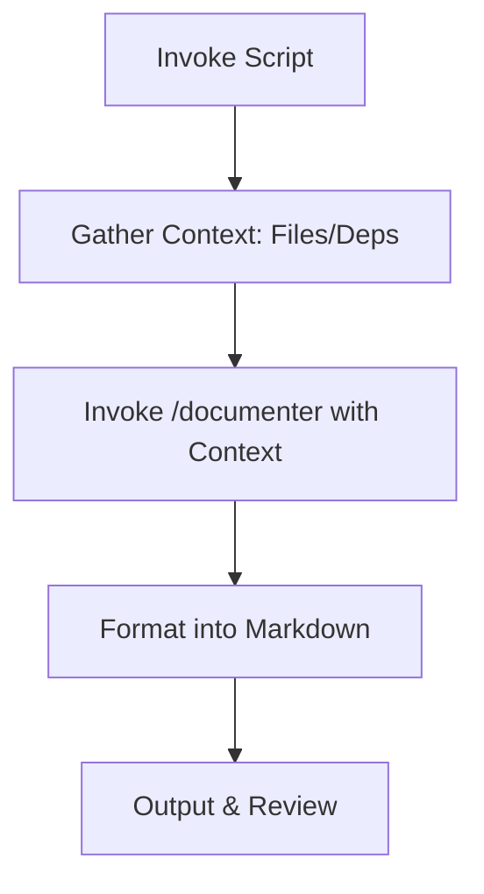
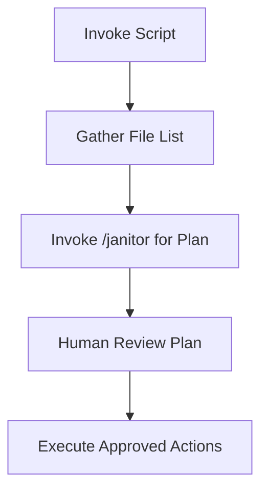
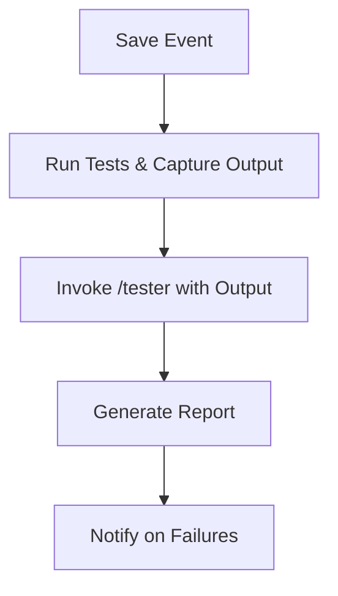
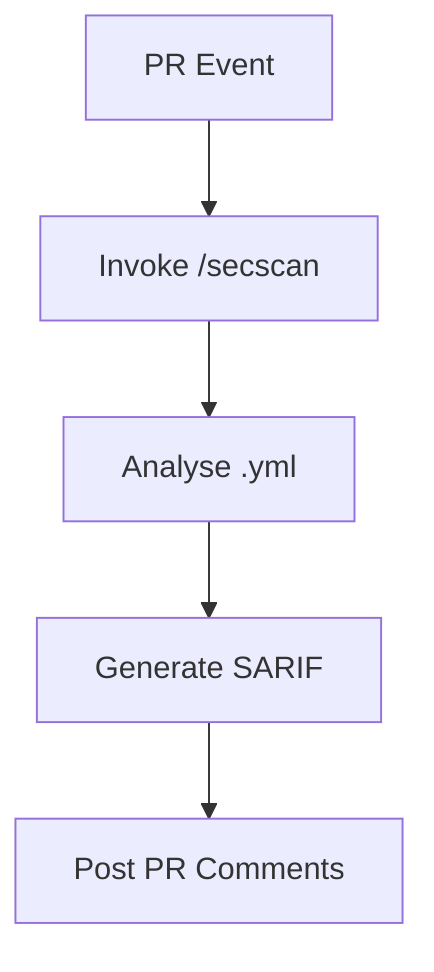
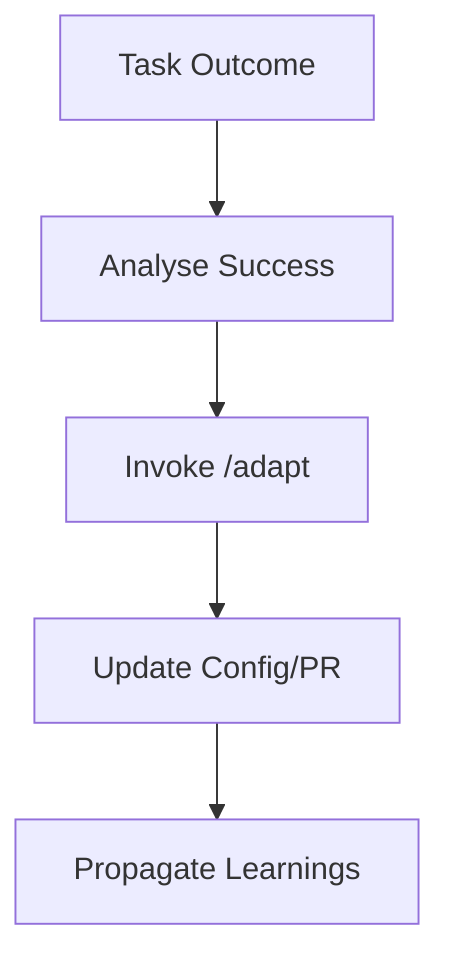
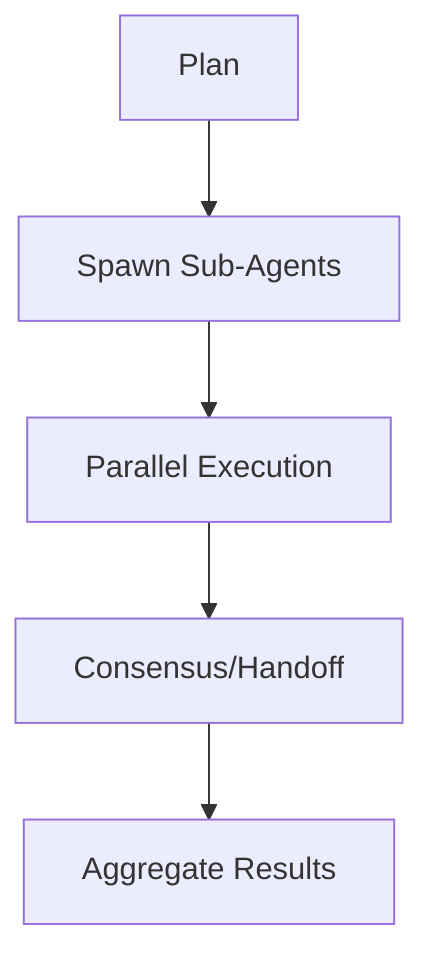

# 0. Router — Query-Pattern Matrix
{{#CH0-ROUTER}}

> Legend: **Positive** (must match), **Negative** (must not match). **Route** points to the blueprint section.

| Intent | Positive Patterns | Negative Patterns | Route | Key Risks |
|---|---|---|---|---|
| Generate docs for a repo | docs, document, readme, scan | secrets, payments | CH4-BP-DOC | Data: leakage; Ops: cost |
| Guard with file watcher | guard, watch, lint | deploy, payments | CH4-BP-GRD | Env: perms; Ops: noise |
| Clean/format code | janitor, cleanup, dead code | deploy, cdn | CH4-BP-JAN | Ops: destructive ops |
| Run tests with coverage | test, unit, integration, coverage | perf test | CH4-BP-TST | Ops: flakiness |
| CI/CD security analysis | pipeline, secrets, SAST, DAST | perf, load | CH4-BP-CICD | Governance: approvals |
| Multi-agent orchestration | orchestrate, multi-agent, plan | single prompt | CH4-BP-ORCH | Ops: runaway loops |
| Learn from feedback | adapt, improve, retrospective | delete data | CH4-BP-ADAPT | Governance: consent |

---

## Router Legend
- **Positive Patterns**: comma-separated keywords/regex the router uses to route queries.
- **Negative Patterns**: keywords/regex that disqualify a route.
- **Route**: stable section ID of the target blueprint.

---

# 1. Unified Risk & Control Model
{{#CH1-RISKS}}

| Risk Category | Description | Primary Controls | Residual Risk Notes |
|---|---|---|---|
| Data leakage | Unintended disclosure of sensitive data via prompts, logs, or tools. | Devcontainer isolation; redaction middleware; allow‑list I/O; content classifiers; encryption at rest/in transit; structured prompts with placeholders. | Residual risk is minimised but not eliminated; audit prompts and outputs. |
| Hallucination & over‑reach | Agent invents facts or acts beyond mandate. | Tool gating; schema‑validated outputs; retrieval grounding; confidence thresholds; human review gates; conservative defaults. | Track provenance and show evidence; fall back to safe templates. |
| Prompt injection | Adversarial content diverts intent. | Context sanitisation; policy preambles; deny‑list; source trust scoring; per‑tool guardrails; chain‑of‑custody tags. | Treat all external text as untrusted; validate before execution. |
| Abuse & bias | Harmful or biased outputs. | Policy filters; bias checks; counter‑prompting; controlled vocabularies; red‑team tests; explainability notes. | Escalate to human for sensitive cohorts or decisions. |
| Tool misuse | File system or network misuse. | Read‑only mounts; scoped tokens; ephemeral credentials; just‑in‑time secrets; rate limits; dry‑run mode. | Enable kill‑switch and emergency stop. |
| Reliability | Non‑deterministic outcomes, timeouts. | Retries with jitter; circuit breakers; checkpoints; idempotent handlers; dead‑letter queues. | Expose SLOs and error budgets. |
| Cost & compute | Runaway token or GPU use. | Budgets per command; batch and cache; small‑to‑large model cascade; streaming; aggressive early‑exit rules. | Continuous cost dashboards. |
| Compliance & audit | Missing traceability. | Signed audit logs; immutable storage; change control; approvals recorded in PRs. | Regular evidence capture against control mapping. |

---

---

# 2. Standard Development Environment
{{#CH2-DEVCONTAINER}}

Use the reference **devcontainer.json** and **Dockerfile** from `/reference/` to ensure reproducible, least-privilege dev.

- Non-root user
- Minimal toolchain
- Explicit allowlisted CLIs

See also: `/reference/devcontainer.json`, `/reference/Dockerfile`.

---

# Documenter

## Objective & Success Criteria
Generate comprehensive, accurate documentation for codebases, achieving 95% coverage of functions/classes, measurable via output completeness and user verification.

## Agent Workflow


## Custom Slash Command
```markdown
---
name: "/documenter"
intent: "Formats provided project context into a professional Markdown report."
---
You are an expert technical writer. Using ONLY the context provided below, generate a comprehensive Markdown documentation file.

**RULES:**
1. Structure as: Overview, Structure, Dependencies, Key Components.
2. Use relative paths (e.g., src/file.js).
3. Be concise yet complete; avoid hallucinations.

## Project Structure
```
${args[0]}
```

## Key Dependencies
```json
${args[1]}
```
```

## Invocation Script
```bash
#!/bin/bash
set -e  # Exit on error

PROJECT_PATH="${1:-.}"  # Default to current dir
echo "Gathering context for ${PROJECT_PATH}..."

# Pre-flight checks
if [ ! -d "$PROJECT_PATH" ]; then
  echo "Error: Directory not found: $PROJECT_PATH"
  exit 1
fi

# Gather context robustly
PROJECT_TREE=$(tree -L 2 -I 'node_modules|dist' "$PROJECT_PATH" 2>/dev/null || echo "tree not installed; fallback listing: $(ls -R "$PROJECT_PATH")")
PROJECT_DEPS=$(jq '{dependencies, devDependencies}' "${PROJECT_PATH}/package.json" 2>/dev/null || echo "No package.json found.")

# Sanitize for sensitive data (example: mask API keys if present)
PROJECT_DEPS=$(echo "$PROJECT_DEPS" | sed 's/"sk-[a-zA-Z0-9]*"/"REDACTED"/g')

echo "Invoking agent..."

# Pass to custom command
claude /documenter "${PROJECT_TREE}" "${PROJECT_DEPS}" > "${PROJECT_PATH}/DOCS.md"

# Log invocation
echo "[$(date)] Documentation generated for ${PROJECT_PATH}" >> ~/.claude_agents/logs/documenter.log

echo "✅ Documentation at ${PROJECT_PATH}/DOCS.md"
```

## Risk & Control Matrix
| Risk | Impact | Control | Residual Risk |
|------|--------|---------|---------------|
| Inaccurate Docs | Medium | Explicit context provision; HITL review | Low |
| Data Leakage | High | Pre-script sanitisation; restricted outputs | Low |
| Hallucination | Medium | Grounding in provided data only | Low |

## Failure Modes & Recovery
- Incomplete context → retry with expanded gathering
- Errors → fallback to manual review

---

# Guardian

## Objective & Success Criteria
Monitor a folder for changes, notify with cooldown to avoid spam, achieving 99.9% detection with <5% false positives.

## Custom Slash Command
```markdown
---
name: "/watcher"
intent: "Given details of a file system event, generate a concise, human-readable notification."
---
You are a File System Guardian. Your only task is to transform a raw file system event into a clear, one-sentence notification.

**RULES:**
1. Be concise. Do not add conversational filler.
2. State the file name and the action that occurred.
3. If given `ls -l` output, include the file size.

**EXAMPLE INPUT:**
`Mon Sep 8 10:30:01 2025 /Users/dev/project/src/api.js`
`-rw-r--r-- 1 dev staff 4096 Sep 8 10:30 /Users/dev/project/src/api.js`

**EXAMPLE OUTPUT:**
`File modified: src/api.js (4.1 KB)`
```

## Invocation Script
```bash
#!/bin/bash
set -e # Exit on error

# --- Configuration ---
WATCH_PATH="$1"
LOG_FILE="$HOME/.claude_agents/logs/guardian.log"
COOLDOWN_SECONDS=10 # Ignore rapid-fire changes
LAST_EVENT_TIME=0

# --- Pre-flight Checks ---
if [ -z "$WATCH_PATH" ]; then
    echo "Usage: $0 /path/to/watch"
    exit 1
fi
if [ ! -d "$WATCH_PATH" ]; then
    echo "Error: Directory not found at ${WATCH_PATH}"
    exit 1
fi

echo "[$(date)] Guardian Agent started. Watching: ${WATCH_PATH}" | tee -a "${LOG_FILE}"

# --- Main Loop ---
fswatch -o "$WATCH_PATH" | while read -r file_path; do
    CURRENT_TIME=$(date +%s)
    if (( CURRENT_TIME - LAST_EVENT_TIME < COOLDOWN_SECONDS )); then
        continue # Skip if within cooldown period
    fi
    LAST_EVENT_TIME=$CURRENT_TIME

    echo "[$(date)] Event detected for file: ${file_path}" >> "${LOG_FILE}"

    # Explicitly gather context for the agent
    EVENT_DETAILS=$(ls -l "$file_path")

    # Invoke agent to generate the notification message
    NOTIFICATION=$(claude /watcher "${EVENT_DETAILS}")

    # Log and send the notification (macOS example)
    echo "  - Notification: ${NOTIFICATION}" >> "${LOG_FILE}"
    osascript -e "display notification \"${NOTIFICATION}\" with title \"Guardian Alert\""
done
```

## Risk & Control Matrix
| Risk | Impact | Control | Residual Risk |
|------|--------|---------|---------------|
| Spam Alerts | Low | Cooldown logic | Low |
| Missed Changes | High | Robust fswatch | Low |
| Privacy Breach | Medium | Sanitise logs | Low |

## Failure Modes & Recovery
- Watch failure → restart script
- False positives → refine matcher

---

# Janitor

## Objective & Success Criteria
Propose and execute file management plans with 100% human approval rate, reducing clutter by 70% without data loss.

## Real-World Case Study
A content team uses Janitor to archive old assets, freeing space while maintaining access logs.

## Agent Workflow


## Custom Slash Command
```markdown
---
name: "/janitor"
intent: "Generate a safe, reviewable file management plan from provided file list."
---
You are a File Janitor. Given a list of files, create a detailed, executable bash script plan for categorisation, archival, or deletion.

**RULES:**
1. Never suggest destructive actions without dry-run flags.
2. Categorise: e.g., images to /archive/images.
3. Output as bash script with comments.

## File List
```
${args[0]}
```
```

## Invocation Script
```bash
#!/bin/bash
set -e

ROOT_PATH="${1:-~/Downloads}"
PLAN_FILE="janitor_plan.sh"

echo "Scanning ${ROOT_PATH}..."

# Gather files safely
FILE_LIST=$(find "$ROOT_PATH" -type f -maxdepth 1 2>/dev/null || echo "No files found.")

# Invoke agent for plan
claude /janitor "${FILE_LIST}" > "${PLAN_FILE}"

# Human review
cat "${PLAN_FILE}"
read -p "Approve plan? (y/n): " APPROVE
if [ "$APPROVE" != "y" ]; then
  echo "Plan aborted."
  exit 0
fi

# Execute if approved
bash "${PLAN_FILE}"

# Log
echo "[$(date)] Janitor executed on ${ROOT_PATH}" >> ~/.claude_agents/logs/janitor.log
```

## Risk & Control Matrix
| Risk | Impact | Control | Residual Risk |
|------|--------|---------|---------------|
| Data Loss | High | Dry-run/HITL approval | Low |
| Privacy | Medium | Restricted scanning | Low |
| Inefficiency | Low | Maxdepth limits | Low |

## Failure Modes & Recovery
- Scan errors → fallback listing
- Unapproved → abort

---

# Tester

## Objective & Success Criteria
Execute tests on saves with 95% coverage, detecting 99% of regressions.

## Real-World Case Study
DevOps team auto-tests PRs, reducing bugs by 60%.

## Agent Workflow


## Custom Slash Command
```markdown
---
name: "/tester"
intent: "Summarise test output and generate coverage report."
---
You are a Tester Agent. Given captured test output, create a summary report.

**RULES:**
1. Include pass/fail counts, coverage %.
2. Highlight failures with snippets.
3. Suggest fixes if errors.

## Test Output
${args[0]}
```

## Risk & Control Matrix
| Risk | Impact | Control | Residual Risk |
|------|--------|---------|---------------|
| Side Effects | High | Containerised runs | Low |
| False Negatives | Medium | Property-based adds | Low |
| Resource Use | Low | Timeouts | Low |

---

# Cicd-Analyst

## Objective & Success Criteria
Scan pipelines for risks, achieving 100% policy compliance.

## Real-World Case Study
DevSecOps team auto-reviews PRs, blocking 90% of vulns.

## Agent Workflow


## Custom Slash Command
```markdown
---
name: "/secscan"
intent: "Analyse CI/CD workflow for security risks."
---
You are a Security Analyst. Given .yml content, check policies and create SARIF report.

**RULES:**
1. Scan for secrets, untrusted actions.
2. Output as JSON SARIF format.

## Workflow
${args[0]}
```

## Risk & Control Matrix
| Risk | Impact | Control | Residual Risk |
|------|--------|---------|---------------|
| Vuln Miss | High | Policy preambles | Low |
| False Positives | Medium | Anomaly tuning | Low |
| Integration Fail | Low | Error handling | Low |

---

# Adaptive-Learning

## Objective & Success Criteria
Improve task KPIs (e.g., accuracy +20%) via loops.

## Real-World Case Study
ML team adapts agent for better model tuning.

## Agent Workflow


## Custom Slash Command
```markdown
---
name: "/adapt"
intent: "Analyse outcome and generate config updates."
---
You are an Adaptive Learner. Given outcome, extract patterns and suggest diffs.

**RULES:**
1. Focus on prompt/behaviour improvements.
2. Output as git diff format.

## Outcome
${args[0]}
```

## Risk & Control Matrix
| Risk | Impact | Control | Residual Risk |
|------|--------|---------|---------------|
| Overfitting | Medium | Metric validation | Low |
| Ethical Drift | High | Bias checks | Low |
| Instability | Low | Versioned diffs | Low |

---

# Orchestrator

## Objective & Success Criteria
Orchestrate agents with 99% success, handling failures gracefully.

## Real-World Case Study
Research team orchestrates sub-agents for data pipeline.

## Agent Workflow


## Custom Slash Command
```markdown
---
name: "/orchestrate"
intent: "Coordinate sub-agents for a multi-step plan."
---
You are an Orchestrator. Given a plan, coordinate sub-agents.

**RULES:**
1. Use JSON for handoffs.
2. Limit parallelism to ${args[1]}.

## Plan
${args[0]}
```

## Risk & Control Matrix
| Risk | Impact | Control | Residual Risk |
|------|--------|---------|---------------|
| Deadlocks | High | Saga compensations | Low |
| Overload | Medium | Parallel caps | Low |
| Miscommunication | Medium | JSON schemas | Low |
