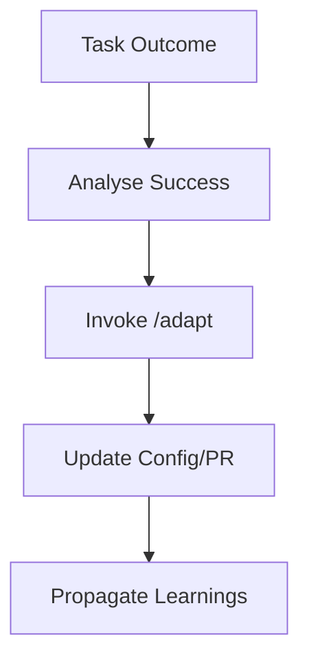

# Adaptive-Learning

## Objective & Success Criteria
Improve task KPIs (e.g., accuracy +20%) via loops.

## Real-World Case Study
ML team adapts agent for better model tuning.

## Agent Workflow


## Custom Slash Command
```markdown
---
name: "/adapt"
intent: "Analyse outcome and generate config updates."
---
You are an Adaptive Learner. Given outcome, extract patterns and suggest diffs.

**RULES:**
1. Focus on prompt/behaviour improvements.
2. Output as git diff format.

## Outcome
${args[0]}
```

## Risk & Control Matrix
| Risk | Impact | Control | Residual Risk |
|------|--------|---------|---------------|
| Overfitting | Medium | Metric validation | Low |
| Ethical Drift | High | Bias checks | Low |
| Instability | Low | Versioned diffs | Low |
