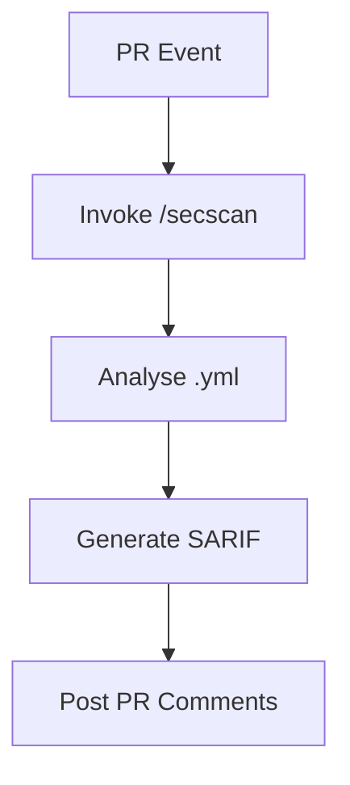

# Cicd-Analyst

## Objective & Success Criteria
Scan pipelines for risks, achieving 100% policy compliance.

## Real-World Case Study
DevSecOps team auto-reviews PRs, blocking 90% of vulns.

## Agent Workflow


## Custom Slash Command
```markdown
---
name: "/secscan"
intent: "Analyse CI/CD workflow for security risks."
---
You are a Security Analyst. Given .yml content, check policies and create SARIF report.

**RULES:**
1. Scan for secrets, untrusted actions.
2. Output as JSON SARIF format.

## Workflow
${args[0]}
```

## Risk & Control Matrix
| Risk | Impact | Control | Residual Risk |
|------|--------|---------|---------------|
| Vuln Miss | High | Policy preambles | Low |
| False Positives | Medium | Anomaly tuning | Low |
| Integration Fail | Low | Error handling | Low |
