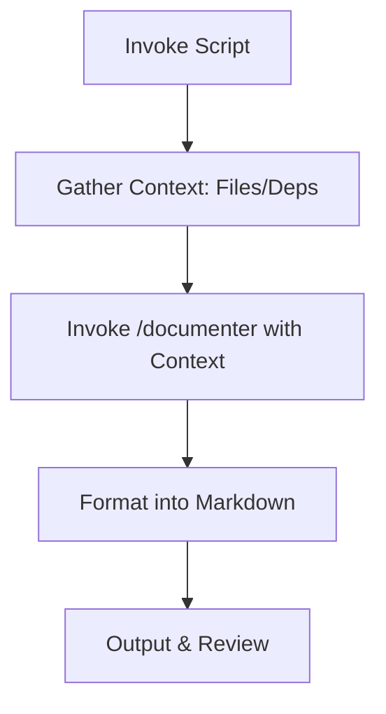

# Documenter

## Objective & Success Criteria
Generate comprehensive, accurate documentation for codebases, achieving 95% coverage of functions/classes, measurable via output completeness and user verification.

## Agent Workflow


## Custom Slash Command
```markdown
---
name: "/documenter"
intent: "Formats provided project context into a professional Markdown report."
---
You are an expert technical writer. Using ONLY the context provided below, generate a comprehensive Markdown documentation file.

**RULES:**
1. Structure as: Overview, Structure, Dependencies, Key Components.
2. Use relative paths (e.g., src/file.js).
3. Be concise yet complete; avoid hallucinations.

## Project Structure
```
${args[0]}
```

## Key Dependencies
```json
${args[1]}
```
```

## Invocation Script
```bash
#!/bin/bash
set -e  # Exit on error

PROJECT_PATH="${1:-.}"  # Default to current dir
echo "Gathering context for ${PROJECT_PATH}..."

# Pre-flight checks
if [ ! -d "$PROJECT_PATH" ]; then
  echo "Error: Directory not found: $PROJECT_PATH"
  exit 1
fi

# Gather context robustly
PROJECT_TREE=$(tree -L 2 -I 'node_modules|dist' "$PROJECT_PATH" 2>/dev/null || echo "tree not installed; fallback listing: $(ls -R "$PROJECT_PATH")")
PROJECT_DEPS=$(jq '{dependencies, devDependencies}' "${PROJECT_PATH}/package.json" 2>/dev/null || echo "No package.json found.")

# Sanitize for sensitive data (example: mask API keys if present)
PROJECT_DEPS=$(echo "$PROJECT_DEPS" | sed 's/"sk-[a-zA-Z0-9]*"/"REDACTED"/g')

echo "Invoking agent..."

# Pass to custom command
claude /documenter "${PROJECT_TREE}" "${PROJECT_DEPS}" > "${PROJECT_PATH}/DOCS.md"

# Log invocation
echo "[$(date)] Documentation generated for ${PROJECT_PATH}" >> ~/.claude_agents/logs/documenter.log

echo "✅ Documentation at ${PROJECT_PATH}/DOCS.md"
```

## Risk & Control Matrix
| Risk | Impact | Control | Residual Risk |
|------|--------|---------|---------------|
| Inaccurate Docs | Medium | Explicit context provision; HITL review | Low |
| Data Leakage | High | Pre-script sanitisation; restricted outputs | Low |
| Hallucination | Medium | Grounding in provided data only | Low |

## Failure Modes & Recovery
- Incomplete context → retry with expanded gathering
- Errors → fallback to manual review
