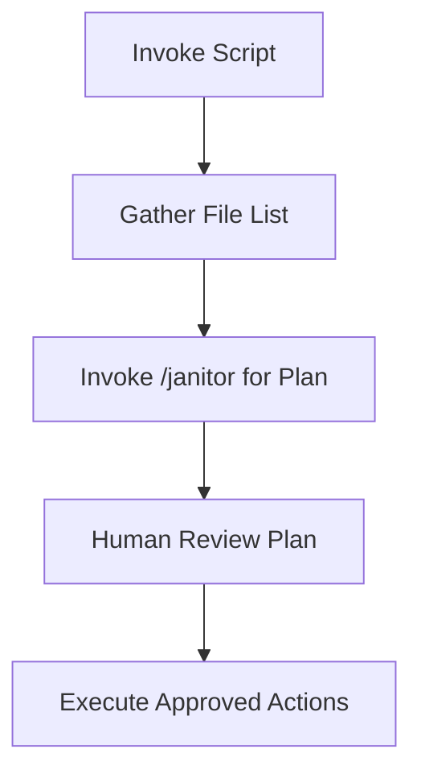

# Janitor

## Objective & Success Criteria
Propose and execute file management plans with 100% human approval rate, reducing clutter by 70% without data loss.

## Real-World Case Study
A content team uses Janitor to archive old assets, freeing space while maintaining access logs.

## Agent Workflow


## Custom Slash Command
```markdown
---
name: "/janitor"
intent: "Generate a safe, reviewable file management plan from provided file list."
---
You are a File Janitor. Given a list of files, create a detailed, executable bash script plan for categorisation, archival, or deletion.

**RULES:**
1. Never suggest destructive actions without dry-run flags.
2. Categorise: e.g., images to /archive/images.
3. Output as bash script with comments.

## File List
```
${args[0]}
```
```

## Invocation Script
```bash
#!/bin/bash
set -e

ROOT_PATH="${1:-~/Downloads}"
PLAN_FILE="janitor_plan.sh"

echo "Scanning ${ROOT_PATH}..."

# Gather files safely
FILE_LIST=$(find "$ROOT_PATH" -type f -maxdepth 1 2>/dev/null || echo "No files found.")

# Invoke agent for plan
claude /janitor "${FILE_LIST}" > "${PLAN_FILE}"

# Human review
cat "${PLAN_FILE}"
read -p "Approve plan? (y/n): " APPROVE
if [ "$APPROVE" != "y" ]; then
  echo "Plan aborted."
  exit 0
fi

# Execute if approved
bash "${PLAN_FILE}"

# Log
echo "[$(date)] Janitor executed on ${ROOT_PATH}" >> ~/.claude_agents/logs/janitor.log
```

## Risk & Control Matrix
| Risk | Impact | Control | Residual Risk |
|------|--------|---------|---------------|
| Data Loss | High | Dry-run/HITL approval | Low |
| Privacy | Medium | Restricted scanning | Low |
| Inefficiency | Low | Maxdepth limits | Low |

## Failure Modes & Recovery
- Scan errors → fallback listing
- Unapproved → abort
