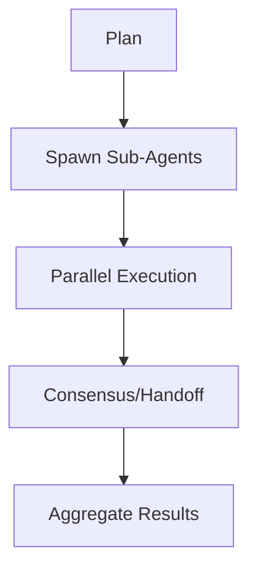

# Orchestrator

## Objective & Success Criteria
Orchestrate agents with 99% success, handling failures gracefully.

## Real-World Case Study
Research team orchestrates sub-agents for data pipeline.

## Agent Workflow


## Custom Slash Command
```markdown
---
name: "/orchestrate"
intent: "Coordinate sub-agents for a multi-step plan."
---
You are an Orchestrator. Given a plan, coordinate sub-agents.

**RULES:**
1. Use JSON for handoffs.
2. Limit parallelism to ${args[1]}.

## Plan
${args[0]}
```

## Risk & Control Matrix
| Risk | Impact | Control | Residual Risk |
|------|--------|---------|---------------|
| Deadlocks | High | Saga compensations | Low |
| Overload | Medium | Parallel caps | Low |
| Miscommunication | Medium | JSON schemas | Low |
