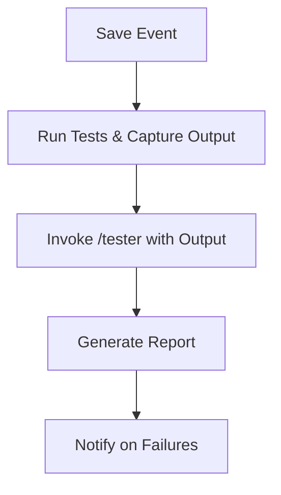

# Tester

## Objective & Success Criteria
Execute tests on saves with 95% coverage, detecting 99% of regressions.

## Real-World Case Study
DevOps team auto-tests PRs, reducing bugs by 60%.

## Agent Workflow


## Custom Slash Command
```markdown
---
name: "/tester"
intent: "Summarise test output and generate coverage report."
---
You are a Tester Agent. Given captured test output, create a summary report.

**RULES:**
1. Include pass/fail counts, coverage %.
2. Highlight failures with snippets.
3. Suggest fixes if errors.

## Test Output
${args[0]}
```

## Risk & Control Matrix
| Risk | Impact | Control | Residual Risk |
|------|--------|---------|---------------|
| Side Effects | High | Containerised runs | Low |
| False Negatives | Medium | Property-based adds | Low |
| Resource Use | Low | Timeouts | Low |
