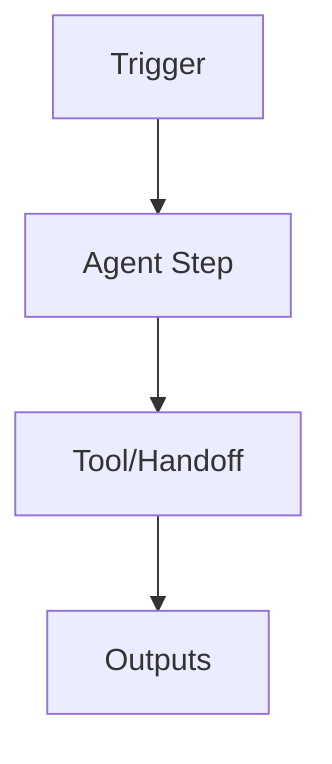

## 0.4 Agent Query Index (Router) {{#CH0-ROUTER}}

**Legend**
- **Positive Patterns**: Any of these tokens in the user query is considered a *match signal*.
- **Negative Patterns**: Presence of any of these tokens *excludes* the row even if positives match.
- **Tie‑break**: If multiple rows match, prefer the one with the *most* positive matches; on ties, choose the row with a more specific Blueprint (BP-*).
- **Fallback**: If nothing matches, route to §I (Foundations) and ask a clarifying question.
- **Risk hinting**: The Gem should surface the listed **Key Risks** rows from §0.2 when answering.


> Deterministic routing matrix for the Gem. Match user intent against **Positive Patterns**; avoid **Negative Patterns** when present. Each row maps to a chapter/blueprint and a suggested quick action.

| Intent | Positive Patterns (any) | Negative Patterns | Chapter → Section | Blueprint | Quick Action | Key Risks |
|---|---|---|---|---|---|---|
| Generate documentation from a repo | `docs`, `readme`, `summarise`, `documentation` | `test`, `pipeline` | §IV → BP-DOC | BP-DOC | `/orchestrate --bp doc` | Data, Ops |
| Watch a folder and lint/guard | `watch`, `file watcher`, `lint`, `guard`, `monitor` | `deploy`, `scan container` | §IV → BP-GUA | BP-GUA | `/orchestrate --bp guard` | Env, Ops |
| Cleanup repo hygiene | `cleanup`, `janitor`, `dead code`, `format` | `security scan`, `ci/cd` | §IV → BP-JAN | BP-JAN | `/orchestrate --bp janitor` | Ops |
| Automated testing | `test`, `unit`, `integration`, `coverage` | `docs`, `generate documentation` | §IV → BP-TST | BP-TST | `/orchestrate --bp test` | Ops |
| CI/CD security analysis | `pipeline`, `ci/cd`, `sast`, `dast`, `secrets scan` | `doc`, `readme` | §IV → BP-CICD | BP-CICD | `/orchestrate --bp cicd` | Gov, Data, Ops |
| Adaptive learning/self-tuning | `feedback`, `self-improve`, `adapt`, `retrospective` | `deploy`, `prod push` | §IV → BP-ADAPT | BP-ADAPT | `/adapt --target ssot` | Gov, Ops |
| Multi-agent orchestration | `plan`, `handoff`, `multi agent`, `workflow`, `orchestrate` | `single step`, `quick fix` | §IV → BP-ORCH | BP-ORCH | `/orchestrate --bp orchestrator` | Gov, Env, Ops |

---

## 0.2 Unified Risk & Control Model {{#CH0-RISKS}}

> Four-pillar governance with explicit **Severity** and **Mitigation** scales. Apply globally and augment with each blueprint's local matrix.

**Severity scale:** 1 (Low) · 2 (Moderate) · 3 (High) · 4 (Critical)  
**Mitigation scale:** A (Advisory) · B (Preventive) · C (Detective) · D (Compensating)

| Pillar | Control (Minimum Standard) | Diagnostic Question | Evidence | Severity (1–4) | Mitigation (A–D) |
|---|---|---|---|---:|:---:|
| Governance | Documented decision rights & HITL approvals | Are approval thresholds defined and enforced for risky actions? | Signed runbooks, approval logs | 3 | B |
| Environment | Least-privilege, sandboxed devcontainer | Does execution occur in a constrained, reproducible environment? | `devcontainer.json`, container policy | 2 | B |
| Data | PII/Secrets handling and redaction | Are inputs/outputs scanned/filtered for sensitive data? | Secrets scan reports, data maps | 4 | B |
| Operations | Observability & provenance | Can we reconstruct actions with evidence and trace IDs? | JSONL logs, trace context | 3 | C |

> For any recommendation, the Gem should surface the relevant rows and request approvals when Severity ≥ 3 and Mitigation ∈ {B, D}.

---

### Standard Development Environment (sourced: Chat1_ _Claude Code_ Agent Blueprints, Patterns & Reference Manual_ version_ 1.md)

ing, and governing agentic systems using Claude Code within a unified, secure **Devcontainer** environment. It is written to function as a timeless reference for general agentic architecture: the blueprints, patterns, and controls herein are transferable to other frameworks and LLMs.

**Design Tenets (evergreen):** modularity, least‑privilege security, explicit orchestration, deterministic boundaries, observability‑first, human‑in‑the‑loop escalation, testability, idempotency, and resource efficiency.

## **High‑Level Risk & Control Overview (Whole‑of‑Framework)**

| Risk Category | Description | Primary Controls | Residual Risk Notes |
| ----- | ----- | ----- | ----- |
| Data leakage | Unintended disclosure of sensitive data via prompts, logs, or tools. | Devcontainer isolation; redaction middleware; allow‑list I/O; content classifiers; encryption at rest/in transit; structured prompts with placeholders. | Residual risk is minimised but not eliminated; audit prompts and outputs. |
| Hallucination & over‑reach | Agent invents facts or acts beyond mandate. | Tool gating; schema‑validated outputs; retrieval grounding; confidence thresholds; human review gates; conservative defaults. | Track provenance and show evidence; fall back to safe templates. |
| Prompt injection | Adversarial content diverts intent. | Context sanitisation; policy preambles; deny‑list; source trust scoring; per‑tool guardrails; chain‑of‑custody tags. | Treat all external text as untrusted; validate before execution. |
| Abuse & bias | Harmful or biased outputs. | Policy filters; bias checks; counter‑prompting; controlled vocabularies; red‑team tests; explainability notes. | Escalate to human for sensitive cohorts or decisions. |
| Tool misuse | File system or network misuse. | Read‑only mounts; scoped tokens; ephemeral credentials; just‑in‑time secrets; rate limits; dry‑run mode. | Enable kill‑switch and emergency stop. |
| Reliability | Non‑deterministic outcomes, timeouts. | Retries with jitter; circuit breakers; checkpoints; idempotent handlers; dead‑letter queues. | Expose SLOs and error budgets. |
| Cost & compute | Runaway token or GPU use. | Budgets per command; batch and cache; small‑to‑large model cascade; streaming; aggressive early‑exit rules. | Continuous cost dashboards. |
| Compliance & audit | Missing traceability. | Signed audit logs; immutable storage; change control; approvals recorded in PRs. | Regular evidence capture against control mapping. |

## **Agent Query Index (for fast RAG)**

| Question | Where to look |
| :---- | :---- |
| “How do I standardise

---

### BP-ORCH — Multi-Agent Orchestrator {#CH4-BP-ORCH}

**ID:** BP-ORCH  
**Name:** Multi-Agent Orchestrator

**Objective & Success Criteria**  
- …

**Real-World Case Study**  
- …

**Agent Workflow (Mermaid):**


**Inputs / Outputs / Tools**  
- …

**Slash Command:**
```yaml
command: "/orchestrate"
args:
  - name: target
    type: string
examples:
  - "/orchestrate --target repo"
```

**Invocation Script (shell):**
```bash
#!/usr/bin/env bash
set -euo pipefail
# ...
```

**JSON Contract / Handoff:**
```json
{"task_id":"...", "role":"...", "artifacts":[{"name":"...","path":"..."}], "evidence":["..."], "status":"planned"}
```

**Risk & Control Matrix (Local)**  
- …

**Failure Modes & Recovery**  
- …

**Ethical Considerations**  
- …

**Telemetry & KPIs**  
- *Tasks planned/executed* and *success rate*  
- *Handoff latency* (mean/p95) and *retries*  
- *Dead‑letter queue size* and *SLA compliance* (%)  
- *Approvals requested/granted* (HITL)  
**Alerting thresholds**: success < 95%, DLQ > 10, p95 latency > 30s.

**Verification Steps (Smoke Tests)**  
- …


---

> **Sourced excerpt from:** Chat1_ _Claude Code_ Agent Blueprints, Patterns & Reference Manual_ version_ 1.md

gent**. |
| “How do multiple agents collaborate safely?” | **Ch.8 – Multi‑Agent Orchestrator**. |
| “What pattern should I apply?” | **Ch.9 – Patterns Summary & decision trees**. |
| “CLI, tools, extensions, or config details?” | **Ch.10–13 – Reference Manual**. |

---

# **Part A: Agent Blueprints & Patterns: Practical Recipes**

Each chapter in Part A provides a **Gold Standard Blueprint** with:

* **Objective & Success Criteria**  
* **Real‑World Case Study**  
* **Agent Workflow Diagram** (Mermaid)  
* **Custom Slash Command (`.md`)** – version‑controlled agent logic  
* **Invocation Script (`.sh`)** – copy‑paste execution with audit logging  
* **Prompt Adaptation Template**  
* **Risk & Control Matrix**  
* **Ethical Considerations**  
* **Failure Modes & Recovery**

All blueprints assume the **Unified Security Model**: run inside the official **Devcontainer** and enforce least‑privilege, reproducible environments.

---

## **Chapter 1: The Standard Development Environment**

### **1.1 The Recommended Architecture: Why We Use Devcontainers**

**Rationale:** Devcontainers deliver consistent, reproducible, isolated workspaces with explicit dependencies, non‑root execution, read‑only mounts, and policy‑controlled secrets. This eliminates “works on my machine” drift, hardens supply chains, and simplifies onboarding, testing, and audit.

**Properties:**

* Immutable base image; locked package versions; SBOM generated.  
* Non‑root user; granular Linux capabilities; read‑only project mount with writable temp workdir.  
* Secret injection via environment providers; short‑lived tokens; no secrets in git.  
* Observability baked in (stdout/stderr structured JSON logging; OpenTelemetry exporter).  
* Predictable **Claude Code** CLI toolchain preinstalled; tools gated by wrappers with allow‑lists.

### **1.2 Setting Up Your First Devcontainer for Claude Code**

**Files:** Place in repository root.

**`devcontainer.json`**

{  
"name": "claude-code-secure",  
"image": "ghcr.io/org/claude-code:stable",  
"runArgs": \["--cap-drop=ALL", "--pids-limit=512"\],  
"containerUser": "dev",  
"remoteUser": "dev",  
"mounts": \[  
"source=${localWorkspaceFolder},target=/workspace,type=bind,consistency=cached,readonly",  
"source=cc\_tmp,target=/tmp,volume"  
\],  
"features": {},  
"postCreateCommand": "bash .devcontainer/post-create.sh",  
"customizations": {  
"vscode": {  
"extensions": \[  
"ms-vscode.azure-repos",  
"ms-azuretools.vscode-docker"  
\]  
}  
}  
}

**`Dockerfile`**

FROM ubuntu:22.04  
ENV DEBIAN\_FRONTEND=noninteractive  
RUN apt-get update &

> **Reference:** [`orchestrator_handoff.schema.json`](./reference/orchestrator_handoff.schema.json) · [`orchestrator_handoff.example.json`](./reference/orchestrator_handoff.example.json)

---

### BP-CICD — CI/CD Security Analyst {#CH4-BP-CICD}

**ID:** BP-CICD  
**Name:** CI/CD Security Analyst

**Objective & Success Criteria**  
- …

**Real-World Case Study**  
- …

**Agent Workflow (Mermaid):**


**Inputs / Outputs / Tools**  
- …

**Slash Command:**
```yaml
command: "/cicd"
args:
  - name: target
    type: string
examples:
  - "/cicd --target repo"
```

**Invocation Script (shell):**
```bash
#!/usr/bin/env bash
set -euo pipefail
# ...
```

**JSON Contract / Handoff:**
```json
{"task_id":"...", "role":"...", "artifacts":[{"name":"...","path":"..."}], "evidence":["..."], "status":"planned"}
```

**Risk & Control Matrix (Local)**  
- …

**Failure Modes & Recovery**  
- …

**Ethical Considerations**  
- …

**Telemetry & KPIs**  
- *Secrets detected* (by type) and block rate  
- *SAST issues* by severity (open/closed)  
- *DAST findings* and *false positive %*  
- *MTTR* for High/Critical vulns and approval overrides  
**Alerting thresholds**: any Critical open > 24h, FP% > 15%.

**Verification Steps (Smoke Tests)**  
- …


---

> **Sourced excerpt from:** Chat1_ _Claude Code_ Agent Blueprints, Patterns & Reference Manual_ version_ 1.md

Ch.5 – Automated Tester**. |
| “How do I enforce security in CI/CD?” | **Ch.6 – CI/CD Security Analyst**. |
| “How can an agent improve itself with feedback?” | **Ch.7 – Adaptive Learning Agent**. |
| “How do multiple agents collaborate safely?” | **Ch.8 – Multi‑Agent Orchestrator**. |
| “What pattern should I apply?” | **Ch.9 – Patterns Summary & decision trees**. |
| “CLI, tools, extensions, or config details?” | **Ch.10–13 – Reference Manual**. |

---

# **Part A: Agent Blueprints & Patterns: Practical Recipes**

Each chapter in Part A provides a **Gold Standard Blueprint** with:

* **Objective & Success Criteria**  
* **Real‑World Case Study**  
* **Agent Workflow Diagram** (Mermaid)  
* **Custom Slash Command (`.md`)** – version‑controlled agent logic  
* **Invocation Script (`.sh`)** – copy‑paste execution with audit logging  
* **Prompt Adaptation Template**  
* **Risk & Control Matrix**  
* **Ethical Considerations**  
* **Failure Modes & Recovery**

All blueprints assume the **Unified Security Model**: run inside the official **Devcontainer** and enforce least‑privilege, reproducible environments.

---

## **Chapter 1: The Standard Development Environment**

### **1.1 The Recommended Architecture: Why We Use Devcontainers**

**Rationale:** Devcontainers deliver consistent, reproducible, isolated workspaces with explicit dependencies, non‑root execution, read‑only mounts, and policy‑controlled secrets. This eliminates “works on my machine” drift, hardens supply chains, and simplifies onboarding, testing, and audit.

**Properties:**

* Immutable base image; locked package versions; SBOM generated.  
* Non‑root user; granular Linux capabilities; read‑only project mount with writable temp workdir.  
* Secret injection via environment providers; short‑lived tokens; no secrets in git.  
* Observability baked in (stdout/stderr structured JSON logging; OpenTelemetry exporter).  
* Predictable **Claude Code** CLI toolchain preinstalled; tools gated by wrappers with allow‑lists.

### **1.2 Setting Up Your First Devcontainer for Claude Code**

**Files:** Place in repository root.

**`devcontainer.json`**

{  
"name": "claude-code-secure",  
"image": "ghcr.io/org/claude-code:stable",  
"runArgs": \["--cap-drop=ALL", "--pids-limit=512"\],  
"containerUser": "dev",  
"remoteUser": "dev",  
"mounts": \[  
"source=${localWorkspaceFolder},target=/workspace,type=bind,consistency=cached,readonly",  
"source=cc\_tmp,target=/tmp,volume"  
\],  
"features": {},  
"postCreateCommand": "bash .devcontainer/post-create.sh",  
"customizations": {  
"vscode": {  
"extensions

---

### BP-ADAPT — Adaptive Learning {#CH4-BP-ADAPT}

**ID:** BP-ADAPT  
**Name:** Adaptive Learning

**Objective & Success Criteria**  
- …

**Real-World Case Study**  
- …

**Agent Workflow (Mermaid):**


**Inputs / Outputs / Tools**  
- …

**Slash Command:**
```yaml
command: "/adapt"
args:
  - name: target
    type: string
examples:
  - "/adapt --target repo"
```

**Invocation Script (shell):**
```bash
#!/usr/bin/env bash
set -euo pipefail
# ...
```

**JSON Contract / Handoff:**
```json
{"task_id":"...", "role":"...", "artifacts":[{"name":"...","path":"..."}], "evidence":["..."], "status":"planned"}
```

**Risk & Control Matrix (Local)**  
- …

**Failure Modes & Recovery**  
- …

**Ethical Considerations**  
- …

**Telemetry & KPIs**  
- *Proposal acceptance rate* for `/adapt` diffs  
- *Helpfulness score lift* (rolling)  
- *Change failure rate* and *rollback rate*  
- *Safety overrides* (count/rate)  
**Alerting thresholds**: acceptance < 60%, rollback > 5%, safety overrides rising WoW.

**Verification Steps (Smoke Tests)**  
- …


---

> **Sourced excerpt from:** Chat1_ _Claude Code_ Agent Blueprints, Patterns & Reference Manual_ version_ 1.md

rity Analyst**. |
| “How can an agent improve itself with feedback?” | **Ch.7 – Adaptive Learning Agent**. |
| “How do multiple agents collaborate safely?” | **Ch.8 – Multi‑Agent Orchestrator**. |
| “What pattern should I apply?” | **Ch.9 – Patterns Summary & decision trees**. |
| “CLI, tools, extensions, or config details?” | **Ch.10–13 – Reference Manual**. |

---

# **Part A: Agent Blueprints & Patterns: Practical Recipes**

Each chapter in Part A provides a **Gold Standard Blueprint** with:

* **Objective & Success Criteria**  
* **Real‑World Case Study**  
* **Agent Workflow Diagram** (Mermaid)  
* **Custom Slash Command (`.md`)** – version‑controlled agent logic  
* **Invocation Script (`.sh`)** – copy‑paste execution with audit logging  
* **Prompt Adaptation Template**  
* **Risk & Control Matrix**  
* **Ethical Considerations**  
* **Failure Modes & Recovery**

All blueprints assume the **Unified Security Model**: run inside the official **Devcontainer** and enforce least‑privilege, reproducible environments.

---

## **Chapter 1: The Standard Development Environment**

### **1.1 The Recommended Architecture: Why We Use Devcontainers**

**Rationale:** Devcontainers deliver consistent, reproducible, isolated workspaces with explicit dependencies, non‑root execution, read‑only mounts, and policy‑controlled secrets. This eliminates “works on my machine” drift, hardens supply chains, and simplifies onboarding, testing, and audit.

**Properties:**

* Immutable base image; locked package versions; SBOM generated.  
* Non‑root user; granular Linux capabilities; read‑only project mount with writable temp workdir.  
* Secret injection via environment providers; short‑lived tokens; no secrets in git.  
* Observability baked in (stdout/stderr structured JSON logging; OpenTelemetry exporter).  
* Predictable **Claude Code** CLI toolchain preinstalled; tools gated by wrappers with allow‑lists.

### **1.2 Setting Up Your First Devcontainer for Claude Code**

**Files:** Place in repository root.

**`devcontainer.json`**

{  
"name": "claude-code-secure",  
"image": "ghcr.io/org/claude-code:stable",  
"runArgs": \["--cap-drop=ALL", "--pids-limit=512"\],  
"containerUser": "dev",  
"remoteUser": "dev",  
"mounts": \[  
"source=${localWorkspaceFolder},target=/workspace,type=bind,consistency=cached,readonly",  
"source=cc\_tmp,target=/tmp,volume"  
\],  
"features": {},  
"postCreateCommand": "bash .devcontainer/post-create.sh",  
"customizations": {  
"vscode": {  
"extensions": \[  
"ms-vscode.azure-repos",  
"ms-azuretools.vscode-docker"  
\]  
}  
}  
}

**

> **Reference:** [`adapt_config.example.json`](./reference/adapt_config.example.json)

---

### BP-DOC — Automated Documenter {#CH4-BP-DOC}

**ID:** BP-DOC  
**Name:** Automated Documenter

**Objective & Success Criteria**  
- …

**Real-World Case Study**  
- …

**Agent Workflow (Mermaid):**


**Inputs / Outputs / Tools**  
- …

**Slash Command:**
```yaml
command: "/document"
args:
  - name: target
    type: string
examples:
  - "/document --target repo"
```

**Invocation Script (shell):**
```bash
#!/usr/bin/env bash
set -euo pipefail
# ...
```

**JSON Contract / Handoff:**
```json
{"task_id":"...", "role":"...", "artifacts":[{"name":"...","path":"..."}], "evidence":["..."], "status":"planned"}
```

**Risk & Control Matrix (Local)**  
- …

**Failure Modes & Recovery**  
- …

**Ethical Considerations**  
- …

**Telemetry & KPIs**  
- *Doc coverage* (% files with up‑to‑date docs)  
- *Freshness lag* (time since last code change vs doc update)  
- *Lint pass rate* for docs (markdownlint)  
- *Hallucination/accuracy* proxy (manual review pass %)  
- *Runtime & tokens* (p95 latency, input/output tokens)  
**Alerting thresholds**: coverage < 80%, freshness > 14d, pass rate < 95%.

**Verification Steps (Smoke Tests)**  
- …


---

> **Sourced excerpt from:** Chat1_ _Claude Code_ Agent Blueprints, Patterns & Reference Manual_ version_ 1.md

ine configs). |
| “What blueprint documents my repos automatically?” | **Ch.2 – Automated Documenter**. |
| “How do I watch folders safely and act on changes?” | **Ch.3 – Guardian File‑Watcher**. |
| “How do I clean, tag, and archive project assets?” | **Ch.4 – Janitor File‑Management**. |
| “How do I run tests with an AI assistant?” | **Ch.5 – Automated Tester**. |
| “How do I enforce security in CI/CD?” | **Ch.6 – CI/CD Security Analyst**. |
| “How can an agent improve itself with feedback?” | **Ch.7 – Adaptive Learning Agent**. |
| “How do multiple agents collaborate safely?” | **Ch.8 – Multi‑Agent Orchestrator**. |
| “What pattern should I apply?” | **Ch.9 – Patterns Summary & decision trees**. |
| “CLI, tools, extensions, or config details?” | **Ch.10–13 – Reference Manual**. |

---

# **Part A: Agent Blueprints & Patterns: Practical Recipes**

Each chapter in Part A provides a **Gold Standard Blueprint** with:

* **Objective & Success Criteria**  
* **Real‑World Case Study**  
* **Agent Workflow Diagram** (Mermaid)  
* **Custom Slash Command (`.md`)** – version‑controlled agent logic  
* **Invocation Script (`.sh`)** – copy‑paste execution with audit logging  
* **Prompt Adaptation Template**  
* **Risk & Control Matrix**  
* **Ethical Considerations**  
* **Failure Modes & Recovery**

All blueprints assume the **Unified Security Model**: run inside the official **Devcontainer** and enforce least‑privilege, reproducible environments.

---

## **Chapter 1: The Standard Development Environment**

### **1.1 The Recommended Architecture: Why We Use Devcontainers**

**Rationale:** Devcontainers deliver consistent, reproducible, isolated workspaces with explicit dependencies, non‑root execution, read‑only mounts, and policy‑controlled secrets. This eliminates “works on my machine” drift, hardens supply chains, and simplifies onboarding, testing, and audit.

**Properties:**

* Immutable base image; locked package versions; SBOM generated.  
* Non‑root user; granular Linux capabilities; read‑only project mount with writable temp workdir.  
* Secret injection via environment providers; short‑lived tokens; no secrets in git.  
* Observability baked in (stdout/stderr structured JSON logging; OpenTelemetry exporter).  
* Predictable **Claude Code** CLI toolchain preinstalled; tools gated by wrappers with allow‑lists.

### **1.2 Setting Up Your First Devcontainer for Claude Code**

**Files:** Place in repository root.

**`devcontainer.json`**

{  
"name": "claude-code-secure",  
"image": "ghcr.io/org/claude-code:stable",  
"runArgs": \["--cap-drop=ALL", "--pids

---

### BP-GUA — Guardian File-Watcher {#CH4-BP-GUA}

**ID:** BP-GUA  
**Name:** Guardian File-Watcher

**Objective & Success Criteria**  
- …

**Real-World Case Study**  
- …

**Agent Workflow (Mermaid):**


**Inputs / Outputs / Tools**  
- …

**Slash Command:**
```yaml
command: "/guard"
args:
  - name: target
    type: string
examples:
  - "/guard --target repo"
```

**Invocation Script (shell):**
```bash
#!/usr/bin/env bash
set -euo pipefail
# ...
```

**JSON Contract / Handoff:**
```json
{"task_id":"...", "role":"...", "artifacts":[{"name":"...","path":"..."}], "evidence":["..."], "status":"planned"}
```

**Risk & Control Matrix (Local)**  
- …

**Failure Modes & Recovery**  
- …

**Ethical Considerations**  
- …

**Telemetry & KPIs**  
- *Events processed/sec* and queue latency  
- *Lint violations per KLOC* and top rule IDs  
- *False positive rate* (silenced/waived alerts)  
- *Time to remediation* (mean/95th)  
**Alerting thresholds**: queue latency > 5s p95, violations/KLOC rising > 20% WoW.

**Verification Steps (Smoke Tests)**  
- …


---

> **Sourced excerpt from:** Chat1_ _Claude Code_ Agent Blueprints, Patterns & Reference Manual_ version_ 1.md

ocumenter**. |
| “How do I watch folders safely and act on changes?” | **Ch.3 – Guardian File‑Watcher**. |
| “How do I clean, tag, and archive project assets?” | **Ch.4 – Janitor File‑Management**. |
| “How do I run tests with an AI assistant?” | **Ch.5 – Automated Tester**. |
| “How do I enforce security in CI/CD?” | **Ch.6 – CI/CD Security Analyst**. |
| “How can an agent improve itself with feedback?” | **Ch.7 – Adaptive Learning Agent**. |
| “How do multiple agents collaborate safely?” | **Ch.8 – Multi‑Agent Orchestrator**. |
| “What pattern should I apply?” | **Ch.9 – Patterns Summary & decision trees**. |
| “CLI, tools, extensions, or config details?” | **Ch.10–13 – Reference Manual**. |

---

# **Part A: Agent Blueprints & Patterns: Practical Recipes**

Each chapter in Part A provides a **Gold Standard Blueprint** with:

* **Objective & Success Criteria**  
* **Real‑World Case Study**  
* **Agent Workflow Diagram** (Mermaid)  
* **Custom Slash Command (`.md`)** – version‑controlled agent logic  
* **Invocation Script (`.sh`)** – copy‑paste execution with audit logging  
* **Prompt Adaptation Template**  
* **Risk & Control Matrix**  
* **Ethical Considerations**  
* **Failure Modes & Recovery**

All blueprints assume the **Unified Security Model**: run inside the official **Devcontainer** and enforce least‑privilege, reproducible environments.

---

## **Chapter 1: The Standard Development Environment**

### **1.1 The Recommended Architecture: Why We Use Devcontainers**

**Rationale:** Devcontainers deliver consistent, reproducible, isolated workspaces with explicit dependencies, non‑root execution, read‑only mounts, and policy‑controlled secrets. This eliminates “works on my machine” drift, hardens supply chains, and simplifies onboarding, testing, and audit.

**Properties:**

* Immutable base image; locked package versions; SBOM generated.  
* Non‑root user; granular Linux capabilities; read‑only project mount with writable temp workdir.  
* Secret injection via environment providers; short‑lived tokens; no secrets in git.  
* Observability baked in (stdout/stderr structured JSON logging; OpenTelemetry exporter).  
* Predictable **Claude Code** CLI toolchain preinstalled; tools gated by wrappers with allow‑lists.

### **1.2 Setting Up Your First Devcontainer for Claude Code**

**Files:** Place in repository root.

**`devcontainer.json`**

{  
"name": "claude-code-secure",  
"image": "ghcr.io/org/claude-code:stable",  
"runArgs": \["--cap-drop=ALL", "--pids-limit=512"\],  
"containerUser": "dev",  
"remoteUser": "dev",  
"mounts": \[

---

### BP-JAN — Janitor {#CH4-BP-JAN}

**ID:** BP-JAN  
**Name:** Janitor

**Objective & Success Criteria**  
- …

**Real-World Case Study**  
- …

**Agent Workflow (Mermaid):**


**Inputs / Outputs / Tools**  
- …

**Slash Command:**
```yaml
command: "/janitor"
args:
  - name: target
    type: string
examples:
  - "/janitor --target repo"
```

**Invocation Script (shell):**
```bash
#!/usr/bin/env bash
set -euo pipefail
# ...
```

**JSON Contract / Handoff:**
```json
{"task_id":"...", "role":"...", "artifacts":[{"name":"...","path":"..."}], "evidence":["..."], "status":"planned"}
```

**Risk & Control Matrix (Local)**  
- …

**Failure Modes & Recovery**  
- …

**Ethical Considerations**  
- …

**Telemetry & KPIs**  
- *Files cleaned* and *LOC formatted* per run  
- *Dead code removals* (count) and revert rate  
- *PR acceptance rate* and time‑to‑merge  
**Alerting thresholds**: revert rate > 5%, PR acceptance < 70%.

**Verification Steps (Smoke Tests)**  
- …


---

> **Sourced excerpt from:** Chat1_ _Claude Code_ Agent Blueprints, Patterns & Reference Manual_ version_ 1.md

le‑Watcher**. |
| “How do I clean, tag, and archive project assets?” | **Ch.4 – Janitor File‑Management**. |
| “How do I run tests with an AI assistant?” | **Ch.5 – Automated Tester**. |
| “How do I enforce security in CI/CD?” | **Ch.6 – CI/CD Security Analyst**. |
| “How can an agent improve itself with feedback?” | **Ch.7 – Adaptive Learning Agent**. |
| “How do multiple agents collaborate safely?” | **Ch.8 – Multi‑Agent Orchestrator**. |
| “What pattern should I apply?” | **Ch.9 – Patterns Summary & decision trees**. |
| “CLI, tools, extensions, or config details?” | **Ch.10–13 – Reference Manual**. |

---

# **Part A: Agent Blueprints & Patterns: Practical Recipes**

Each chapter in Part A provides a **Gold Standard Blueprint** with:

* **Objective & Success Criteria**  
* **Real‑World Case Study**  
* **Agent Workflow Diagram** (Mermaid)  
* **Custom Slash Command (`.md`)** – version‑controlled agent logic  
* **Invocation Script (`.sh`)** – copy‑paste execution with audit logging  
* **Prompt Adaptation Template**  
* **Risk & Control Matrix**  
* **Ethical Considerations**  
* **Failure Modes & Recovery**

All blueprints assume the **Unified Security Model**: run inside the official **Devcontainer** and enforce least‑privilege, reproducible environments.

---

## **Chapter 1: The Standard Development Environment**

### **1.1 The Recommended Architecture: Why We Use Devcontainers**

**Rationale:** Devcontainers deliver consistent, reproducible, isolated workspaces with explicit dependencies, non‑root execution, read‑only mounts, and policy‑controlled secrets. This eliminates “works on my machine” drift, hardens supply chains, and simplifies onboarding, testing, and audit.

**Properties:**

* Immutable base image; locked package versions; SBOM generated.  
* Non‑root user; granular Linux capabilities; read‑only project mount with writable temp workdir.  
* Secret injection via environment providers; short‑lived tokens; no secrets in git.  
* Observability baked in (stdout/stderr structured JSON logging; OpenTelemetry exporter).  
* Predictable **Claude Code** CLI toolchain preinstalled; tools gated by wrappers with allow‑lists.

### **1.2 Setting Up Your First Devcontainer for Claude Code**

**Files:** Place in repository root.

**`devcontainer.json`**

{  
"name": "claude-code-secure",  
"image": "ghcr.io/org/claude-code:stable",  
"runArgs": \["--cap-drop=ALL", "--pids-limit=512"\],  
"containerUser": "dev",  
"remoteUser": "dev",  
"mounts": \[  
"source=${localWorkspaceFolder},target=/workspace,type=bind,consistency=cached,readonly"

---

### BP-TST — Automated Tester {#CH4-BP-TST}

**ID:** BP-TST  
**Name:** Automated Tester

**Objective & Success Criteria**  
- …

**Real-World Case Study**  
- …

**Agent Workflow (Mermaid):**


**Inputs / Outputs / Tools**  
- …

**Slash Command:**
```yaml
command: "/test"
args:
  - name: target
    type: string
examples:
  - "/test --target repo"
```

**Invocation Script (shell):**
```bash
#!/usr/bin/env bash
set -euo pipefail
# ...
```

**JSON Contract / Handoff:**
```json
{"task_id":"...", "role":"...", "artifacts":[{"name":"...","path":"..."}], "evidence":["..."], "status":"planned"}
```

**Risk & Control Matrix (Local)**  
- …

**Failure Modes & Recovery**  
- …

**Ethical Considerations**  
- …

**Telemetry & KPIs**  
- *Tests executed* (unit/integration) and *coverage %*  
- *Failure counts* by suite and *flaky rate*  
- *Time to green* (from first fail to passing build)  
**Alerting thresholds**: coverage < 80%, flaky > 3%, time‑to‑green > 30m.

**Verification Steps (Smoke Tests)**  
- …


---

> **Sourced excerpt from:** Chat1_ _Claude Code_ Agent Blueprints, Patterns & Reference Manual_ version_ 1.md

or File‑Management**. |
| “How do I run tests with an AI assistant?” | **Ch.5 – Automated Tester**. |
| “How do I enforce security in CI/CD?” | **Ch.6 – CI/CD Security Analyst**. |
| “How can an agent improve itself with feedback?” | **Ch.7 – Adaptive Learning Agent**. |
| “How do multiple agents collaborate safely?” | **Ch.8 – Multi‑Agent Orchestrator**. |
| “What pattern should I apply?” | **Ch.9 – Patterns Summary & decision trees**. |
| “CLI, tools, extensions, or config details?” | **Ch.10–13 – Reference Manual**. |

---

# **Part A: Agent Blueprints & Patterns: Practical Recipes**

Each chapter in Part A provides a **Gold Standard Blueprint** with:

* **Objective & Success Criteria**  
* **Real‑World Case Study**  
* **Agent Workflow Diagram** (Mermaid)  
* **Custom Slash Command (`.md`)** – version‑controlled agent logic  
* **Invocation Script (`.sh`)** – copy‑paste execution with audit logging  
* **Prompt Adaptation Template**  
* **Risk & Control Matrix**  
* **Ethical Considerations**  
* **Failure Modes & Recovery**

All blueprints assume the **Unified Security Model**: run inside the official **Devcontainer** and enforce least‑privilege, reproducible environments.

---

## **Chapter 1: The Standard Development Environment**

### **1.1 The Recommended Architecture: Why We Use Devcontainers**

**Rationale:** Devcontainers deliver consistent, reproducible, isolated workspaces with explicit dependencies, non‑root execution, read‑only mounts, and policy‑controlled secrets. This eliminates “works on my machine” drift, hardens supply chains, and simplifies onboarding, testing, and audit.

**Properties:**

* Immutable base image; locked package versions; SBOM generated.  
* Non‑root user; granular Linux capabilities; read‑only project mount with writable temp workdir.  
* Secret injection via environment providers; short‑lived tokens; no secrets in git.  
* Observability baked in (stdout/stderr structured JSON logging; OpenTelemetry exporter).  
* Predictable **Claude Code** CLI toolchain preinstalled; tools gated by wrappers with allow‑lists.

### **1.2 Setting Up Your First Devcontainer for Claude Code**

**Files:** Place in repository root.

**`devcontainer.json`**

{  
"name": "claude-code-secure",  
"image": "ghcr.io/org/claude-code:stable",  
"runArgs": \["--cap-drop=ALL", "--pids-limit=512"\],  
"containerUser": "dev",  
"remoteUser": "dev",  
"mounts": \[  
"source=${localWorkspaceFolder},target=/workspace,type=bind,consistency=cached,readonly",  
"source=cc\_tmp,target=/tmp,volume"  
\],  
"features": {},  
"postCreateCommand": "bash .
