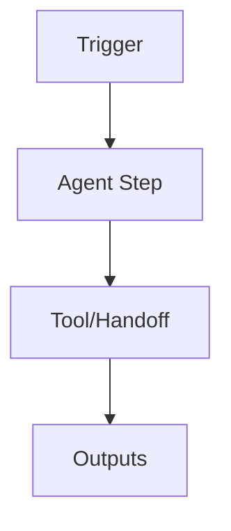

### BP-ADAPT — Adaptive Learning {#CH4-BP-ADAPT}

**ID:** BP-ADAPT  
**Name:** Adaptive Learning

**Objective & Success Criteria**  
- …

**Real-World Case Study**  
- …

**Agent Workflow (Mermaid):**


**Inputs / Outputs / Tools**  
- …

**Slash Command:**
```yaml
command: "/adapt"
args:
  - name: target
    type: string
examples:
  - "/adapt --target repo"
```

**Invocation Script (shell):**
```bash
#!/usr/bin/env bash
set -euo pipefail
# ...
```

**JSON Contract / Handoff:**
```json
{"task_id":"...", "role":"...", "artifacts":[{"name":"...","path":"..."}], "evidence":["..."], "status":"planned"}
```

**Risk & Control Matrix (Local)**  
- …

**Failure Modes & Recovery**  
- …

**Ethical Considerations**  
- …

**Telemetry & KPIs**  
- *Proposal acceptance rate* for `/adapt` diffs  
- *Helpfulness score lift* (rolling)  
- *Change failure rate* and *rollback rate*  
- *Safety overrides* (count/rate)  
**Alerting thresholds**: acceptance < 60%, rollback > 5%, safety overrides rising WoW.

**Verification Steps (Smoke Tests)**  
- …


---

> **Sourced excerpt from:** Chat1_ _Claude Code_ Agent Blueprints, Patterns & Reference Manual_ version_ 1.md

rity Analyst**. |
| “How can an agent improve itself with feedback?” | **Ch.7 – Adaptive Learning Agent**. |
| “How do multiple agents collaborate safely?” | **Ch.8 – Multi‑Agent Orchestrator**. |
| “What pattern should I apply?” | **Ch.9 – Patterns Summary & decision trees**. |
| “CLI, tools, extensions, or config details?” | **Ch.10–13 – Reference Manual**. |

---

# **Part A: Agent Blueprints & Patterns: Practical Recipes**

Each chapter in Part A provides a **Gold Standard Blueprint** with:

* **Objective & Success Criteria**  
* **Real‑World Case Study**  
* **Agent Workflow Diagram** (Mermaid)  
* **Custom Slash Command (`.md`)** – version‑controlled agent logic  
* **Invocation Script (`.sh`)** – copy‑paste execution with audit logging  
* **Prompt Adaptation Template**  
* **Risk & Control Matrix**  
* **Ethical Considerations**  
* **Failure Modes & Recovery**

All blueprints assume the **Unified Security Model**: run inside the official **Devcontainer** and enforce least‑privilege, reproducible environments.

---

## **Chapter 1: The Standard Development Environment**

### **1.1 The Recommended Architecture: Why We Use Devcontainers**

**Rationale:** Devcontainers deliver consistent, reproducible, isolated workspaces with explicit dependencies, non‑root execution, read‑only mounts, and policy‑controlled secrets. This eliminates “works on my machine” drift, hardens supply chains, and simplifies onboarding, testing, and audit.

**Properties:**

* Immutable base image; locked package versions; SBOM generated.  
* Non‑root user; granular Linux capabilities; read‑only project mount with writable temp workdir.  
* Secret injection via environment providers; short‑lived tokens; no secrets in git.  
* Observability baked in (stdout/stderr structured JSON logging; OpenTelemetry exporter).  
* Predictable **Claude Code** CLI toolchain preinstalled; tools gated by wrappers with allow‑lists.

### **1.2 Setting Up Your First Devcontainer for Claude Code**

**Files:** Place in repository root.

**`devcontainer.json`**

{  
"name": "claude-code-secure",  
"image": "ghcr.io/org/claude-code:stable",  
"runArgs": \["--cap-drop=ALL", "--pids-limit=512"\],  
"containerUser": "dev",  
"remoteUser": "dev",  
"mounts": \[  
"source=${localWorkspaceFolder},target=/workspace,type=bind,consistency=cached,readonly",  
"source=cc\_tmp,target=/tmp,volume"  
\],  
"features": {},  
"postCreateCommand": "bash .devcontainer/post-create.sh",  
"customizations": {  
"vscode": {  
"extensions": \[  
"ms-vscode.azure-repos",  
"ms-azuretools.vscode-docker"  
\]  
}  
}  
}

**

> **Reference:** [`adapt_config.example.json`](./reference/adapt_config.example.json)
